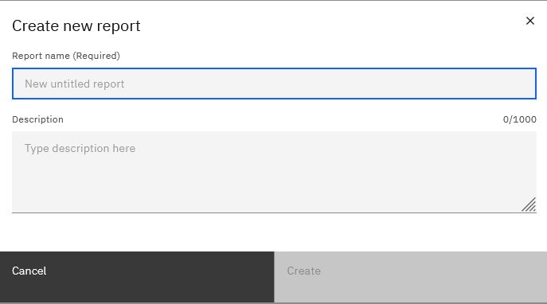
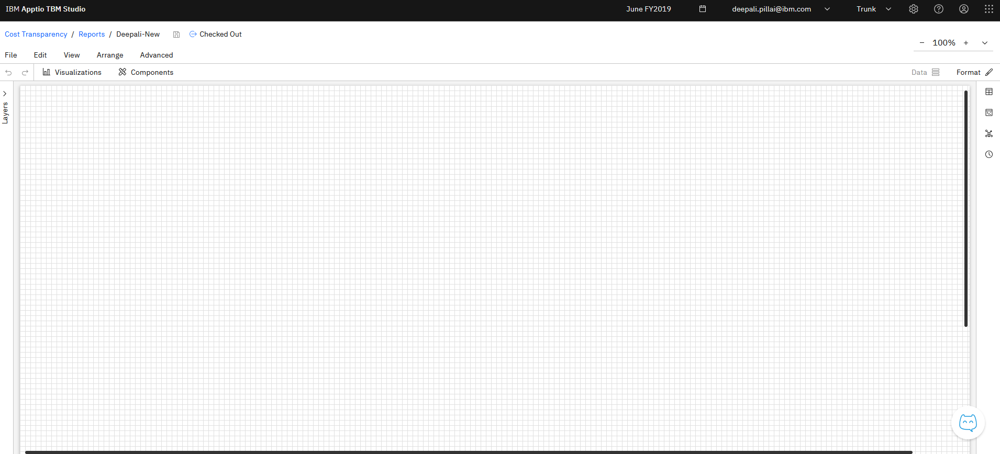
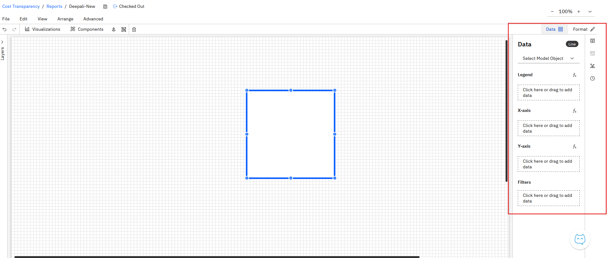

# Criação de um relatório

Siga estas etapas para criar e desenvolver seu relatório:

1. **Criar um relatório ou uma coleção**
   1. Clique em **New** e escolha criar um **relatório** ou uma **coleção de relatórios**.

      
   2. Digite o nome e a descrição do relatório e clique no botão **Criar**. Uma tela de relatório em branco será aberta

      

      Observação: Você também pode criar um novo relatório usando o atalho de teclado *Ctrl+Shift+O*.
2. **Explore o layout da tela**
   1. **Barra de ferramentas (parte superior):** contém visualizações e componentes de relatório que você pode adicionar.
   2. **Painel de camadas (à esquerda)** : Mostra a hierarquia dos componentes em seu relatório. A partir daí, você pode copiar, colar, reordenar, excluir ou alterar a associação ao grupo.
   3. **Dimensions Explorer (à direita)** : Lists Tables (Tabelas de listas), Editable Tables (Tabelas editáveis), Metrics (Métricas) e Time (Tempo). Use isso para arrastar e soltar dimensões em configurações de componentes.
3. **Adicionar componentes ou visualizações**
   1. Arraste um componente/visualização da barra de ferramentas para a tela.
   2. Cada componente adicionado aparece no painel de **camadas**.
4. **Configure seu componente**
   1. Quando um componente é adicionado, dois painéis aparecem no lado direito, ao lado do Dimensions Explorer: 
      1. **Painel de dados:** Selecione um objeto de modelo e adicione dimensões de dados.
      2. **Painel de formatação** : Personalize propriedades como cor, fonte, tamanho e outras opções de estilo.
      3. Propriedades Gerais

         |  |  |
         | --- | --- |
         | Título | Deslize o botão de alternância se quiser adicionar um título ao componente. Se sim, você pode editar o seguinte: - Título - Tamanho e estilo da fonte (negrito, itálico, sublinhado) - Cor do texto do título (com a opção de redefinir a cor) |
         | Subtítulo | Deslize o botão de alternância se quiser adicionar um subtítulo ao componente. Se sim, você pode editar o seguinte: - Subtítulo - Tamanho e estilo da fonte (negrito, itálico, sublinhado) - Cor do texto da legenda (com opção para redefinir a cor) |
         | Dica de ferramenta de ajuda | Forneça uma dica de ferramenta para o componente. Ao fornecer essa dica de ferramenta, o ícone de ajuda aparecerá ao lado do componente. |
         | Alt text | Forneça o texto Alt, que é o texto descritivo das imagens e gráficos da interface do usuário, fornecendo uma alternativa de texto para usuários com leitores de tela ou se a imagem não for carregada. |
         | Posição e tamanho | Edite as seguintes propriedades, conforme necessário: - Largura - Altura - Posição (eixos x e y) |
         | Estilo | Edite as seguintes propriedades, conforme necessário: - Cor do texto - Cor do plano de fundo - Cor da borda - Tamanho da borda |
5. **Salve seu trabalho**
   1. **Salvamento automático:** Suas alterações são salvas automaticamente à medida que você trabalha.
   2. **Salvar explicitamente:** Você também pode clicar no botão **Salvar** na parte superior (ao lado dos breadcrumbs) para salvar manualmente a qualquer momento.
