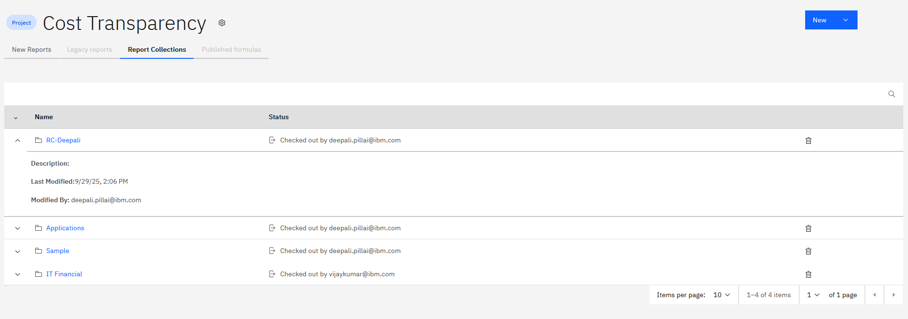

# Visão geral das coleções de relatórios

1. Abra a coleção na guia Report Collections (Coleções de relatórios) na página inicial.

   
2. Você pode visualizar:
   1. Todos os relatórios agrupados dentro da coleção.
   2. Os metadados da coleção (descrição, detalhes da última modificação)
