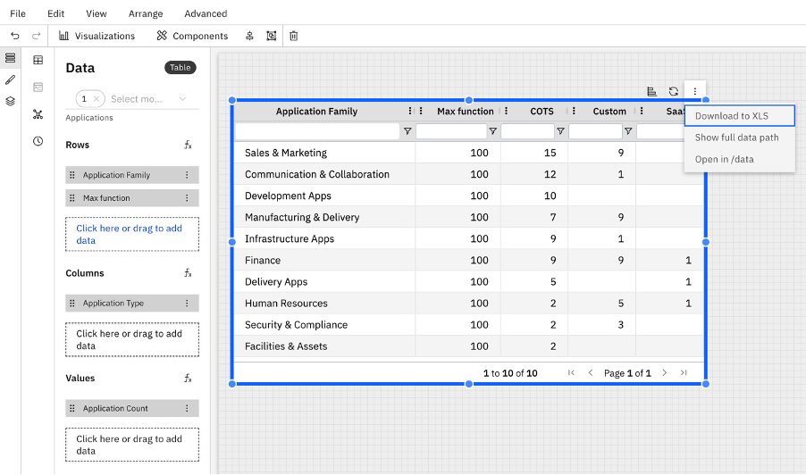

# Exportar uma tabela para o Excel

É possível exportar tabelas individuais de um relatório para o Microsoft Excel (.xlsx) diretamente a partir dos controles da tabela. Isso permite que você analise mais detalhadamente, compartilhe ou arquive os dados do relatório fora do aplicativo. Atualmente disponível no Novo Visualizador de Relatórios.

**Como exportar uma tabela para o Excel?**

1. Abra o relatório no Visualizador de Novos Relatórios.
2. Acesse a tabela que você deseja exportar.
3. Clique no menu de opções adicionais nos controles laterais da tabela.
4. Selecione **Exportar para o Excel.**
5. O arquivo será baixado automaticamente para o seu computador.

O que é exportado?

- Todas as linhas atualmente disponíveis na tabela
- Cabeçalhos das colunas conforme exibidos
- Os filtros aplicados são refletidos nos dados exportados

Observação: A exportação reflete o estado atual da tabela no momento do download.

Dicas:

- Aplique filtros antes de exportar, caso precise apenas de um subconjunto dos dados.
- Se a tabela estiver ordenada, o arquivo exportado refletirá essa ordem.

**Exportar para o Excel no Report Designer**

Agora é possível exportar visualizações de tabelas diretamente para o Excel a partir do Report Designer, utilizando os controles externos da tabela.

**Tópico principal:** [Tabela](../../../studio/report-studio/visualizations/rs-table.html "O componente de tabela exibe dados em um formato tabular estruturado. É ideal para apresentar informações detalhadas, resumir métricas e permitir a filtragem interativa dentro de um relatório.")
