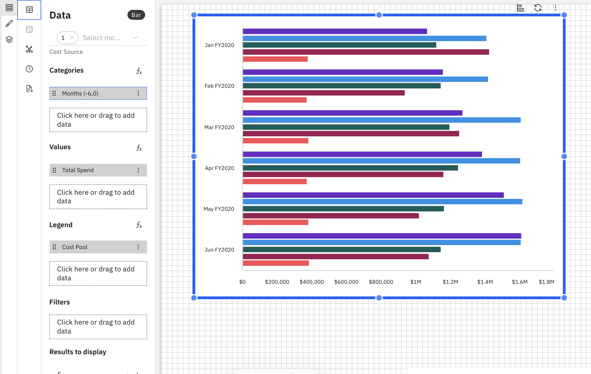

# Gráficos de barras

Um gráfico de barras exibe valores como barras horizontais, facilitando a comparação de métricas entre categorias. Os gráficos de barras são especialmente eficazes quando se comparam valores entre várias categorias.

## Quando usar um gráfico de barras

Use um gráfico de barras quando desejar:

- Compare valores em várias categorias
- Classifique as categorias da mais alta à mais baixa
- Destaque as diferenças de forma clara e rápida

## Adicionar um gráfico de barras a um relatório

1. Adicione um gráfico de barras a partir do painel Visualizações na barra de ferramentas
2. Clique no gráfico de barras para ativar os painéis Dados e Formato.
3. Painel de dados
   1. Selecione o objeto modelo no menu suspenso
   2. Categorias – Define como os dados são agrupados ao longo do eixo usando uma dimensão. Clique aqui ou arraste para adicionar dimensões a partir do Dimension Explorer
   3. Valores – Especifica a(s) métrica(s) exibida(s) como barras
   4. Legenda – Divide os valores em várias séries com base em uma dimensão.
   5. Filtros – Limita os dados exibidos no gráfico com base nas condições selecionadas
   6. Resultados a exibir – Indique o número de barras a exibir
   7. Configurar classificação – Controla a ordem das barras por valor em ordem crescente ou decrescente.
4. Painel de formatação
   1. Propriedades gerais – Veja [Propriedades do componente](../components/components.html#abt-comp__comprop)
   2. Propriedades específicas do gráfico de barras
      1. Categorias
         1. Mostrar título da categoria
         2. Mostrar rótulos de categoria
         3. Escolha o tamanho da fonte, o estilo (negrito, itálico, sublinhado) e a cor
         4. Alternar para mudar a posição das categorias
         5. Mostrar linhas da grade
      2. Valores
         1. Mostrar título dos valores
         2. Mostrar rótulos de valores
         3. Escolha o tamanho da fonte, o estilo (negrito, itálico, sublinhado) e a cor
         4. Alternar para inverter a faixa
         5. Mostrar linhas da grade
      3. Legenda
         1. Alternar para mostrar a legenda
         2. Tamanho e estilo da fonte da legenda (negrito, itálico, sublinhado)
         3. Cor do texto da legenda (com opção para redefinir a cor)
      4. Barras
         1. Acolchoamento entre as barras (espessura das barras)
         2. Preenchimento entre grupos (espaçamento entre grupos)
      5. Etiquetas de dados
         1. Alterne para mostrar as etiquetas de dados – as opções são dentro ou fora da barra.
         2. Escolha o tamanho da fonte, o estilo (negrito, itálico, sublinhado) e a cor
         3. Definir cores automaticamente – atribui cores automaticamente às barras com base nos dados e no tema selecionados.
         4. Defina o contorno e a cor da etiqueta

Exemplo: Gráfico de barras

Os gráficos de barras suportam fórmulas personalizadas e dimensões de fórmulas. Para obter mais detalhes, consulte [Fórmulas personalizadas.](../create-first/custom-formula.html "As fórmulas personalizadas (também conhecidas como dimensões de fórmula) permitem definir novas dimensões calculadas utilizando campos existentes no seu modelo de dados. Isso permite uma análise mais profunda e insights mais ricos, sem a necessidade de alterações no conjunto de dados ou esquema subjacente.")

Os gráficos de barras também suportam visualizações compatíveis. Para obter mais detalhes, consulte [Visualizações compatíveis](visualizations.html#abt-visual__compvis).

## Gráficos de barras empilhadas

Os gráficos de barras podem ser convertidos em barras empilhadas para mostrar as contribuições das subcategorias dentro de cada categoria, mantendo o valor total visível.
