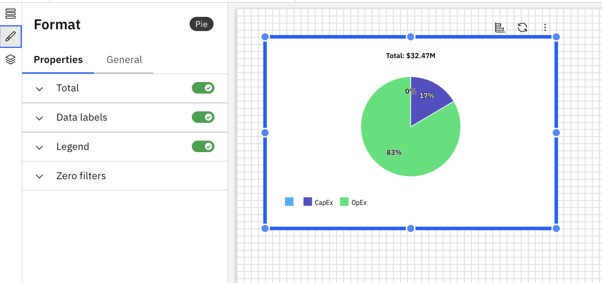

# Gráficos circulares

Um gráfico circular exibe os dados como fatias de um círculo, mostrando as proporções relativas de cada categoria em relação ao todo. É ideal para ilustrar relações percentuais ou entre partes e o todo.

## Quando usar um gráfico circular

Use um gráfico circular quando desejar:

- Mostrar proporções de um total para um pequeno número de categorias
- Destaque os segmentos maiores ou menores
- Forneça uma comparação visual rápida das partes com o todo

## Adicionar um gráfico circular a um relatório

1. Adicione um gráfico circular a partir do painel Visualizações na barra de ferramentas
2. Clique no gráfico circular para ativar os painéis Dados e Formato.
3. Painel de dados
   1. Selecione o objeto modelo no menu suspenso
   2. Categorias – Define as fatias do bolo usando uma dimensão. Clique aqui ou arraste para adicionar dimensões a partir do Dimension Explorer
   3. Valores – Especifica a(s) métrica(s) que determina(m) o tamanho da fatia
   4. Filtros – Limita os dados exibidos no gráfico com base nas condições selecionadas
4. Painel de formatação
   1. Propriedades gerais – Veja [Propriedades do componente](../components/components.html#abt-comp__comprop)
   2. Propriedades específicas do gráfico de pizza
      1. Total
         1. Alternar para mostrar a contagem total.
         2. Tamanho e estilo da fonte da legenda (negrito, itálico, sublinhado)
         3. Cor do texto total (com opção para redefinir a cor)
      2. Etiquetas de dados
         1. Alterne para mostrar a posição da etiqueta – as opções são Externa ou Interna.
         2. Conteúdo da etiqueta – Escolha entre as opções: Categoria, Valor e Porcentagem.
         3. Escolha o tamanho da fonte, o estilo (negrito, itálico, sublinhado) e a cor
         4. Definir cores automaticamente – atribui cores automaticamente às barras com base nos dados e no tema selecionados.
         5. Defina o contorno e a cor da etiqueta
      3. Legenda
         1. Alternar para mostrar a legenda
         2. Tamanho e estilo da fonte da legenda (negrito, itálico, sublinhado)
         3. Cor do texto da legenda (com opção para redefinir a cor)

Exemplo: Gráfico circular

O gráfico circular suporta fórmulas personalizadas e dimensões de fórmulas. Para obter mais detalhes, consulte [Fórmulas personalizadas.](../create-first/custom-formula.html "As fórmulas personalizadas (também conhecidas como dimensões de fórmula) permitem definir novas dimensões calculadas utilizando campos existentes no seu modelo de dados. Isso permite uma análise mais profunda e insights mais ricos, sem a necessidade de alterações no conjunto de dados ou esquema subjacente.")
