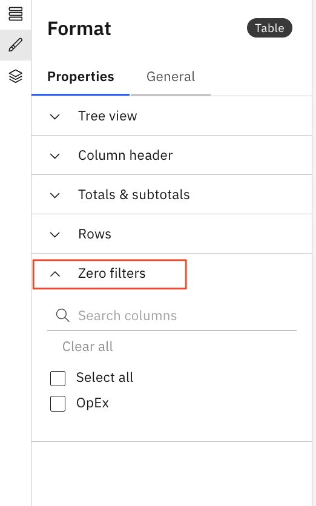

# Tabela

O componente tabela exibe dados em um formato tabular estruturado. É ideal para mostrar informações detalhadas, resumir métricas e oferecer suporte à filtragem interativa em um relatório.

## Quando usar uma tabela

Use um componente Tabela quando desejar:

- Apresentar linhas e colunas de dados (dados estruturados)
- Mostrar várias métricas ou dimensões juntas
- Habilite a classificação, filtragem ou detalhamento de informações

## Adicionar uma tabela ao relatório

1. Adicione uma tabela a partir do painel Visualizações na barra de ferramentas
2. Clique na tabela para ativar os painéis Dados e Formato.
3. **Painel de dados**
   - Selecionar objeto modelo
   - **Linhas** - Fornece entradas para a primeira coluna da tabela. Se houver entradas duplicadas na fonte, elas serão agrupadas e uma única entrada para cada valor exclusivo será exibida. Se você adicionar mais de um campo à área, serão criados subgrupos na primeira coluna da tabela.
   - **Colunas** - Fornece cabeçalhos de coluna para a tabela. Apenas um campo pode ser colocado na área Colunas.
   - **Valores** - Fornece os dados exibidos no corpo da tabela
   - **Filtros** - Filtra as entradas em uma coluna da tabela.
4. **Painel de formatação**
   1. Propriedades gerais – Veja [Propriedades do componente](../components/components.html#abt-comp__comprop)
   2. **Total e subtotais**
      1. Mostrar coluna total – Exibe uma coluna de resumo à direita que calcula os totais para cada uma das linhas numéricas.
      2. Mostrar linha total – Exibe uma linha de resumo na parte inferior da tabela que calcula os totais para cada uma das colunas numéricas.
      3. Mostrar outra linha - Se houver muitas linhas em uma tabela e você quiser limitar o número de linhas exibidas, é possível adicionar outra linha. A outra linha é exibida na parte inferior da tabela. Mostra o total de toda a tabela menos os valores exibidos na página atual da tabela.
      4. Mostrar subtotal – Exibe linhas de subtotal para dados agrupados. Você pode escolher onde exibir os rótulos de subtotal e quais itens devem ser somados.
   3. **Limite de linhas por página**
      1. Define o número máximo de linhas exibidas por página na tabela, permitindo a paginação para grandes conjuntos de dados.
   4. **Filtro zero**
      1. O recurso Zero Filters ajuda você a se concentrar em dados significativos, ocultando rapidamente as linhas em que as colunas numéricas selecionadas contêm valores zero. Isso facilita a análise de dados relevantes sem filtragem manual.
      2. **Selecionar colunas numéricas**
         1. Todas as colunas numéricas da tabela são listadas com caixas de seleção.
         2. Selecione uma ou mais colunas às quais você deseja aplicar o filtro zero.

            
      3. **Aplicar o filtro zero**
         1. Após selecionar as colunas numéricas, a tabela é atualizada instantaneamente para exibir dados diferentes de zero.
         2. As linhas em que as colunas selecionadas contêm valores zero são ocultadas da visualização.
      4. **Limpar o filtro**
         1. Para voltar à visualização original, limpe o filtro zero.
         2. Todas as linhas, inclusive aquelas com valores zero, serão restauradas.

- **[Menu de transbordamento de colunas da tabela](../../../studio/report-studio/visualizations/table-col-overflow.html)**
- **[Renomear colunas em uma tabela](../../../studio/report-studio/visualizations/remaining-col-tables.html)**
- **[Ocultando dimensões intermediárias](../../../studio/report-studio/visualizations/hiding-intermediate-dimensions.html)**
- **[Mostrar valores](../../../studio/report-studio/visualizations/show-values.html)**
- **[Exibição em árvore](../../../studio/report-studio/visualizations/tree-view.html)**
- **[Exportar uma tabela para o Excel](../../../studio/report-studio/visualizations/export-table.html)**
