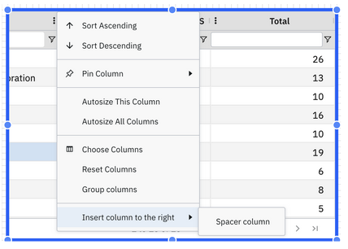

# Menu de transbordamento de colunas da tabela

Cada coluna de uma tabela possui um menu de opções que oferece ações adicionais para gerenciar o comportamento e o layout da coluna:

- Ordenar por ordem crescente – Ordena os valores da coluna por ordem crescente.
- Ordenar por ordem decrescente – Ordena os valores da coluna por ordem decrescente.
- Fixar coluna – Fixa a coluna à esquerda para que ela permaneça visível durante a rolagem.
- Ajuste automático da largura da coluna – Ajusta automaticamente a largura da coluna para se adequar ao seu conteúdo.
- Escolher colunas – Permite selecionar quais colunas serão exibidas na tabela.
- Redefinir colunas – Restaura a ordem e a visibilidade padrão das colunas da tabela.
- Agrupar colunas – Agrupa uma ou mais colunas
- Inserir coluna espaçadora – Adiciona uma coluna vazia à direita para ajudar no espaçamento do layout

**Tópico principal:** [Tabela](../../../studio/report-studio/visualizations/rs-table.html "O componente de tabela exibe dados em um formato tabular estruturado. É ideal para apresentar informações detalhadas, resumir métricas e permitir a filtragem interativa dentro de um relatório.")
