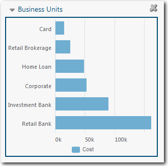
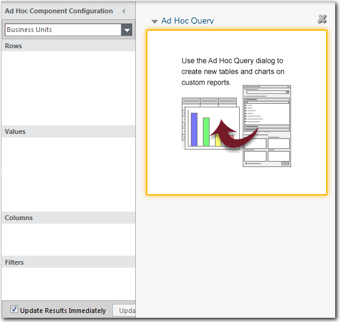
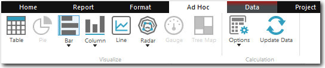
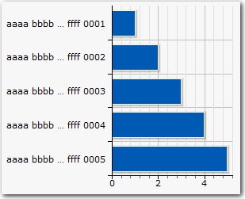
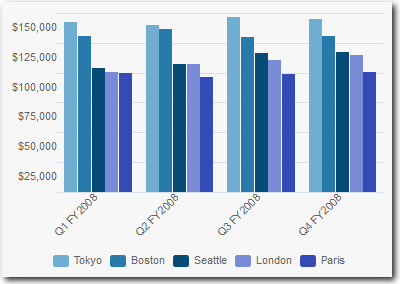
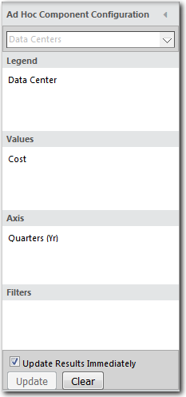

# Adicionar um gráfico

**Aplica-se a** : TBM Studio 12.0 e posterior

Quando você adiciona um gráfico pela primeira vez, o formato padrão é um gráfico de barras horizontais, como o mostrado na imagem a seguir. Depois de criar o gráfico inicial, você pode alterar o tipo de gráfico.

## Adicionar um gráfico a um relatório

1. Exibir o relatório.
2. Na guia **Relatório**, clique no ícone **Gráfico**. O painel **Ad Hoc Component Configuration** é exibido, conforme mostrado na imagem a seguir. Sua aparência varia de acordo com seus conjuntos de dados.

   
3. Use o painel **Ad Hoc Component Configuration** para criar o gráfico.
4. Você cria gráficos abrindo as perspectivas **Tables**, **Calculations**, **Time** e outras no painel **Project Explorer** e arrastando os campos para as quatro áreas do painel **Component Configuration**.

## Alterar o tipo de gráfico

Por padrão, o aplicativo cria um gráfico de barras horizontais. Você pode alterar o tipo de gráfico selecionando o gráfico, selecionando a guia **Ad Hoc** e, em seguida, selecionando um dos tipos de gráfico na seção **Visualizar** mostrada na imagem a seguir:

## Rótulos dos eixos X e Y encurtados

Os rótulos exibidos nos eixos x e y têm um comprimento máximo de 20 caracteres. Se uma etiqueta exceder esse comprimento, os caracteres serão removidos do meio da etiqueta. Por exemplo, suponha que você tenha a seguinte série de rótulos:

> aaaa bbbb cccc dddd eeee ffff 0001
>
> aaaa bbbb cccc dddd eeee ffff 0002
>
> aaaa bbbb cccc dddd eeee ffff 0003
>
> aaaa bbbb cccc dddd eeee ffff 0004
>
> aaaa bbbb cccc dddd eeee ffff 0005

Se você usá-los em um gráfico, eles aparecerão da seguinte forma:

## Criar um gráfico de exemplo

Neste exemplo, criaremos o gráfico de barras mostrado na imagem a seguir. Ele se baseia em dados do Data Center.

Para criar o gráfico:

1. Clique em **Chart (Gráfico** ) na guia **Report (Relatório** ).
2. No painel **Component Configuration (Configuração de componentes** ), selecione **Data Centers (Centros de dados** ) como a tabela modelada.
3. Clique na perspectiva **Tables (Tabelas** ), abra a tabela Data Centers (Centros de dados) e arraste **Data Center (Centro de dados** ) para a área Legend ( **Legenda** ).
4. Clique na perspectiva **Cálculos** e arraste **Custo** para a área **Valores**.
5. Selecione a perspectiva **Time** e arraste Quarters para a área **Axis** (Eixo). A caixa de diálogo **Ad Hoc Component Configuration** deve se parecer com a imagem a seguir:

   
6. Para mudar para as barras verticais, selecione a guia **Ad Hoc** e, em seguida, selecione o ícone **Coluna**.
