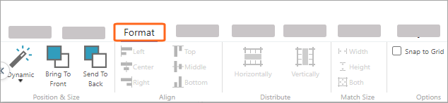
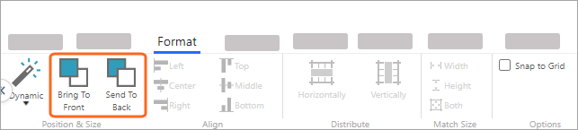
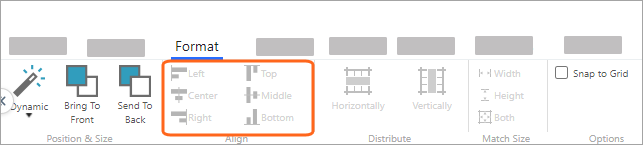
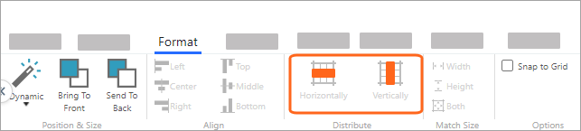
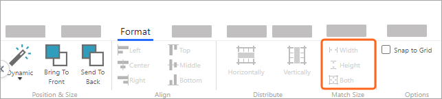
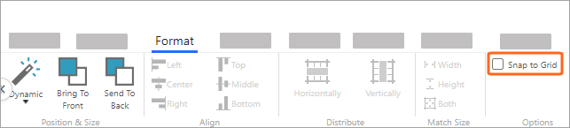
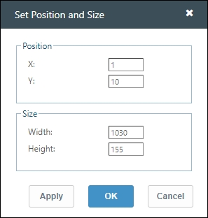
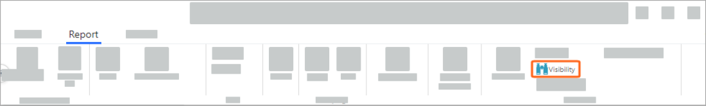
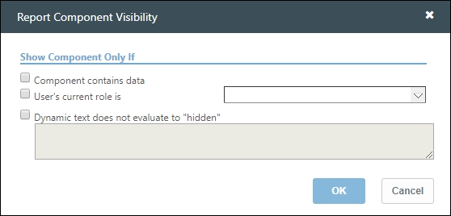

# Organizar os componentes do relatório

**Aplica-se a** : TBM Studio 12.0 e posterior

TBM Studio R12 oferece ferramentas de layout flexíveis para colocar e organizar componentes em um relatório. A maioria dessas ferramentas de layout está na guia **Format** :

## Selecionar componentes

Pelo menos um componente deve ser selecionado para ativar os comandos na guia **Format**. Para começar, clique no cabeçalho do componente que você deseja modificar. Por padrão, o cabeçalho do relatório exibe o nome do componente.

Algumas ferramentas de layout exigem a seleção de vários componentes. Para selecionar mais de um componente:

- **No Windows** : Mantenha pressionada a tecla **Ctrl** e clique no cabeçalho de cada componente que deseja modificar.
- **No MacOS** : mantenha pressionada a tecla **Alt** e clique no cabeçalho de cada componente que deseja modificar.

## Mover componentes do relatório

Em um relatório, você pode reposicionar os componentes.

- Clique e mantenha pressionado o cabeçalho do componente do relatório e, em seguida, arraste o componente para um novo local.

Se você mover um componente para uma posição em que ele se sobreponha a outro componente, poderá selecionar quais componentes devem estar na frente do outro.

1. Selecione o componente.
2. Na guia **Format (Formato** ), no grupo **Position & Size (Posição e tamanho** ), clique em **Bring to Front (Trazer para frente** ) ou **Send to Back (Enviar para trás** ).

   

## Alinhar componentes

Use os comandos do grupo Align (Alinhar) da guia Format (Formato) para controlar como dois ou mais componentes aparecem em relação uns aos outros. Esses comandos só ficam ativos depois que você seleciona dois ou mais componentes em um relatório.

1. Selecione os dois ou mais componentes que deseja alinhar.
2. No grupo **Align (Alinhar** ) da guia **Format (Formato** ), clique nas opções de alinhamento desejadas.

   

Os comandos **Left**, **Center** e **Right** controlam o alinhamento horizontal dos componentes selecionados. Os comandos **Top**, **Middle** e **Bottom** controlam o alinhamento vertical dos componentes selecionados.

## Redimensionar componentes do relatório

Redimensione um componente de relatório arrastando a parte inferior, os lados ou os cantos da borda do componente.

1. Passe o ponteiro do mouse sobre a parte inferior, a lateral ou o canto da borda de um componente. O ponteiro do mouse mudará para um redimensionamento icon.If. A borda está oculta; posicione o ponteiro do mouse em qualquer lugar sobre o componente para ver a borda.
2. Quando o ícone Redimensionar for exibido, clique e arraste a borda para alterar a altura ou a largura do componente.

## Distribuir componentes

Para espaçar os componentes horizontal ou verticalmente de maneira uniforme em um relatório, use os comandos do grupo Distribuir. O aplicativo usa os componentes externos para definir os limites e, em seguida, distribui os componentes uniformemente dentro dos limites. Se necessário, o aplicativo sobreporá componentes.

## Faça componentes do mesmo tamanho

Para fazer com que os gráficos e tabelas em um relatório tenham o mesmo tamanho, use os comandos do grupo **Match Size**. O aplicativo usa o primeiro componente que você seleciona como padrão e redimensiona todos os outros componentes para que correspondam. Você pode redimensionar a largura, a altura ou ambas.

## Ajustar à grade

Quando **Snap to Grid** estiver selecionado, os componentes se encaixarão no ponto mais próximo de uma grade invisível.

## Definir a posição e o tamanho do componente com coordenadas

Para posicionar ou dimensionar componentes com precisão, use **Set Position and Size**. Os componentes podem ser posicionados em relação à janela do relatório ou a um quadro de grupo.

Os números de posição e tamanho são exibidos em pixels. Você também pode usar números negativos (até -24 pixels) no campo de posição X. Isso é útil se você quiser ocultar o cabeçalho do componente e mover o componente para a borda superior da caixa de grupo.

1. Clique com o botão direito do mouse no componente que deseja mover e, em seguida, clique em **Position and Size (Posição e tamanho** ).
2. Digite os valores de posição e tamanho (em pixels) desejados.

   
3. Clique em **Apply (Aplicar** ) para salvar as alterações e, em seguida, clique em **OK** para fechar a janela.

## Definir a visibilidade do componente

Você pode controlar se componentes inteiros aparecem sob determinados critérios.

1. Selecione um componente.

   
2. No grupo Advanced (Avançado) da guia **Report (Relatório** ), clique em **Visibility (Visibilidade** ).

   As opções na caixa Visibilidade do componente do relatório variam, dependendo do tipo de componente selecionado.

   

As opções podem incluir:

**O componente contém dados** : Ocultará o componente selecionado se ele não contiver ou calcular dados.

**A função atual do usuário é** : Permite que você escolha funções específicas que podem visualizar o componente selecionado.

**O texto dinâmico não é avaliado como "hidden"** : Oculta o componente se o argumento for resolvido como "hidden"

**Exemplo** : Quero que um componente fique visível se a variação for negativa. Se a variação for positiva, defina-a como "oculta"

## Configurações da página impressa

Para definir a orientação e o tamanho da página para relatórios impressos e para ver o relatório na exibição de página, use as ferramentas Layout de impressão. Para saber mais, consulte [Imprimir e exportar relatórios](printexportreports.html "Aplica-se a: Apptio TBM Studio R12.5 e posterior. O TBM Studio se baseia na exportação de relatórios para o formato PDF para impressão e compartilhamento de relatórios fora da suíte TBM. O administrador do TBMA ou do TBM Studio pode personalizar as opções de layout de PDF por relatório para todos os usuários do site Apptio ao imprimir ou enviar relatórios por e-mail.").
