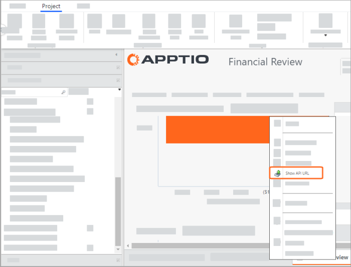
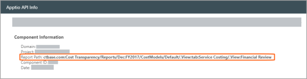

# Links de código para outros relatórios

**Aplica-se a** : TBM Studio 12.0 e posterior

Se você estiver criando muitos relatórios, poderá fornecer ao usuário links para passar rapidamente de um relatório para outro usando a sintaxe no estilo Wiki. Os links devem ser inseridos em uma caixa de texto HTML ou em um botão.

- Para obter informações sobre como criar caixas de texto HTML, consulte [Caixa de texto HTML](html.html "Aplica-se a: TBM Studio 12.0 e posterior").
- Para obter informações sobre como criar botões, consulte [Botão](button.html "Aplica-se a: TBM Studio R.12.0 e posterior.").

Os links no estilo Wiki também podem ser usados na guia **Ações** dos botões.

## Sintaxe

A sintaxe de um link no estilo Wiki é mostrada abaixo:

> `[[report|display-text|ToolTip-text]]`

Os parâmetros dos links estão descritos na tabela a seguir:

*relatório*

O nome de um relatório infantil. As opções são as seguintes:

| **Apptio versão** | **Opção** | **Descrição** |
| --- | --- | --- |
| Todos | *%métrica* | Cria um link para o relatório de métricas especificado e exibe o valor da métrica como o texto do link. |
| Todos | .. | Sobe um nível na hierarquia do relatório. |
| Todos | @ | Insere essa parte do link literalmente. Por exemplo, use para relatórios de objetos. |
| Todos | / | Passa para o relatório padrão do projeto. |
| Todos | *//nome do projeto/* | Indica um projeto diferente do projeto atual. |
| Todos | diálogo:relatório: | Abre o relatório como uma caixa de diálogo modal (ou seja, pop-up). |
| Todos | tabulação *:nome da tabulação/nome do relatório* | Indica um relatório em uma guia. |
| v.11 | */@Objeto/*!FILTRO[ *Table.Column ="valor"* ] | Pode ser usado para qualificar um relatório de objeto. |
| v.11 | /@*.TableTransform:Table/*!FILTRO[ *Table.Column ="valor"* ] | Pode ser usado para qualificar um relatório TableTransform. |
| v.12.1, v.12.2+ | dataTable *:nome da tabela* | Cria um link para uma tabela especificada. |
| v.12.1, v.12.2+ | costModel *:nome do modelo* | Cria um link para um relatório de visão geral do modelo especificado. |

*exibir texto*

O texto exibido no link. Se não for especificado, o nome do relatório será usado como o texto do link.

*texto da dica de ferramenta*

O texto que aparece quando o usuário pausa o ponteiro do mouse sobre o link.

## Caracteres especiais

Se um URL incluir caracteres especiais, você deverá *codificar* os caracteres usando a codificação de caracteres padrão do URL.

## Exemplo

- Digite %2FA para uma barra ( / )
- Digite %22 para uma aspa (")

Para obter mais informações sobre a codificação de caracteres URL, pesquise *URL encoding* na Internet.

**VEJA TAMBÉM** : Consulte o seguinte em *w3schools.com* : [Referência de codificação URL HTML](https://www.w3schools.com/tags/ref_urlencode.asp "(Abre em uma nova guia ou janela)").

## Codificar URLs

Os URLs podem ser enviados pela Internet somente com o uso do conjunto de caracteres ASCII.

- Como os URLs geralmente contêm caracteres fora do conjunto ASCII, o endereço URL deve ser convertido. URL converte o endereço URL em um formato ASCII válido.
- URL substitui caracteres ASCII inseguros por "%" seguido de dois dígitos hexadecimais correspondentes aos valores dos caracteres no conjunto de caracteres [HTML ISO-8859-1](https://www.w3schools.com/charsets/ref_html_8859.asp "(Abre em uma nova guia ou janela)").
- Os URLs não podem conter espaços. URL substitui um espaço por um sinal **de +**.

## Exemplos

O exemplo a seguir cria um link para o relatório filho Aplicativos, com o texto do link **Clique aqui** e uma dica de ferramenta que diz **Este relatório Aplicativos é preliminar** :

> ```
> [[Applications|Click here|This Applications report is
>       preliminary.]]
> ```

O exemplo a seguir cria um link para um relatório de nível superior chamado Server Group Analysis (observe a barra à esquerda).

> ```
> [[dialog:report:/Server Group Analysis/Server Detail|Server Detail|Examine server
>           details.]]
> ```

O exemplo a seguir cria uma caixa de diálogo modal (caixa de diálogo pop-up) para um relatório chamado Server Detail (Detalhes do servidor):

> ```
> [[dialog:report:/Server Group Analysis/Server Detail|Server Detail|Examine server
>           details.]]
> ```

O exemplo a seguir cria um relatório filtrado com base no objeto Origem do custo, que filtra o pool de custos do Software:

> ```
> [[/Software
>           Report/@Cost Source/!FILTER[Cost Source Master Data.Cost Pool="Software"]|Software
>           Report|Examine the Software Cost Pool.]]
> ```

O exemplo a seguir cria um relatório filtrado com base na transformação dos dados mestre da fonte de custos (somente em v.11 ):

> ```
> [[/Software
>           Report/@.TableTransform:Cost Source Master Data/!FILTER[Cost Source Master Data.Cost
>           Pool="Software"]|Software Report|Examine the Software Cost
>       Pool.]]
> ```

O exemplo a seguir cria um link para um relatório de métricas chamado Custo. Se o valor do Custo para este objeto for $ 1.500, o texto do link será **$ 1.500** :

> `[[%Cost]]`

O exemplo a seguir vincula o mesmo relatório de custos do exemplo anterior, mas o texto do link é Relatório de custos aberto:

> ```
> [[%Cost|Open cost
>           report]]
> ```

O exemplo a seguir vincula o relatório de orçamento de 2013 na guia Budgeting (Orçamento) no projeto Budget1 :

> `[[//Budget1/tab:Budgeting/2013 Budget]]`

Supondo a seguinte hierarquia de relatórios: Página inicial > Unidades de negócios > Relatório de serviços

- [[/|Go Home]] - Produz um link Go Home que se vincula ao relatório padrão.
- [[..|Voltar para BU]] inserida no Relatório de Serviços - Produz um link Voltar para BU que vincula de volta ao relatório pai. Nesse caso, Home > Business Units.

Suponha que você tenha um relatório pai chamado Teste. Ele tem dois relatórios filhos: Filho 1 e Filho 2. Para criar um botão que vá da Criança 1 para a Criança 2, digite o seguinte no campo **Navigate (Navegar** ):

> ```
> ../Child
>         2
> ```

O exemplo a seguir cria um link para a tabela Cost Source ( v.12.1, v.12.2+ ):

> ```
> dataTable:Cost
>           Source
> ```

O exemplo a seguir cria um link para um relatório de visão geral do modelo denominado Resumo ( v.12.1, v.12.2+ ):

> `costModel:Summary`

## Resolução de problemas

Às vezes, o caminho para um relatório não é óbvio a partir do nome ou de onde ele aparece no Project Explorer. Além disso, renomear relatórios pode complicar as coisas porque o sistema usa o nome original do relatório para o caminho. Nesses casos, consulte o site URL para obter o relatório. Esta seção apresenta um cenário de exemplo para mostrar como fazer isso.

Digamos que você queira criar um botão ou um link HTML que navegue até o relatório Financial Review.

O gráfico a seguir mostra o relatório de Revisão Financeira em TBM Studio.

1. Clique com o botão direito do mouse em um elemento de relatório, como uma tabela, para produzir um menu de contexto que inclua a seleção Show API URL.

   
2. Selecione **Show API URL**. É exibida uma caixa de diálogo que mostra o caminho do relatório:

   

## Formato da string de caminho

A seguir estão as informações relevantes do caminho acima:

> /.View:tab:Service Costing/.View:Financial Revisão

No contexto do campo de navegação de um botão ou de um link HTML, você usaria isso:

> [[/tab:Custo do serviço/revisão financeira]]

Observação: Indica uma situação importante que, se não for evitada, pode prejudicar seriamente as operações.

Se você tentar usar [[/IT Finance - Summary]], ocorrerá uma falha porque não é o caminho completo, incluindo a especificação da guia.
