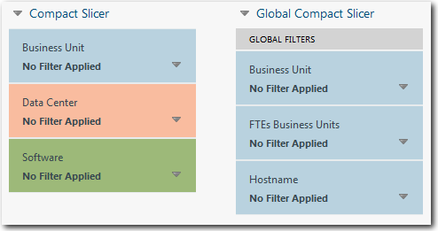
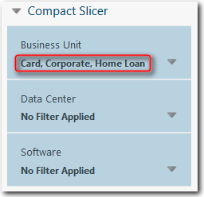

# Cortadores compactos

**Aplica-se a** : TBM Studio 12.0 e posterior

Se você quiser colocar vários slicers em um relatório, mas não quiser que eles ocupem uma grande área do relatório, crie um slicer compacto. Os slicers compactos podem ser locais ou globais. O exemplo mostrado na imagem a seguir inclui um fatiador compacto local e um fatiador compacto global:

## Tipos de fatiadores compactos

Há dois tipos de fatiadores compactos: local e global.

- **Local** - Um slicer compacto local tem as mesmas propriedades de um slicer único. Ele pode usar campos bloqueados e desbloqueados. As seleções feitas nos fatiadores pelos usuários não são salvas.
- **Global** - Um fatiador compacto global tem as mesmas propriedades de um filtro global.
  - Aplicar a todas as tabelas e gráficos baseados em objetos em um relatório.
  - Somente os campos bloqueados para um objeto podem ser incluídos em um fatiador compacto global.
  - Os fatiadores compactos globais podem incluir vários campos. Os campos devem ser de perspectivas personalizadas ou de aplicativos. Não é possível usar campos das perspectivas Dados, Cálculos ou Tempo.
  - Usuários individuais podem salvar suas próprias configurações globais de filtro do compact slicer.
  - As configurações salvas permanecem em vigor quando o usuário sai do aplicativo e faz login novamente.
  - As alterações feitas em um slicer compacto global em um relatório se aplicam a todos os relatórios que incluem o slicer.
  - Diferentes segmentações compactas globais podem ser adicionadas a diferentes conjuntos de relatórios.
  - Se você enviar um relatório por e-mail, as configurações globais do compact slicer serão salvas com o relatório.

Os fatiadores compactos globais destinam-se a substituir os filtros globais. Sempre que possível, use slicers compactos globais em vez de filtros globais.

## Criar um fatiador compacto

Para criar um fatiador compacto:

1. Na guia **Relatório**, clique em **Compact Slicer**.
2. Decida se o fatiador será local ou global e selecione a opção apropriada na guia **Compact Slicer (Fatiador compacto** **).AVISO**

   Se você criar um fatiador compacto local e depois alterá-lo para um fatiador compacto global, os campos desbloqueados serão removidos do painel de configuração e seus fatiadores correspondentes serão removidos do fatiador compacto.
3. No painel **Compact Slicer Configuration (Configuração do fatiador compacto** ), arraste os campos para a seção Slice By (Fatiar por). area.When Você adiciona um campo, um fatiador correspondente é adicionado ao fatiador compacto.

## Filtrar um fatiador compacto

É possível aplicar filtros a cada um dos fatiadores em um fatiador compacto selecionando um fatiador e criando os filtros na caixa de diálogo **Configuração do fatiador**. Os usuários não poderão modificar os filtros. Para obter mais informações, consulte [Filtrar fatiadores](filter-slicers.htm "(Abre em uma nova guia ou janela)").

## Selecionar valores do fatiador

É possível selecionar valores de slicer em um slicer compacto expandindo o slicer. Os valores selecionados são exibidos na linha abaixo do nome do fatiador, conforme mostrado na imagem a seguir. Se houver mais valores do que os que podem ser exibidos na linha, passe o ponteiro do mouse sobre a linha e será exibida uma janela pop-up que lista todos os valores. Os usuários podem modificar os filtros criados dessa forma.

## Formatar um fatiador compacto

Assim como nos fatiadores padrão, você pode formatar um fatiador compacto usando as opções da guia **Compact Slicer (Fatiador compacto** ).

Para formatar um fatiador:

1. Clique no fatiador no fatiador compacto.
2. Clique na guia **Compact Slicer**.
3. Selecione as opções de formatação.
   - Para obter informações sobre as opções de pesquisa, consulte [Selecionar uma opção de pesquisa](select-search-option.htm "(Abre em uma nova guia ou janela)")
   - Para obter informações sobre as opções de classificação, consulte [Classificar valores do fatiador](slicer-states-and-values.htm "(Abre em uma nova guia ou janela)")
