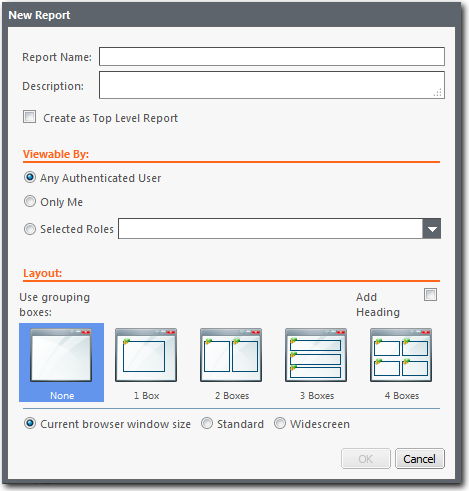
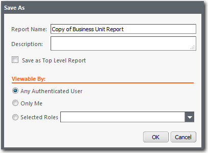
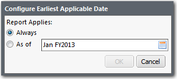

# Criar um relatório

**Aplica-se a** : TBM Studio 12.0 e posterior

Você pode criar um número ilimitado de relatórios. Depois de criar um relatório, você pode salvá-lo, renomeá-lo, restringir datas e excluir o relatório. Quando você cria um relatório, uma guia é exibida na parte inferior do espaço de trabalho. Para criar um relatório, vá para **TBM Studio**clique na guia **Home**, clique em **New** e, em seguida, clique em **Report**.

Assista a estes vídeos do site Apptio Education Services:

- [Criar um novo relatório](https://community.apptio.com/videos/1439 "(Abre em uma nova guia ou janela)")
- [Criar um relatório de taxa unitária](https://community.apptio.com/videos/1894 "(Abre em uma nova guia ou janela)")

Ou navegue por [todos os vídeos do site Apptio](https://community.apptio.com/docs/DOC-7714 "(Abre em uma nova guia ou janela)").

## Como as funções afetam a criação de relatórios

Suas opções para criar relatórios são controladas por sua função e pelas permissões atribuídas a ela. Há uma permissão **Editar relatórios pessoais** que, se atribuída à sua função, permitirá que você crie relatórios pessoais que somente você poderá visualizar. Por padrão, essa permissão é atribuída à função **Analista**, mas pode ser atribuída a qualquer função. Consulte o administrador do site Apptio para ver se você foi atribuído a uma função que tenha essa permissão.

## Criar um relatório

1. Mudança para **TBM TBM Studio**.
2. Clique na guia **Início**, clique em **Novo** e, em seguida, clique em **Relatório**. Observe que os itens exibidos na caixa de diálogo dependerão de suas permissões de função.
3. Digite um nome para o relatório**.NOTICE**

   Se você for exportar relatórios para o Excel, saiba que o Excel limita os nomes das planilhas a 31 caracteres. Se o nome de um relatório for maior que o limite de caracteres, o Excel truncará o nome e colocará "-0" no final.
4. Insira uma descrição do report.The descrição será exibida no **Report Finder**, portanto, é importante que você insira uma descrição que seja útil para um usuário final que esteja visualizando e imprimindo relatórios.
5. Se estiver criando o relatório em um ou mais níveis abaixo na hierarquia de relatórios e quiser que o relatório seja criado no nível superior, marque a opção **Criar como relatório de nível superior**.
6. Selecione quem pode visualizar o report.If. Se você criar relatórios que somente você pode visualizar, as opções **Viewable By** não serão exibidas na caixa de diálogo.
7. Selecione o layout do relatório e se deseja ou não adicionar um título ao relatório (caixa de seleção **Adicionar título** à direita).

   Depois de criar o relatório, você pode alterar o layout e optar por exibir ou não o cabeçalho.
8. Escolha o tamanho da tela que será usada para o layout do relatório.
   - **Padrão** : 1024 pixels de largura
   - **Tela panorâmica** : 1440 pixels de largura
9. Para determinados relatórios, uma opção **Avançada** será exibida na caixa de diálogo, permitindo que você escolha quando o relatório será exibido, selecionando opções nas listas suspensas. As listas disponíveis dependerão do relatório pai e do fato de os dados do relatório terem sido filtrados. Um relatório detalhado é aquele em que o usuário faz uma busca detalhada de um relatório de objeto para outro.

   | Tipo de relatório | Opção | Descrição |
   | --- | --- | --- |
   | Sem avarias | Mesmo ao mostrar um detalhamento | Exibe o relatório mesmo que os dados que estão sendo alimentados no relatório sejam dados de parada. |
   | Somente quando não estiver mostrando uma parada | Exibe o relatório somente se os dados que estão sendo alimentados no relatório não forem dados de parada. |
   | Detalhamento | Mesmo quando não estiver mostrando um colapso | Exibe o relatório mesmo que os dados que estão sendo alimentados no relatório não sejam dados de parada. |
   | Somente quando estiver mostrando um detalhamento | Exibe o relatório somente se os dados que estão sendo alimentados no relatório forem dados de parada. |
   | Filtrado | Somente quando filtrado desta forma | Essa opção está disponível apenas para relatórios filtrados. Ele exibe o mesmo relatório, mas somente se a filtragem for a mesma. A filtragem é a mesma se os filtros tiverem sido definidos para as mesmas colunas nas tabelas de origem. |
   | Mesmo que filtrado de outra forma | Essa opção está disponível apenas para relatórios filtrados. Ele exibe o mesmo relatório (mesmo que tenham sido definidos conjuntos diferentes de filtros). |
   | Unidade | Para todas as unidades | Essa opção está disponível apenas para relatórios de unidades. Ele aplica o relatório a todas as unidades na coluna de identificador de unidade. |
   | Apenas para a *unidade* | Essa opção está disponível apenas para relatórios de unidades. Aplica o relatório somente à unidade especificada no filtro. |
10. Para salvar o relatório e fechar a caixa de diálogo, clique em **OK**.

Depois de criar um relatório, você pode adicionar tabelas, gráficos e componentes de formatação e navegação.

## Criação e aplicação de paletas de cores

Você pode criar e gerenciar paletas de cores para um relatório. Para saber mais, consulte [Paleta de cores personalizada](../admin/color-enhancement.htm "(Abre em uma nova guia ou janela)").

## Salvar um relatório

Quando você cria um relatório pela primeira vez, o aplicativo salva automaticamente o relatório. Se você fizer alterações em um relatório e depois sair dele, o relatório será salvo automaticamente.

Quando você faz uma alteração em um relatório, um asterisco (\*) é exibido na frente do nome do relatório na guia Relatório, na parte inferior do espaço de trabalho de edição do relatório. O asterisco é um lembrete de que você precisa salvar o relatório.

Para salvar um relatório, clique no ícone **Salvar**  na guia **Home**.

## Salvar um relatório com um novo nome

Para fazer uma cópia do relatório e salvá-la em um novo nome de relatório:

1. Abra o menu sob o ícone **Salvar** e clique em **Salvar como**. A caixa de diálogo **Salvar como** é exibida conforme mostrado na imagem a seguir:
2. Digite um nome e uma descrição para o relatório.
3. Se estiver criando o relatório em um ou mais níveis abaixo na hierarquia de relatórios e quiser que o relatório seja criado no nível superior, marque a opção **Criar como relatório de nível superior**.
4. Selecione quem pode visualizar o report.If. Se você criar relatórios que somente você pode visualizar, as opções **Viewable By** não serão exibidas na caixa de diálogo.
5. Para salvar o relatório e fechar a caixa de diálogo, clique em **OK**.

## **Excluir um relatório**

1. No **Project Explorer**, clique no nome do relatório que você deseja excluir.
2. Na guia **Home**, clique em **Delete (Excluir** ).
3. Salve o relatório.
4. Verifique no relatório.

## Restringir datas para um relatório

Por padrão, os relatórios ficam visíveis em todas as datas de um projeto. No entanto, você pode restringir as datas em que um relatório fica visível definindo a opção **Earliest Applicable Date (Data aplicável mais antiga** ). Isso pode ser útil se você estiver criando um relatório e quiser ocultá-lo até que esteja pronto para ser visualizado pelos usuários.

Para definir a primeira data aplicável:

1. Clique no relatório no **Project Explorer**.
2. Confira o relatório.
3. Na guia **Relatório**, clique no ícone **Data de início**. A caixa de diálogo **Configure Earliest Applicable Date (Configurar a primeira data aplicável** ) é exibida como mostra a imagem a seguir:
4. Clique no ícone do calendário no final do campo **As of (A partir de** ) e selecione uma data.

   Quando você define uma data mais antiga e um usuário tenta visualizar o relatório antes dessa data, o aplicativo exibe uma mensagem explicando que o relatório ainda não pode ser visualizado. O usuário tem a oportunidade de clicar em um link que o leva ao primeiro período de visualização.

## Pré-carregar um relatório

Os dados exibidos em alguns relatórios podem levar muito tempo para serem calculados. Na maioria dos casos, é necessário garantir que os dados de um relatório tenham sido pré-carregados antes que os usuários acessem o relatório. Para isso, marque a opção **Active (Ativo** ) no grupo **Advanced (Avançado** ) na guia **Report (Relatório** ).

Se o seu domínio tiver sido configurado para impedir que os usuários visualizem relatórios que não tenham sido pré-carregados, será exibida uma mensagem informando aos usuários que eles não podem visualizar o relatório porque ele não foi pré-carregado.

## Dominar um relatório

Se você quiser usar o relatório como um modelo mestre para outros relatórios, clique na opção **Relatório mestre**. Para obter mais informações sobre o uso de relatórios mestre, consulte [Trabalhar com relatórios mestre](master-reports.htm "(Abre em uma nova guia ou janela)").
