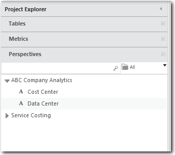
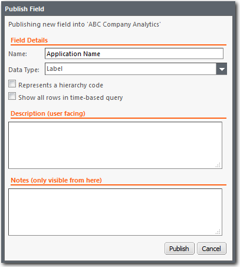

# Criar perspectivas personalizadas

**Aplica-se a** : TBM Studio 12.0 e posterior

Para aumentar as seções padrão no **Project Explorer**, é possível criar perspectivas personalizadas. Na imagem a seguir, há uma perspectiva personalizada: **ABC Company Analytics**. Uma perspectiva personalizada contém campos selecionados de outras perspectivas que você deseja disponibilizar aos usuários corporativos.

Para criar uma perspectiva personalizada e adicionar campos a ela:

1. Clique com o botão direito do mouse na seção **Perspectivas** do **Project Explorer** e selecione **Adicionar nova perspectiva**.
2. Na caixa de diálogo **Criar perspectiva**, digite o nome da perspectiva e clique em **OK**.

Os analistas veem apenas as perspectivas personalizadas e a perspectiva **de tempo** no **Project Explorer**. Todos os analistas veem todas as perspectivas personalizadas. Não é possível criar diferentes conjuntos de perspectivas personalizadas para diferentes grupos de analistas. As perspectivas personalizadas são listadas em ordem alfabética na parte superior da área **Perspectivas**.

## Adicionar um campo a uma perspectiva personalizada

Para adicionar um campo a uma perspectiva personalizada:

1. Execute uma das seguintes ações:
2. Arraste um campo das seções **Tables (Tabelas** ), **Metrics (Métricas** ) ou **Time (Tempo** ) para a barra de título da seção **Perspectives (Perspectivas** ) no **Project Explorer**.
3. Arraste um campo de uma área no painel **Configuração de componentes** para a barra de título da seção **Perspectivas** no **Project Explorer**.
4. Clique com o botão direito do mouse em um campo no painel **Configuração de componentes** e selecione **Publicar**.
5. Preencha os campos e clique em **Publicar**. Os campos são descritos abaixo:

## **Descrições de campo**

- **Nome** - O nome do campo. Você pode aceitar o nome padrão ou alterar o nome.
- **Data Type (Tipo de dados** ) - Selecione um tipo de dados na lista. O tipo controla a formatação básica dos dados.
- **Representa um código de hierarquia** - Aplica-se somente a fatiadores. Quando marcado, e o campo publicado é usado para definir um fatiador, ele encontra todos os valores que começam com os caracteres de pesquisa inseridos pelo usuário mais um caractere adicional e cria um grupo de fatiadores para cada um deles. Por exemplo, se o usuário digitar "ab", o filtro encontrará "aba", "abc" e "abd" e criará grupos para cada um deles. Para obter uma discussão mais detalhada sobre essa opção, consulte [Representar um código de hierarquia em perspectivas](hierarchy-codes-perspectives.html "Aplica-se a: TBM Studio 12.0 e posterior").
- **Show all rows in time-based query (Mostrar todas as linhas na consulta baseada em tempo** ) - Quando marcada, se uma tabela ou gráfico for baseado em tempo (por exemplo, g.: meses, trimestres, etc.), todas as linhas serão exibidas em todos os períodos, mesmo que um ou mais períodos contenham linhas com zeros em todos os campos. Para obter uma discussão mais detalhada sobre essa opção, consulte [Mostrar todas as linhas na opção de consulta baseada em tempo](#Createcustomperspectives__Showallrowsintimebasedqueryoption) abaixo.
- **Descrição** - O texto inserido no campo é exibido como uma dica de ferramenta quando o usuário passa o ponteiro do mouse sobre o campo. Use esse campo para fornecer informações aos analistas sobre os dados representados pelo campo. Isso é importante porque os analistas podem não estar familiarizados com os conjuntos de dados do projeto e o nome do campo pode não transmitir o conteúdo. A inserção de uma explicação completa dos dados ajudará os analistas a usar o campo de forma eficaz ao criar tabelas e gráficos.
- **Notas** - Informações para outros usuários avançados que possam editar o campo. As informações estão disponíveis somente nessa caixa de diálogo.
- **Filtro** - Esse campo é exibido se você estiver publicando um campo da área **Filtro**. Esse é um campo não editável.
- **Fórmula** - Esse campo é exibido se houver uma fórmula associada ao campo. Você pode editar a fórmula.

## Mostrar todas as linhas na opção de consulta baseada em tempo

Algumas tabelas baseadas em tempo podem ter uma ou mais linhas que não têm valores para um ou mais períodos de tempo. Por padrão, as linhas sem valores não são exibidas. Para garantir que todas as linhas sejam exibidas em todos os períodos, marque a opção **Mostrar todas as linhas na consulta baseada em tempo**.

Por exemplo, suponha que você tenha os seguintes dados:

**FY2011 de janeiro**

| Coluna A | Coluna B |
| --- | --- |
| X | 1 |
| Y | 2 |
| Z | 3 |

**Fevereiro FY2011**

| Coluna A | Coluna B |
| --- | --- |
| X | 4 |
| Z | 3 |

Você tem duas métricas calculadas: Custo e YearToDate(Cost ). Você adiciona colunas de Custo e YTD à tabela para exibir as métricas.

Em fevereiro, não haverá exibição da linha Y:

| Coluna A | Custo | YTD |
| --- | --- | --- |
| X | $4 | 5 |
| Z | $3 | 6 |

No entanto, se você tiver marcado a opção, a linha Y será exibida:

| Coluna A | Custo | YTD |
| --- | --- | --- |
| X | $4 | 5 |
| Z | $3 | 6 |
| Y |  | 2 |

## Renomear uma perspectiva personalizada

Para alterar o nome de uma perspectiva personalizada, clique com o botão direito do mouse na perspectiva personalizada e clique em Renomear.

## Criar grupos de campos

Você pode agrupar campos em uma perspectiva personalizada.

1. Clique com o botão direito do mouse em uma perspectiva personalizada e selecione **Add New Group**.
2. Arraste os campos de uma área para o grupo.

Para remover um campo de um grupo, arraste-o para uma área em branco de uma perspectiva personalizada.

## Excluir um campo

Para excluir um campo de uma perspectiva personalizada, clique com o botão direito do mouse no campo e clique em **Excluir campo**.

## Excluir uma perspectiva

Para excluir uma perspectiva, clique com o botão direito do mouse na barra de título da perspectiva e selecione Excluir.

## Criar perspectivas somente para administradores

Se você estiver atribuído a uma função de administrador, poderá criar perspectivas que sejam visíveis apenas para outros usuários com funções de administrador. Isso é útil para criar um local onde você pode armazenar campos usados com frequência que não deseja que os analistas acessem.

Para criar uma perspectiva somente para administradores, coloque parênteses ao redor do nome da perspectiva.
