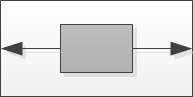
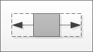
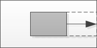
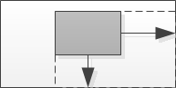
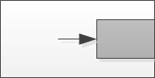
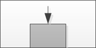

# Dimensionamento e posicionamento dinâmicos

**Aplica-se a** : TBM Studio 12.0 e posterior

As opções de layout dinâmico controlam o tamanho e a posição dos componentes do relatório. As opções de tamanho ajustam o tamanho dos componentes e do contêiner do conteúdo. As opções de posição controlam o posicionamento dos componentes em seu contêiner. O contêiner pode ser um relatório inteiro, uma caixa de grupo ou um componente com guias. Para aplicar essas opções, use o menu **Dinâmico** na guia **Formato**.

As opções de layout podem ser aplicadas:

- Tabelas
- Gráficos
- Caixas de grupo
- Componentes com guias

## Aplicar as opções

Para aplicar as opções:

1. Selecione o componente.
2. Abra o menu **Dinâmico** na guia **Formato**.
3. Selecione uma das opções.

Apenas uma opção pode ser aplicada a um componente em um determinado momento.

## Descrições das opções

**Dynamic Off (Dinâmico desativado** ) - Desativa o dimensionamento e o posicionamento dinâmicos.

- **Center (Centro** ) - Posiciona o componente no centro do relatório, da caixa de grupo ou do componente com guias. O tamanho do componente não é alterado.

  
- **Center and Grow (Centralizar e aumentar** ) - Posiciona o centro do componente no centro do relatório, da caixa de grupo ou do componente com guias. À medida que você move a borda esquerda do componente, ele ajusta a borda direita para manter a caixa centralizada.

  
- **Preencher à direita** - Estende o componente até a borda direita do relatório, da caixa de grupo ou do componente com guias.

  
- **Fill Right and Bottom** - Estende o componente até as bordas direita e inferior do relatório, da caixa de grupo ou do componente com guias.

  
- **Dock Right (Dockar à direita** ) - Move o componente para que a borda direita toque a borda direita do relatório, da caixa de grupo ou do componente com guias. O tamanho do componente não é alterado.

  
- **Dock Bottom** - Move o componente para que a borda inferior toque a parte inferior do relatório, da caixa de grupo ou do componente com guias. O tamanho do componente não é alterado.

  
