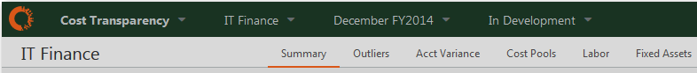

# Componentes de navegação do relatório

**Aplica-se a** : TBM Studio 12.0 e posterior

Para permitir que os usuários naveguem entre os relatórios, é possível adicionar botões, links codificados, coleções de relatórios e links de relatórios aos relatórios.

## Botões

Quando clicado, um botão leva o usuário a um relatório específico. Ver [Botão](button.htm "(Abre em uma nova guia ou janela)").

## Links codificados

Quando clicados, os links codificados exibem um relatório específico. Os links usam a sintaxe do estilo Wiki e devem ser inseridos em uma caixa de texto HTML ou em um botão. Consulte [Links de codificação para outros relatórios](coding-links-to-other-reports.htm "(Abre em uma nova guia ou janela)").

## Navegador de coleta de relatórios

As coleções de relatórios agrupam relatórios relacionados. Um navegador de coleção de relatórios é usado para exibir os relatórios na coleção. A imagem a seguir mostra um navegador de coleção de relatórios do IT Finance. Consulte [Criar coleções de relatórios.](creating-report-collections.htm "(Abre em uma nova guia ou janela)")

## Links de relatórios

Os links podem ser adicionados a tabelas e gráficos em relatórios. Quando um usuário clica em uma entrada de uma tabela ou em um elemento de um gráfico, ele é levado a um relatório designado. Os links podem incluir filtros. Para obter informações sobre links, consulte [Link para relatórios](link-to-reports.htm "(Abre em uma nova guia ou janela)").
