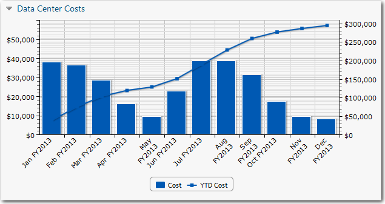

# Gráficos de sobreposição

**Aplica-se a** : TBM Studio 12.0 e posterior

Um gráfico de sobreposição exibe duas séries de dados em um único gráfico. Por exemplo, você pode exibir o orçamento e os dados reais em um gráfico, ou a capacidade de armazenamento disponível e a capacidade de armazenamento usada em um gráfico. Um exemplo de gráfico de sobreposição é mostrado na imagem a seguir:

## Colunas e linhas

Em um gráfico de sobreposição, os dados podem ser exibidos usando colunas, barras empilhadas e linhas.

Para selecionar colunas ou linhas para o gráfico base, selecione a guia **Overlay (Sobreposição** ) e selecione uma opção. As colunas podem ser uma barra separada para cada valor ou empilhadas.

## Fatiadores

Os fatiadores se aplicam a gráficos de sobreposição, bem como a outros tipos de gráficos.

## Criar um gráfico de sobreposição

1. Na guia **Relatório**, clique em **Sobreposição**. A caixa de diálogo **Configuração de componentes ad hoc** é exibida.
2. Clique na guia **Overlay**.
3. Para adicionar a primeira série de dados, clique em **Edit Base Layer (Editar camada de base** ).
4. Para definir os rótulos exibidos no eixo x, arraste um campo para a área **Axis (Eixo** ).
5. Para definir o elemento que será representado graficamente, arraste um campo para a área **Valores**.
6. Formate os dados exibidos clicando em uma opção de visualização de camada.
7. Para adicionar a segunda série de dados, clique em Edit Layer 1 (Editar camada 1) e repita as etapas 4 a 6 acima.
8. Se você precisar simplificar o gráfico, adicione um filtro.

O gráfico agora deve estar completo.

## Classificar

Você pode classificar os dados usando apenas a camada de base.

1. Clique em **Edit Base** layer.
2. Clique em **Sort**.

## Navegar (Drill)

A navegação é suportada usando a opção **Drill**.

## Habilitar a navegação

Torna os elementos do gráfico ativos como links para navegação.

## Uso por brocas métricas

Quando você ativa a navegação, as fatias de pizza e as barras do gráfico de barras ficam disponíveis para drilldowns.

Marcar a opção **Use Per Metric Drills** ativa o detalhamento dos números exibidos nas fatias de pizza e nas barras do gráfico de barras.

## Navegar

Insira o nome de um relatório personalizado para o qual pesquisar. O relatório deve ser um filho do relatório atual. Se esse campo for preenchido, todos os links não métricos no gráfico levarão ao relatório designado.
