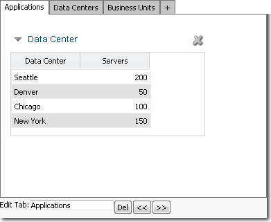

# Coloque os componentes nas guias

**Aplica-se a** : TBM Studio 12.0 e posterior

Se você tiver uma série de componentes relacionados que deseja colocar em um relatório, mas não quiser espalhá-los por uma grande área do relatório, poderá colocar os componentes em um grupo com guias. O usuário pode então selecionar uma guia para exibir um ou mais componentes específicos. Todos os componentes, exceto as caixas de agrupamento, podem ser colocados em uma guia. Um exemplo de grupo com guias é mostrado na imagem a seguir:



## Adicionar um grupo com guias

Na guia **Relatório**, clique no ícone **Guias**.

## Realizar ações em grupos com guias

As ações que podem ser executadas em um grupo com guias estão descritas abaixo:

| Para: | Faça isso: |
| --- | --- |
| Adicionar uma guia ao grupo | Clique na guia com o sinal + e digite um nome para a guia no campo **Editar guia**. Para salvar a guia, pressione Enter. |
| Adicionar um componente a uma guia | Crie o componente na superfície de relatório e arraste-o para o grupo com guias. É possível adicionar mais de um componente a uma guia. |
| Remover um componente de uma guia | Arraste o componente para fora do grupo com guias ou clique no ícone de exclusão no canto superior direito do componente. |
| Alterar a ordem das guias | Selecione uma guia e clique nos ícones de seta dupla para a esquerda/direita (<<) (>>) abaixo da caixa de grupo com guias. |
| Excluir uma guia | Selecione a guia e clique no ícone **Excluir** abaixo da caixa de grupo com guias. |
| Redimensionar a caixa de grupo | Clique e arraste as bordas. |
| Adicionar cor de fundo a uma guia | Clique com o botão direito do mouse na guia e selecione **Propriedades** no menu pop-up. Na guia General ( **Geral** ) da caixa de diálogo **Properties (Propriedades** ), selecione uma cor no campo **Tab Background Color (Cor de fundo da guia** ). Você pode selecionar uma cor diferente para cada guia. |

## Definir as propriedades

Para definir as propriedades do grupo com guias, exiba a caixa de diálogo **Propriedades** seguindo um destes procedimentos:

- No canto superior esquerdo do grupo com guias, clique no pequeno triângulo  ao lado do nome do componente para exibir o menu **Actions (Ações** ). No menu **Ações**, clique em **Propriedades**.
- Clique com o botão direito do mouse em qualquer lugar dentro das bordas do componente e clique em **Propriedades** no menu pop-up.

## Propriedades gerais

- **Nome** - Digite um nome a ser exibido no cabeçalho do componente acima do componente quando **Show Header** for selecionado.
- **Legenda** - Insira informações adicionais sobre o componente. As informações são exibidas com base na configuração do campo **Caption Position (Posição da legenda** ).
- **Caption Position (Posição da legenda** ) - Na lista, selecione uma posição da legenda em relação ao botão: **Superior**, **Inferior**, **Esquerda** ou **Direita**, ou selecione **Ocultar** para não exibir a legenda.
- **Show Header (Mostrar cabeçalho** ) - O cabeçalho do componente exibe o conteúdo do campo **Name (Nome** ). Selecione essa opção para tornar o cabeçalho do componente visível (o padrão). Quando o cabeçalho está oculto, é possível pausar o ponteiro do mouse no componente para exibi-lo no modo Editar.
- **Show Border (Mostrar borda** ) - Selecione essa opção para exibir uma borda ao redor da tabela. Quando a borda está oculta, é possível pausar o ponteiro do mouse no componente para exibi-la no modo Editar.
- **Wrap Title (Envolver título** ) - Envolve o texto inserido no campo **Name (Nome** ) para acomodar a largura do componente.
- **Tab Background Color (Cor do plano de fundo** da guia) - Selecione uma cor para o plano de fundo das guias. Essa configuração se aplica a todas as guias do grupo.

## Propriedades avançadas

**Atualização automática quando os cálculos terminam** - Quando o aplicativo exibe um componente de guia, ele o exibe com os dados calculados disponíveis no momento. Em muitos casos, o aplicativo pode estar calculando novos valores em segundo plano. Se você quiser que os resultados sejam exibidos quando os cálculos forem concluídos, marque essa opção.

## Colocar componentes em um grupo com guias

O ideal é que os componentes em um grupo com guias se movam com o grupo se você o reposicionar. Para que os componentes se movam com o grupo, eles devem estar bem posicionados dentro das bordas do grupo. Para garantir que eles sejam colocados corretamente:

- Clique com o botão direito do mouse no título do objeto e clique em **Position and Size (Posição e tamanho** ) no menu pop-up.
- Na caixa de diálogo **Set Position and Size (Definir posição e tamanho** ), defina as coordenadas X e Y como zero.

Use as margens resultantes como pontos de partida para posicionar o objeto. Você pode aumentar as margens e o objeto se moverá com o grupo. Se você diminuir as margens, o objeto será desacoplado do grupo.

## Controle a exibição de guias

Quando você adiciona um grupo de guias a um relatório, pode usar texto dinâmico para controlar quais guias são exibidas. O texto dinâmico pode fazer referência a um conjunto de dados ou pode usar uma instrução If com filtros.

As opções para controlar as guias são:

- **ativada** : a guia está visível e pode ser selecionada
- **hidden** : a guia não está visível
- **disabled** : a guia está visível, mas não pode ser selecionada

As opções podem ser aplicadas a todas as guias em um grupo, exceto a primeira guia. A primeira guia estará sempre visível e selecionável.

O exemplo abaixo usa o valor "hidden" de um conjunto de dados chamado TabStatus:

> `<%=TabStatus:Hidden%>`

O exemplo abaixo mostra uma opção simples para ocultar a guia:
> <%="oculto"%>

O conjunto de dados pode se parecer com o seguinte, com uma linha de cabeçalho e uma linha de valor:

| Ativado | Oculto(a) | Desativado |
| --- | --- | --- |
| ativado | oculto | desativado |

Um exemplo de instrução If é mostrado abaixo:

> `<%=If(GetLastFilterValue()="Sales","hidden","enabled")%>`

O exemplo acima só funcionará em um relatório filtrado.

Para tornar as guias ativadas ou ocultas condicionalmente com base na função do usuário, use a seguinte instrução IF:

> ```
> <%=IF(eval("{$CurrentUser}:{Users.Role}")
>       ="Admin","enabled","hidden")%>
> ```

Para especificar as configurações das guias:

1. Selecione o grupo com guias.
2. Na guia **Tabs (Guias** ), clique em **Visibility (Visibilidade** ).
3. Insira uma referência a um conjunto de dados ou uma instrução If para cada guia (exceto a guia 1, que está sempre visível).
4. Clique em **Salvar**.
