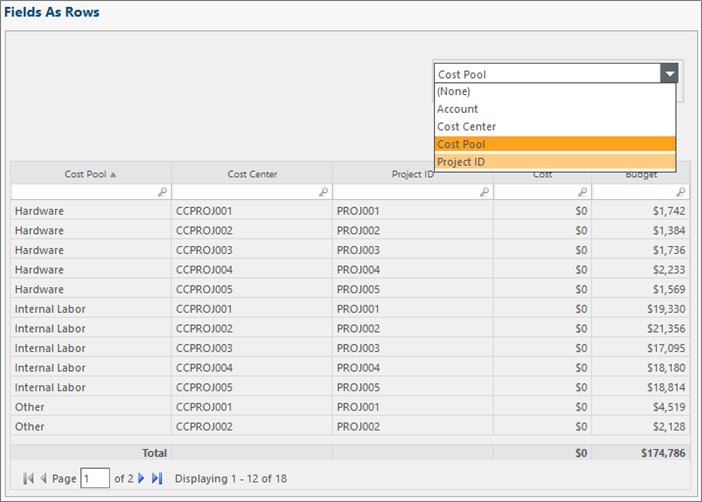
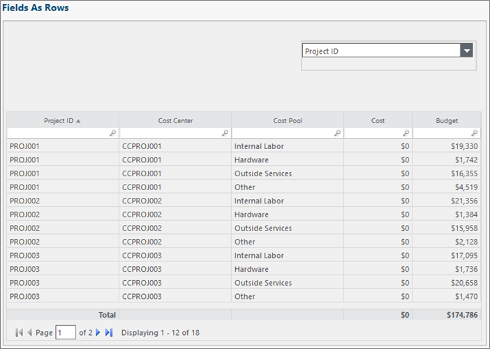

# Componente Quick Pivot

**Aplica-se a** : TBM Studio 12.0 e posterior

O componente Quick Pivot agrupa entradas de tabela por valores em uma coluna selecionada.

Quando o usuário seleciona uma coluna no menu suspenso Quick Pivot, essa coluna se torna a primeira da tabela.

As linhas são ordenadas pelos valores da coluna selecionada.

## Criar um Quick Pivot

1. Abra o relatório com a tabela que você deseja dinamizar.
2. Na guia **Relatório**, clique em **QuickPivot**. O aplicativo adiciona um objeto **QuickPivot** ao relatório e exibe o painel **QuickPivot Configuration**.
3. Usando o campo na parte superior do painel, selecione a tabela que você deseja dinamizar.
4. No **Project Explorer**, arraste um ou mais campos para a área **Pivots** da **QuickPivot Configuration** panel.The campos que você arrastar para a área estarão disponíveis na lista suspensa QuickPivot. Os campos bloqueados fornecem os resultados mais previsíveis. No entanto, em geral, você obterá resultados satisfatórios se usar campos desbloqueados.
5. Na guia **QuickPivot** escolha uma das opções de seleção.
   - **Seleção não necessária** : Uma opção "nenhum" estará disponível no campo QuickPivot
   - **Seleção obrigatória** : A opção "nenhum" não estará disponível na QuickPivot
