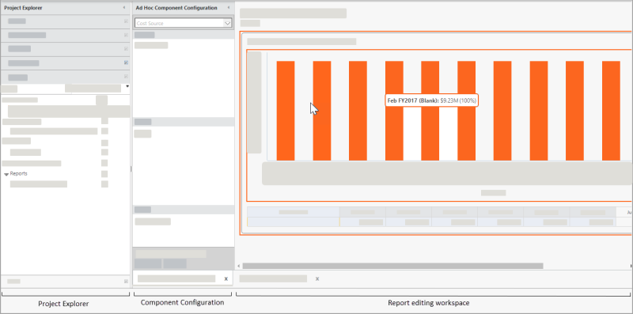
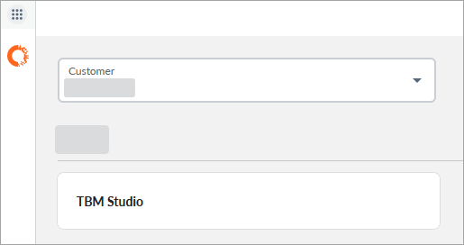

# O espaço de trabalho do relatório

**Aplica-se a** : TBM Studio 12.0 e posterior

O espaço de trabalho do relatório é dividido em três painéis.

- **Project Explorer** : Use para selecionar um relatório que deseja editar.
- Painel **de configuração de componentes** : Use para adicionar colunas e valores a uma tabela ou gráfico.
- Espaço de trabalho **de edição de relatórios** : Crie seu relatório nesse painel adicionando tabelas e gráficos.

  

## Explorador de projetos

O painel **Project Explorer** exibe os documentos que estão disponíveis. Os documentos são agrupados em seções:

- Tabelas
- Métricas
- Perspectivas
- Relatórios

Ao trabalhar com relatórios, você se concentrará na seção **Relatórios**.

Para exibir o painel **Project Explorer**, siga um destes procedimentos.

1. Em TBM Studio 12.2 +: Abra o menu Project/Applications (Projeto/Aplicativos) e clique em TBM Studio.

   
2. Nas versões anteriores a TBM Studio 12.2:, clique no ícone Studio Mode no lado direito do cabeçalho Global.

Para alterar a largura do painel Explorer, arraste a alça da borda direita.

Para minimizar o painel Explorer, clique na seta de minimização no canto superior direito.

Para localizar um relatório no Project Explorer, insira o texto no filtro da seção Relatório.

## Painel de configuração de componentes

Use o painel **Configuração de componentes** para criar as tabelas e os gráficos que você adiciona aos relatórios. Para criar as tabelas e os gráficos, arraste os valores do **Project Explorer** para as áreas do painel.

Para criar uma tabela ou um gráfico, arraste os campos do **Project Explorer** para as áreas na parte inferior da caixa de diálogo. As quatro áreas são descritas a seguir.

- **Rows (Linhas** ) - Fornece as entradas para a primeira coluna na tabela ou para o eixo x em um gráfico. Se houver entradas duplicadas na fonte, as entradas serão agrupadas e será exibida uma única entrada para cada valor exclusivo. Se você adicionar mais de um campo à área, os subgrupos serão criados na primeira coluna da tabela.
- **Valores** - Fornece os dados exibidos no corpo da tabela ou do gráfico. Você pode ocultar um valor clicando com o botão direito do mouse no valor e selecionando **Hide (Ocultar** ).
- **Columns (Colunas** ) - Fornece os cabeçalhos das colunas da tabela. Arraste um campo aqui a partir de uma perspectiva. Somente um campo pode ser colocado na área **Columns (Colunas** ).
- **Filtros** - Filtra as entradas em uma coluna na tabela ou no gráfico. Arraste os campos para cá a partir de perspectivas e outras áreas. Se você usar uma métrica, poderá clicar com o botão direito do mouse na métrica e definir o intervalo de números.
  - Vários campos podem ser adicionados a todas as áreas, exceto na área **Colunas**. Se um campo não puder ser aplicado a uma área, será exibida uma mensagem de aviso.
  - Para remover um campo de uma área, arraste-o para fora da área ou clique com o botão direito do mouse no campo e selecione Remove (Remover).

## Espaço de trabalho de edição de relatórios

Use o painel do espaço de trabalho **Report Editing** para criar o relatório adicionando tabelas, gráficos e outros componentes do relatório. Para adicionar componentes, clique na guia **Relatório** e clique em um componente.
