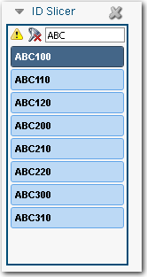
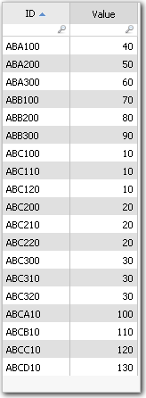
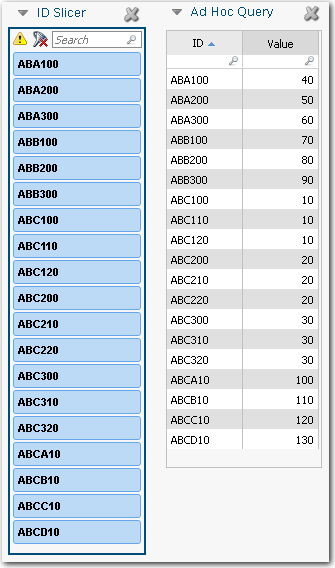
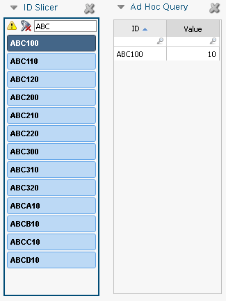
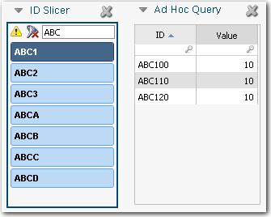

# Selecione uma opção de pesquisa

**Aplica-se a** : TBM Studio 12.0 e posterior

Se houver muitos valores em um fatiador, os usuários poderão limitar as entradas usando a caixa de pesquisa automática na parte superior do fatiador. Na imagem a seguir, ABC foi inserido e somente os valores que começam com ABC são mostrados. Ao adicionar um slicer a um relatório, você pode definir como a caixa de pesquisa automática funcionará.

## Duas opções de pesquisa

Há duas opções de pesquisa disponíveis na guia **Slicer**.

- **Contains (Contém** ) - Encontra todos os valores que incluem os caracteres inseridos. Se o usuário digitar abc, o filtro encontrará abcefg, defabc e defabcefg, mas não abdc ou adbc.
- **Starts With** - Encontra todos os valores que começam com os caracteres inseridos. Se o usuário digitar abc, o filtro encontrará abcefg e abc, mas não dabc ou 1abc.

Selecione a opção que você acha que melhor atenderá às necessidades dos usuários. Os usuários não podem alterar a opção de pesquisa ao trabalhar com o fatiador.

## Pesquisa de hierarquia

A pesquisa hierárquica encontra todos os valores que começam com o texto inserido mais um caractere adicional. Em seguida, ele cria uma entrada de grupo para cada um. A pesquisa hierárquica só pode ser aplicada a fatiadores com base em campos bloqueados em um objeto. Os slicers hierárquicos se aplicam a todos os componentes de um relatório ou, se contidos em um grupo, a todos os componentes do grupo, inclusive outros slicers.

Para ilustrar como funciona uma pesquisa de hierarquia, suponha que você tenha a tabela mostrada na imagem a seguir:

Você adiciona um slicer com base no campo ID com uma estratégia de pesquisa **Starts With (Começa com)**, conforme mostrado na imagem a seguir. O fatiador contém uma entrada para cada correspondência:

Se você digitar o texto ABC no campo de pesquisa e selecionar um valor como ABC100, obterá os resultados mostrados na imagem a seguir. Cada entrada do slicer representa um único valor na tabela:

Se você mudar a estratégia de pesquisa para **Group Search**, obterá os resultados mostrados na Figura E abaixo. Observe que cada entrada no fatiador representa um grupo de valores. ABC1 quando selecionado, exibe os valores ABC100, ABC110, e ABC120:

Para criar um fatiador de hierarquia:

- Clique com o botão direito do mouse em um campo bloqueado por objeto em uma perspectiva personalizada e selecione **Editar 'nome'**.
- Na caixa de diálogo **Editar campo publicado**, selecione a opção **Representa um código de hierarquia**.
