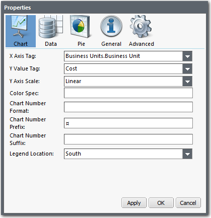
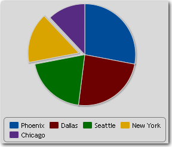
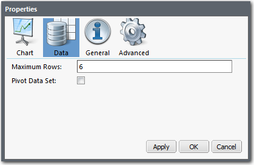
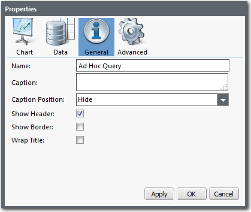
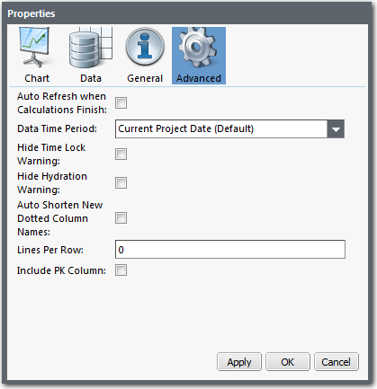

# Definir propriedades do gráfico

**Aplica-se a** : TBM Studio 12.0 e posterior

Há uma grande variedade de propriedades disponíveis para gráficos que controlam a aparência dos gráficos. A caixa de diálogo **Chart Properties** é mostrada na imagem a seguir:

## Exibir a caixa de diálogo Propriedades

Para editar as propriedades de um gráfico, exiba a caixa de diálogo **Propriedades** executando uma das seguintes ações:

- Selecione o gráfico e clique no ícone **Properties (Propriedades** )  na guia **Author (Autor** ).
- No canto superior esquerdo do gráfico, clique no pequeno triângulo  ao lado do nome do gráfico para exibir o menu **Actions (Ações** ). No menu **Ações**, selecione **Propriedades**.
- Clique com o botão direito do mouse na barra de título do gráfico e selecione **Properties (Propriedades** ) no menu pop-up.

## Propriedades de gráficos para gráficos

As propriedades **do gráfico** são mostradas abaixo. Para ver todas as propriedades, talvez seja necessário rolar a tela.

Seguem as descrições dos campos **do gráfico**. **OBSERVAÇÃO** : alguns gráficos terão um subconjunto desses campos. Os campos marcados com um asterisco (\*) se aplicam apenas a gráficos antigos e não a gráficos ad hoc.

- **Tag do eixo X** - Selecione a coluna de origem para os valores do eixo X no gráfico.
- **Y Value Tag (Etiqueta de valor Y** ) - Selecione a coluna de origem para os valores do eixo Y no gráfico.
- **Escala do eixo Y** - Selecione Linear ou Logarítmico.
- **Chart Style\* (Estilo de gráfico)** - Selecione a opção Pie (torta), Bar (barra), Horizontal Bar (barra horizontal), Stacked Bar (barra horizontal empilhada), Filled Radar (radar preenchido), Radar with Markers (radar com marcadores) ou Trend (linha).
- **Color Spec (Especificação de cor** ) - Insira uma string de formatação de cor para alterar a cor de uma entidade no gráfico. Para obter mais informações, consulte [Definição das cores padrão para métricas em gráficos](set-default-colors-charts.html "Aplica-se a: TBM Studio 12.0 e posterior").
- **Chart Number Format (Formato do número do gráfico** ) - Insira um padrão para formatar os números no eixo do gráfico. A sintaxe é a mesma usada pela função NumberFormat, mas sem o nome da função ou as aspas. Por exemplo, para exibir números como $5.000.000, digite #,###. Não é possível usar uma fórmula nesse campo.
  - Para remover toda a formatação dos números, digite #.
  - Se você estiver exibindo um cálculo métrico no gráfico, a formatação do gráfico substituirá a formatação métrica. Se você deixar esse campo (e os campos Prefixo de número e Sufixo de número) em branco, será usado o formato padrão especificado para a métrica que está sendo exibida.
  - Para formatar números como moeda usando o símbolo de moeda da localidade selecionada para o projeto, coloque no início da declaração de formato o símbolo Unicode de moeda universal (¤). A maneira mais fácil de fazer isso é copiar o símbolo da frase anterior e colá-lo no campo.
  - Para obter mais informações sobre a formatação de números, consulte a [função NumberFormat](../formulas-and-functions/functions/numberformat.html "Formata um valor numérico em um rótulo (string) usando padrões personalizados para números positivos e negativos, durações ou formatação de tamanho de dados. Essa função foi projetada para uso em colunas do tipo Label.") no *Guia do Studio*.
- **Prefixo do número do gráfico** - Digite o texto a ser exibido antes de todos os números do gráfico (por exemplo, $ para dólares).
  - Se você quiser que os valores em dólares sejam exibidos no formato $#.##M (por exemplo, $7.28M ), insira um sinal $ nesse campo e limpe toda a formatação do campo **Chart Number Format**.
  - Para formatar números como moeda usando o símbolo de moeda da localidade selecionada para o projeto, insira o símbolo Unicode de moeda universal (¤) no campo em vez do sinal $. A maneira mais fácil de fazer isso é copiar o símbolo da frase anterior e colá-lo no campo. Use o símbolo Unicode nesse campo ou no campo **Chart Number Format**, mas não em ambos.
  - Se você deixar esse campo em branco, será usado o formato padrão especificado para a métrica que está sendo exibida.
- **Sufixo do número do gráfico** - Insira o texto a ser exibido após os números no gráfico (por exemplo, M para milhões).
- Se você deixar esse campo em branco, será usado o formato padrão especificado para a métrica que está sendo exibida.
- **Show Data Values (Mostrar valores de dados** ) - Selecione essa opção para exibir valores de dados para cada ponto de dados no gráfico.
- **Gráficos multicoloridos de série única** - Em um gráfico com uma única série de valores, por exemplo, **Custo por unidade de negócios**, a série é exibida em uma única cor. Selecione essa opção para exibir cada elemento da série em uma cor diferente.
- **Reverse Order (Ordem inversa** ) - Inverte a ordem da série exibida no eixo x ou y.
- **Hide X axis (Ocultar eixo** X) - Oculta o eixo X.
- **Hide Y Axis (Ocultar eixo** Y) - Oculta o eixo Y.
- **Hide Grid Lines (Ocultar linhas de grade** ) - Oculta as linhas de grade horizontais e verticais.
- **Legend Location (Local da legenda** ) - Selecione um local para a legenda do gráfico ou selecione **Hidden (Oculto** ) para tornar a legenda invisível. O local padrão é Sul (abaixo do gráfico).
- **Include zero on the y-axis (Incluir zero no eixo y** ) - Se selecionada, essa opção força o eixo Y a começar em 0. Se estiver desmarcado, o eixo Y pode começar em um número maior para exibir melhor as pequenas variações.
- **Share Axis** - Usado somente com gráficos de sobreposição. Faz com que as escalas nos eixos esquerdo e direito sejam iguais.
- **Exploded Slice (Fatia explodida** ) - Digite o nome de uma das fatias a ser ligeiramente deslocada (explodida) do restante do gráfico. No exemplo abaixo, a fatia de Nova York é explodida. Você também pode explodir uma fatia selecionando uma fatia em um gráfico de pizza, clicando com o botão direito do mouse e selecionando **Explode (Explodir** ).

  

## Propriedades de dados para gráficos

As propriedades Data mostradas na imagem a seguir controlam os dados exibidos no gráfico:

Seguem as descrições dos campos de dados.

Observação: Alguns gráficos terão um subconjunto desses campos. Os campos marcados com um (\*) se aplicam apenas a gráficos antigos e não a gráficos ad hoc.

- **Maximum Rows (Linhas máximas** ) - Determina o número de elementos exibidos no gráfico.
  - Nos gráficos de barras, ele controla o número de barras.
  - Em gráficos de pizza, ele controla o número de fatias.
  - Em gráficos de linhas, ele controla o número de elementos no eixo X.
  - Se o número de elementos exceder o número especificado nesse campo, os elementos restantes serão agrupados em um elemento chamado Outro.

  Dica: antes de poder visualizar esses dados, vá para **Reports > Data (Relatórios > Dados** ) e, na opção **Sum (Soma** ), selecione **Show Other Row (Mostrar outra linha** ).
- **Include Columns\* (Incluir colunas\*** ) - Restringe as colunas exibidas àquelas selecionadas nessa lista.
- **Exclude Columns\* (Excluir colunas\*** ) - Permite que todas as colunas sejam exibidas, exceto as selecionadas nessa lista.
- **Show rows for which all metric values are 0\* (Mostrar linhas para as quais todos os valores métricos são 0\*** ) - Substitui o comportamento padrão, permitindo a exibição de linhas com valor zero.
- **Pivot Data Set\* (Dinamizar conjunto de dados)** - Dinamiza os dados contidos no gráfico, alternando os eixos X e Y. Essa opção só se aplica a gráficos antigos.

## Propriedades gerais para gráficos

As propriedades **gerais** são mostradas na imagem a seguir. Ao alterar as configurações, você pode visualizar as alterações clicando em **Apply (Aplicar** ).

Seguem as descrições dos campos **gerais**.

- **Nome** - Digite um nome a ser exibido no cabeçalho do gráfico acima do componente. O nome é exibido quando a opção **Mostrar cabeçalho** é selecionada.
- **Legenda** - Insira informações adicionais sobre o gráfico. As informações são exibidas com base na configuração do campo **Caption Position (Posição da legenda** ). Você pode usar código HTML nesse campo, mas o código HTML não pode incluir links. A restrição do código HTML é por motivos de segurança.
- **Caption Position (Posição da legenda** ) - Na lista, selecione uma posição de legenda em relação ao gráfico. As informações: **Superior**, **Inferior**, **Esquerda** ou **Direita**, ou selecione **Ocultar** para não exibir a legenda.
- **Show Border (Mostrar borda** ) - Selecione essa opção para exibir uma borda ao redor do gráfico. Quando a borda está oculta, você pode pausar o ponteiro do mouse no gráfico para exibi-la quando estiver no modo **Editar**.
- **Show Header (Mostrar cabeçalho** ) - O cabeçalho do componente exibe o conteúdo do campo **Name (Nome** ). Selecione essa opção para tornar o cabeçalho do gráfico visível (o padrão). Quando o cabeçalho está oculto, você pode pausar o ponteiro do mouse no gráfico para exibi-lo quando estiver no modo **Editar**.
- **Wrap Title (Envolver título** ) - Envolve o texto inserido no campo **Name (Nome** ) para acomodar a largura do gráfico.

## Propriedades avançadas para gráficos

As propriedades **Advanced** controlam várias opções de exibição de gráficos. A guia é mostrada a seguir:

Seguem as descrições dos campos **avançados**.

Observação: Alguns gráficos terão um subconjunto desses campos. Os campos marcados com um (\*) se aplicam apenas a gráficos antigos e não a gráficos ad hoc.

- **Dados URL** \* - Exibe o caminho para a tabela que fornece os dados para esse relatório. Você pode inserir uma função de tabela nesse campo clicando no ícone **Editar caminho de dados** à direita do campo. O aplicativo exibe a caixa de diálogo **Editar caminho**. **AVISO** : não edite o caminho se você não estiver familiarizado com caminhos de dados.
- **Atualização automática quando os cálculos terminam** - Quando o aplicativo exibe um gráfico, ele o exibe com os dados calculados que estão disponíveis no momento. Em muitos casos, o aplicativo pode estar calculando novos valores em segundo plano. Se você quiser que os resultados sejam exibidos quando os cálculos forem concluídos, marque essa opção.
  - Essa opção está disponível quando a Política de cálculo de um projeto (na caixa de diálogo **Cálculo do projeto** ) está definida como **Publicação dinâmica**.
- **Período de tempo dos dados** - Determina o período de tempo aplicado ao gráfico. A **Data atual do projeto** padrão exibe dados para a data exibida no seletor de datas. Há muitas outras opções disponíveis na lista suspensa.
- **Aviso de bloqueio de tempo oculto** - Se você tiver definido o campo **Período de tempo dos dados** como um valor diferente de **Hora atual do projeto**, um ícone de bloqueio será exibido no canto inferior direito do gráfico. Marcar essa opção oculta o ícone.
- **Ocultar aviso de hidratação** - Se você colocar um gráfico em um relatório de objeto que seja baseado em uma unidade diferente da do próprio relatório, o aplicativo exibirá um ícone de aviso  e uma mensagem de texto no canto inferior direito do componente no modo Editar. Eles não são exibidos no modo Exibir. Se você selecionar essa opção, os avisos não serão exibidos no modo Editar.
  - Por exemplo, suponha que você tenha um objeto Business Units e faça uma pesquisa em um relatório Business Unit A com um gráfico e uma tabela que exibem dados sobre a Business Unit A. No mesmo relatório, você deseja exibir informações sobre a Business Unit B para fins de comparação. Você adiciona componentes ao relatório para exibir essas informações. Como você fez isso intencionalmente, não deseja que o aplicativo exiba o aviso de hidratação, portanto, selecione a opção **Hide Hydration Warning (Ocultar aviso de hidratação** ).
- **Auto Shorten New Dotted Column Names (Encurtar automaticamente novos nomes de colunas pontilhadas** ) - Exibe apenas a parte de um nome de coluna que segue o "." ponto. Por exemplo, se o nome da coluna for Data Center Costs.Data Center Hosting Cost, o nome será exibido como Data Center Hosting Cost.
- **Lines Per Row (Linhas por linha** ) - Esse campo é usado com tabelas e não se aplica a gráficos. Deixe o campo em branco.
- **Max. Columns to Display** - Determina o número máximo de colunas processadas na tabela de origem. Isso não afeta os dados exibidos no gráfico.
- **Pivot Row Col\*** - A coluna na tabela de origem que fornece os valores para a primeira coluna na tabela dinâmica.
- **Pivot Col Col\*** - A coluna na tabela de origem que fornece os cabeçalhos para as colunas de dados na tabela dinâmica.
- **Pivot Val Col\*** - A coluna na tabela de origem que fornece os valores para as células na tabela dinâmica.
- **Incluir coluna PK** - Incluirá a coluna padrão no gráfico, independentemente de estar ou não especificada na lista normal "colunas a serem incluídas". Para gráficos que exibem dados não agrupados, esse é normalmente o identificador do objeto que faz o backup do componente do relatório. Para gráficos que exibem dados agrupados, normalmente é a coluna usada para o agrupamento.
- **Use Column Aliases (Usar aliases de coluna** ) - Quando você tiver dois objetos com as mesmas colunas exibidas na mesma tabela, como Consumer.Master Table.L0 Name e Provider.Master Table.L0 Name, marcar essa opção permite configurar corretamente as colunas na tabela. **Recomendação** : Deixe essa opção selecionada.
