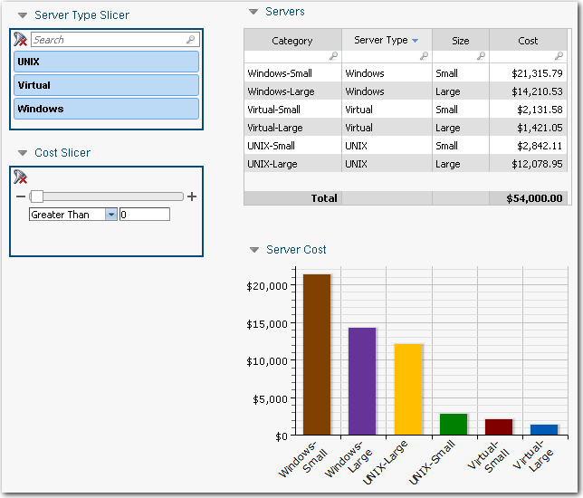
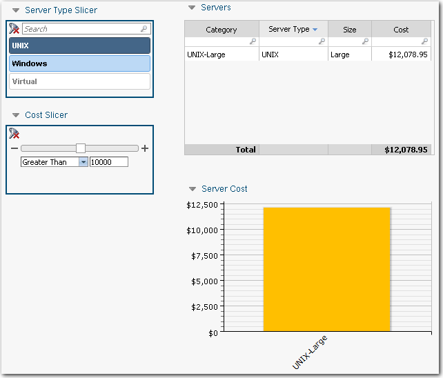
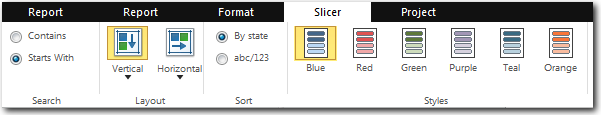

# Componente Slicer

**Aplica-se a** : TBM Studio 12.0 e posterior

Ao adicionar uma tabela ou um gráfico a um relatório, você toma decisões sobre os dados exibidos. Mas, e se você quiser que os usuários possam filtrar o relatório para atender às suas necessidades específicas? Você pode dar a eles essa capacidade adicionando segmentações ao relatório. Uma amostra de relatório com duas segmentações é mostrada na imagem a seguir. Os fatiadores estão à esquerda:

Você pode filtrar o relatório por tipo de servidor e custo. A imagem a seguir mostra o mesmo relatório filtrado para UNIX e Maior que 10.000. Este tópico e seus subtópicos se concentram na criação de slicers. Os fatiadores só funcionam com tabelas e gráficos criados com a caixa de diálogo Configuração de componentes ad hoc. Eles não funcionam com tabelas e gráficos herdados.

## Guia Slicer

Depois de adicionar um slicer a um relatório, você controla sua aparência e funcionalidade usando a guia Slicer:

## Pontos principais

Veja abaixo os principais pontos sobre a criação e o uso de slicers:

- Os fatiadores só funcionam com tabelas e gráficos do Ad Hoc Query. Eles não funcionam com tabelas e gráficos herdados.
- Os fatiadores devem ser adicionados a um relatório pela pessoa que está criando o relatório. Os usuários finais não podem criar slicers quando estão visualizando um relatório.
- Somente os usuários atribuídos a uma função de administrador ou analista podem criar slicers.
- Os fatiadores adicionados a um relatório estão disponíveis para todos os usuários do relatório.
- Os fatiadores exibem apenas valores do mês atual, mesmo que as tabelas anualizadas no relatório exibam entradas do ano inteiro.
- `!ALL_ROWS` é ativado por padrão em todos os projetos. Quando `!ALL_ROWS` estiver ativado, os fatiadores exibirão todos os valores, inclusive aqueles que talvez não tenham nenhuma entrada no período atual. Se o site `!ALL_ROWS` estiver desativado nas Configurações do projeto, as segmentações exibirão apenas os valores do mês atual, mesmo que as tabelas anualizadas do relatório exibam entradas do ano inteiro.

  Exemplo

  | Fornecedor | Período | Gastos |
  | --- | --- | --- |
  | IBM | Jan | 100 |
  | IBM | Fev | 100 |
  | IBM | Mar | 100 |
  | Cisco | Jan | 100 |
  | Cisco | Fev | 100 |

  Neste exemplo, temos as despesas do fornecedor de IBM de janeiro a março e as despesas do fornecedor da Cisco somente em janeiro e fevereiro.
  - Se `ALL_ROWS` estiver ativado, no Período Mar, tanto IBM quanto Cisco aparecerão no fatiador Vendor Name (Nome do fornecedor).
  - Se `ALL_ROWS` estiver desativado, no Período Mar, somente IBM aparecerá no divisor Nome do fornecedor
- Os valores selecionados em dois ou mais slicers são combinados usando a lógica AND. Os valores selecionados no mesmo slicer são combinados usando a lógica OR.
- Os fatiadores que não estão em uma caixa de grupo se aplicam a todas as tabelas e gráficos do relatório (mesmo aqueles em grupos e grupos aninhados). Os fatiadores em uma caixa de grupo só se aplicam às tabelas e aos gráficos dentro da caixa de grupo e a todas as caixas de grupo aninhadas.
- Os fatiadores em uma guia se aplicam somente às tabelas e aos gráficos na mesma guia.
- Os fatiadores são aplicados imediatamente quando você edita tabelas e gráficos em relatórios.
- Os fatiadores podem ser hierárquicos.
- Um slicer pode exibir apenas 250 valores. Se houver mais valores, uma mensagem será exibida na parte inferior do fatiador.
- Se você imprimir um relatório, os slicers também serão impressos para preservar as informações sobre como o relatório foi filtrado.

## Combinação de fatiadores em um fatiador compacto

Se você quiser colocar vários slicers em um relatório, mas não quiser que eles ocupem uma grande área do relatório, crie um slicer compacto. Um exemplo é mostrado na imagem a seguir. Para obter mais informações, consulte [Cortadores compactos](compact-slicers.htm "(Abre em uma nova guia ou janela)").

## Detalhes específicos do fatiador

Os fatiadores são descritos em detalhes nos tópicos a seguir:

- [Adicionar fatiadores](add-slicer.htm "(Abre em uma nova guia ou janela)")
- [Organizar os valores do fatiador](arrange-slicer-values.htm "(Abre em uma nova guia ou janela)")
- [Estados e valores do fatiador](slicer-states-and-values.htm "(Abre em uma nova guia ou janela)")
- [Cortadores de filtros](filter-slicers.htm "(Abre em uma nova guia ou janela)")
- [Selecione uma opção de pesquisa](select-search-option.htm "(Abre em uma nova guia ou janela)")
- [Fatiador compacto](compact-slicers.htm "(Abre em uma nova guia ou janela)")
- [Fatiador hierárquico](hierarchical-slicers.htm "(Abre em uma nova guia ou janela)")
