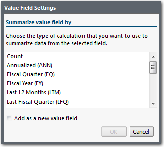
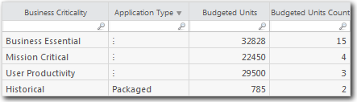
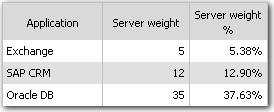
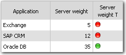
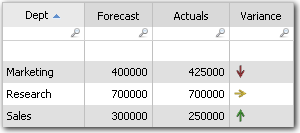
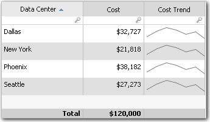
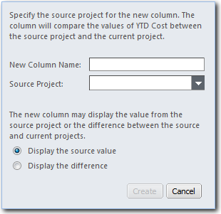
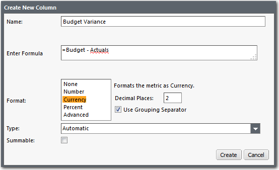

# Adicionar uma coluna calculada a uma tabela

**Aplica-se a** : TBM Studio 12.0 e posterior

Se você tiver adicionado campos à área **Valores** do painel **Configuração de componentes**, poderá adicionar colunas calculadas à tabela com base nos valores. Há três tipos de colunas calculadas:

- **Valores** - São valores calculados com base em uma coluna existente na tabela. Os exemplos incluem Contagem, Porcentagem e Soma. Os cálculos disponíveis dependerão da coluna que você selecionar.
- **Comparação** - Compara os valores em uma coluna com os mesmos valores de outro projeto. Isso é útil para comparações ano a ano.
- **Variance (Variação** ) - Exibe a diferença entre duas colunas na tabela.

## Adicionar uma coluna de valores

1. Selecione a tabela.
2. No painel **Configuração de componentes**, clique com o botão direito do mouse em um campo na área **Valores** e clique em **Configurações do campo de valor**. O aplicativo exibe a caixa de diálogo **Value Field Settings (Configurações do campo de valor** ) mostrada na imagem a seguir:

   
3. Selecione o tipo de cálculo. Para obter uma descrição dos tipos de cálculos, consulte *Tipos de cálculos* abaixo.
4. Se você quiser substituir uma coluna existente pelos valores calculados, desmarque a opção **Adicionar um novo campo de valor**.

## Tipos de cálculos

Os cálculos disponíveis dependem do valor selecionado. Vários dos tipos mais comuns de cálculos são descritos a seguir. Para ver uma descrição pop-up de um cálculo no produto, passe o ponteiro do mouse sobre o nome do cálculo.

- **Count** - Retorna o número de entradas representadas por uma linha. Em tabelas não agrupadas, o valor será 1. Em tabelas agrupadas, esse será o número de entradas representadas por uma entrada de vários () na coluna de origem. Um exemplo é mostrado na imagem a seguir.

  
- **Percentual** - Adiciona uma coluna à tabela que exibe a porcentagem com que cada entrada em uma coluna contribui para o valor total da coluna. O nome padrão da coluna será o nome da coluna original seguido do sinal %. Um exemplo é mostrado na imagem a seguir.

  
- **Ícones de** limite - Exibe ícones vermelhos e verdes com base em um valor de limite. Um ícone vermelho é exibido para valores abaixo do limite. Um ícone verde é exibido para valores acima do limite. Um exemplo é mostrado abaixo. O nome padrão da coluna será o nome da coluna original seguido da letra T:

  
- **Setas de zero** - Exibe uma seta para cima para valores maiores que zero, uma seta lateral para valores iguais a zero e uma seta para baixo para valores menores que zero.

  
- **Sparkline Trend** - Exibe um pequeno gráfico de tendências que abrange os últimos seis meses. Um exemplo é mostrado na imagem a seguir.

  

## Adicionar uma coluna de comparação entre projetos

Para comparar números entre projetos, adicione uma coluna de comparação entre projetos à tabela. Por exemplo, você pode querer comparar os custos do servidor do projeto atual com os custos do servidor do ano anterior. As colunas de comparação devem ser baseadas em uma métrica.

Para adicionar uma coluna de comparação:

1. Selecione uma coluna na tabela e clique no ícone **Comparação** no **Formulastab**, ou clique com o botão direito do mouse em um título de coluna e selecione **Adicionar coluna de comparação** no menu pop-up. O aplicativo exibe a caixa de diálogo mostrada na imagem a seguir

   
2. Digite um nome para a nova coluna.
3. Selecione o projeto de origem na lista suspensa.
4. Selecione a opção de exibição: valor de origem ou difference.You pode adicionar uma coluna de origem e uma de diferença na mesma tabela.
5. Clique em **OK**.

## Adicionar uma coluna de variação

Uma coluna de variância calcula a diferença entre duas colunas em uma tabela. Por exemplo, se você tiver uma coluna de orçamento e uma coluna real em uma tabela, poderá adicionar uma coluna de variação para mostrar a diferença.

Para adicionar uma coluna de variação:

1. Mantenha pressionada **a tecla Ctrl** e selecione as duas colunas da tabela. A segunda coluna selecionada será subtraída da primeira coluna selecionada.
2. Clique no ícone **Variance (Variação** ) na guia **Formulas (Fórmulas** ). O aplicativo exibe a caixa de diálogo **Create New Column (Criar nova coluna** ), mostrada na imagem a seguir. Ele subtrai o valor da segunda coluna da primeira coluna da primeira coluna.

   
3. Digite um nome para a coluna.
4. Revise a fórmula e modifique-a, se for o caso.
5. Selecione o formato da coluna. O **separador de agrupamento** é o caractere que separa "milhares"
6. Selecione um tipo.
   - **Automático** : O aplicativo escolhe um formato com base no conteúdo da coluna.
   - **Numérico** : número inteiro ou real.
   - **Rótulo** : Texto. Não é possível realizar operações matemáticas em colunas de rótulos.
   - **Data** : Informações sobre a data.
7. Se for o caso, marque a opção **Totalizável**. Quando marcada, especifica que a coluna pode ser somada com segurança ao ser agrupada ou totalizada. Normalmente, os valores são recalculados. Isso permite que uma pesquisa global (que faz referência à chave que está sendo usada para agrupar os dados) seja totalizada corretamente. Não selecione essa opção se a fórmula de valor realizar cálculos, ou o resultado será incorreto. Se você planeja adicionar subtotais à tabela e não deseja que os subtotais sejam exibidos para a coluna, deixe esse campo desmarcado.

## Adicionar uma coluna espaçadora

Se quiser inserir uma coluna **espaçadora** em branco em uma tabela por motivos estéticos, selecione a tabela, clique na guia **Data (Dados)** e clique em **Insert Spacer Column (Inserir coluna espaçadora** ) no menu do ícone **Inserir**.
