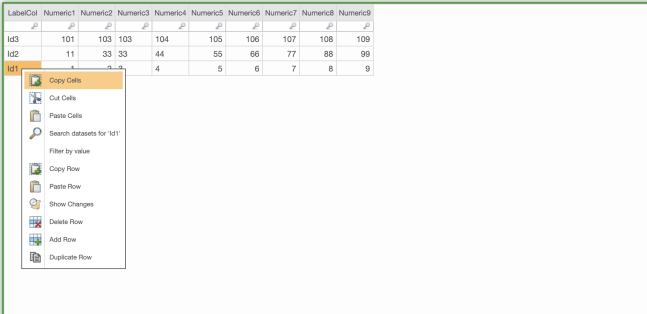

# Adicionar linha duplicada

O recurso Duplicate Row melhora e simplifica o mapeamento dividido. O botão de linha duplicada aparecerá no menu do botão direito do mouse no ET ou no relatório com ET. Esse botão terá a mesma permissão que a operação de adicionar linha, pois duplicar uma linha é semelhante a adicionar uma nova linha, mas com algum conteúdo. A linha duplicada será adicionada logo abaixo da linha que está sendo duplicada. Ele funciona tanto para tabelas editáveis brutas quanto enriquecidas. Ele permite que o usuário aloque uma linha a mais de um item para que os custos possam ser divididos entre vários itens. A duplicação de várias linhas é permitida mesmo antes de salvá-las. As linhas não desaparecerão se o número máximo de linhas na tabela for atingido e a paginação for acionada. O usuário pode desativar essa opção no nível da tabela. Essa função duplicará todas as colunas visíveis e ocultas. A coluna autoincrementada continuará oculta, mas para colunas que impõem exclusividade na tabela:

- Preencher previamente com o valor incrementado se o incremento automático estiver ativado.
- Defina como vazio, mas realce conforme necessário se não for incrementado automaticamente.

## Navegação

1. Clique com o botão direito do mouse em uma célula e clique em **Duplicate Row (Duplicar linha)**

   
2. A nova linha duplicada aparece logo abaixo da linha original. Se for uma tabela editável em branco, todos os campos dessa linha serão duplicados, independentemente de estarem ou não incluídos em "Included Columns" (Colunas incluídas).
3. Edite a linha conforme desejado.
4. Clique em "Salvar"

Observação: A linha duplicada nem sempre mantém sua posição abaixo da linha original, devido à forma como as tabelas editáveis são classificadas.

## Exemplo

Esta é a tabela editável com quatro colunas, antes de duplicar a linha.

No entanto, apenas duas colunas estão incluídas no relatório. Vamos duplicar a terceira linha.

Observação: A linha duplicada nem sempre mantém sua posição abaixo da linha original, devido à forma como as tabelas editáveis são classificadas. Ele exibe valores em todas as colunas, correspondendo à linha original, a menos que seja alterado ou removido manualmente.
