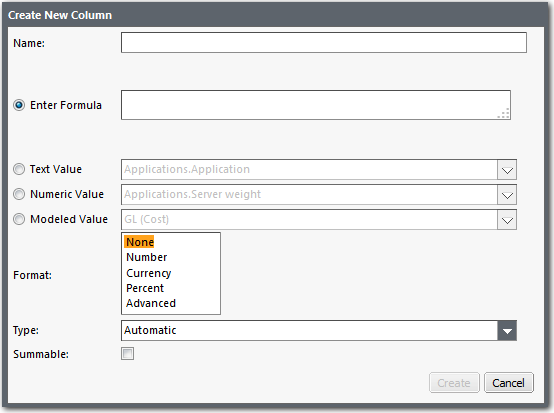
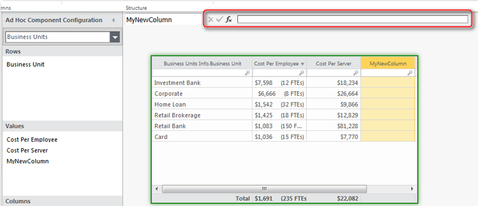

# Adicionar uma coluna de fórmula a uma tabela

**Aplica-se a** : TBM Studio 12.0 e posterior

Você pode adicionar uma coluna de fórmula a uma tabela. A coluna pode se basear em uma fórmula personalizada, nas colunas do conjunto de dados que fazem o backup da tabela ou em um valor modelado. Por exemplo, talvez você queira realizar alguns cálculos complexos com base em duas ou mais colunas da tabela. Ao se referir a colunas em uma tabela, certifique-se de usar o formato table.column para os nomes das colunas.

## Adicionar uma coluna de fórmula

Uma coluna de fórmula obtém valores de outras colunas da tabela e de cálculos. Ao se referir a colunas em uma tabela, certifique-se de usar o formato table.column para os nomes das colunas.

Para adicionar uma coluna de fórmula a uma tabela:

1. Selecione a tabela.
2. Na guia **Dados**, abra o menu **Inserir** e clique em **Inserir coluna de fórmula**. A caixa de diálogo **Create New Column (Criar nova coluna** ) é exibida, conforme mostrado na imagem a seguir:

   Observação: Se você clicar em **Inserir** nos **Dados** em vez de abrir o menu, uma coluna em branco chamada **MyNewColumn** será adicionada à tabela. Para adicionar uma fórmula à coluna, clique no nome da coluna para destacá-lo e, em seguida, clique em **Editar** na guia **Dados**.
3. Preencha os campos usando as informações fornecidas na tabela abaixo.
   - **Nome** - Aceita todos os caracteres alfa numéricos padrão.
   - **Inserir fórmula** - Qualquer fórmula que siga a sintaxe de fórmula do relatório. Ao usar colunas em fórmulas, certifique-se de usar o formato *table.column* para o nome de uma coluna. Quando você começar a digitar no campo, o aplicativo exibirá uma lista de valores que correspondem ao que você digitou. Para obter informações, consulteSintaxe [para fórmulas e funções](../../formulas-and-functions/syntax-for-formulas-and-functions.html "Aplica-se a: TBM Studio 12.0 e posterior"). Observe que a tabela Enriched Editable suportará a seleção da coluna Formula como chave primária.
   - **Valor de texto** - Selecione essa opção para usar dados de uma coluna de texto na tabela.
   - **Valor numérico** - Selecione essa opção para usar os dados de uma coluna numérica na tabela**.Valor modelado** - Selecione essa opção para usar os dados de um driver. Essa opção está disponível apenas para tabelas em relatórios de objetos gerados automaticamente**.Formato** - Selecione o formato apropriado. Se você selecionar **Advanced**, poderá inserir uma fórmula que defina o formato.
   - **Formato** - Selecione o formato apropriado. Se você selecionar **Advanced**, poderá inserir uma fórmula que defina o formato.
   - **Tipo** - Selecione um dos quatro tipos de coluna:
     - **Automático** - O aplicativo escolhe um formato com base no conteúdo da coluna.
     - **Numérico** - Número inteiro ou real.
     - **Rótulo** - Texto. Não é possível realizar operações matemáticas em colunas do Label
     - **Data** - Informações sobre a data.
   - **Summable (Somável** ) - Quando marcada, especifica que a coluna pode ser somada com segurança ao ser agrupada ou totalizada. Normalmente, os valores são recalculados. Isso permite que uma pesquisa global (que faz referência à chave que está sendo usada para agrupar os dados) seja totalizada corretamente. Não selecione essa opção se a fórmula de valor realizar cálculos, ou o resultado será incorrect.If você planeja adicionar subtotais à tabela e não deseja que os subtotais sejam exibidos para a coluna, deixe esse campo desmarcado.

## Editar uma coluna de fórmula

Se você tiver adicionado uma coluna de fórmula a uma tabela, poderá editar a coluna selecionando-a e clicando em **Editar** na guia **Dados**. O aplicativo exibe a caixa de diálogo **Editar coluna**, que é idêntica à caixa de diálogo **Criar nova coluna** mostrada na Figura A acima. Observe que, nas colunas numéricas, de moeda e de porcentagem, você pode definir o número de casas decimais. A opção **Usar separador de agrupamento** adiciona o separador de "milhares" apropriado (vírgula, ponto ou espaço) ao número com base na localidade definida para o projeto.

## Editar uma fórmula

Você pode editar a fórmula de uma coluna usando a barra Fórmula no painel de edição do relatório, conforme mostrado na imagem a seguir. À medida que você editar a fórmula, será exibida uma lista de funções, nomes de objetos, tabelas e colunas disponíveis. Selecione uma entrada na lista com o mouse ou com a seta para a entrada e pressione a tecla Tab. Para salvar uma fórmula, clique no ícone de salvar  à esquerda da barra de fórmulas.

## Ocultar uma coluna de fórmula

É possível ocultar uma coluna de fórmula que você adicionou a uma tabela. Para ocultar uma coluna, clique com o botão direito do mouse na coluna na área **Linhas** ou **Valores** do painel **Configuração de Competentes** e selecione **Ocultar**.

## Excluir uma coluna de fórmula

1. Selecione a tabela.
2. Na caixa de diálogo **Configuração de componentes**, arraste o nome da coluna para fora da área **Valores**.
