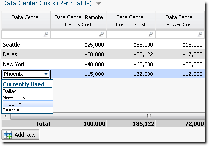
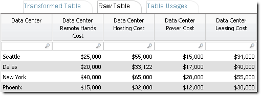
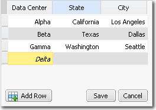
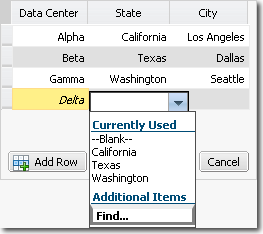
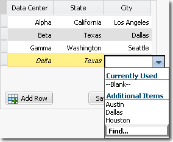
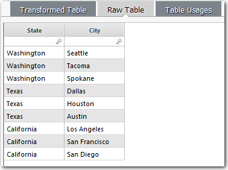

# Adicionar uma lista a uma tabela editável

**Aplica-se a** : TBM Studio 12.0 e posterior

Se quiser que os usuários possam selecionar um valor para uma célula em uma tabela editável, você pode adicionar uma lista à célula, conforme mostrado na imagem a seguir. Os valores da lista são extraídos de uma coluna de tabela definida no conjunto de dados.



Em uma lista, o aplicativo exibe os primeiros 15 valores exclusivos nos dados de origem. Se a lista contiver mais de 15 valores, um botão **Localizar** será exibido na parte inferior da lista. Clicar no botão Localizar exibe uma caixa de diálogo em que o usuário pode selecionar a partir de toda a lista de valores.

## Criar uma lista básica

1. Na guia **Data (Dados** ), selecione o conjunto de dados que é a fonte da tabela editável.
2. Na guia **Edit Columns (Editar colunas** ), selecione a coluna que fornecerá os valores para a lista suspensa exibida nas células.
3. No campo **Possible Values (Valores possíveis** ) no painel **Column Details (Detalhes da coluna** ), insira uma lista de valores separados por vírgula ou insira a seguinte fórmula para usar uma lista de valores de uma coluna em uma tabela:
   - Digite uma instrução de seleção:`%tablename /TableFunction[ ]`Para os exemplos mostrados na imagem anterior, a instrução de seleção é:

     ```
     %Data Center Costs/!LIMIT_COLUMNS[Data
                   Center]
     ```
   - A instrução de seleção usa valores da tabela bruta mostrada abaixo. O!A parte LIMIT\_COLUMNS do comando diz ao aplicativo para exibir somente a coluna Data Center.

     
   - Para fornecer contexto adicional aos usuários, é possível inserir qualquer número de colunas separadas por vírgulas. A primeira coluna da lista será o valor inserido no exemplo editável table.For :

     ```
     %Data Center
                   Costs/!LIMIT_COLUMNS[Data Center,Remote Hands Cost, Data Center Power Cost,Data
                   Center Leasing Cost]
     ```
   - No exemplo acima, um usuário pode clicar em Find... para ver quatro colunas em uma caixa de diálogo de seleção pop-up, embora apenas o valor do Data Center seja armazenado na tabela editável.
   - Além disso, você pode usar texto dinâmico no campo **Possible Values (Valores possíveis** ) para tornar os valores exibidos na lista dependentes do valor em uma coluna na linha. Para obter mais informações, consulte [Gerar uma lista com texto dinâmico](#Addalisttoaneditabletable__Generatealistwithdynamictext).
4. No campo **Contexto de valores possíveis**, selecione **Relatório**.
5. No painel **Detalhes da coluna**, na guia **Editar colunas**, selecione a opção **Chave primária**. Se você não quiser usar a chave primária da tabela de dados de pesquisa, poderá usar a opção!Função GROUPBY na instrução de seleção **Possible Values (Valores possíveis** ). A sintaxe é:`%tablename
   /!GROUPBY[column name]`

## Permitir que os usuários editem uma lista

Se quiser que os usuários possam editar os valores em uma lista, crie um conjunto de dados com os valores padrão e, em seguida, copie e cole a tabela de conjunto de dados brutos em um relatório. A tabela no relatório será editável, e os usuários poderão adicionar, editar e excluir entradas na tabela. Faça referência ao conjunto de dados no campo **Valores possíveis** quando você criar a lista.

## Gerar uma lista com texto dinâmico

Uma lista pode conter valores com base no valor de outra coluna da tabela. Por exemplo, suponha que você queira que os usuários possam inserir novos nomes de data centers juntamente com o estado e a cidade em que os data centers estão localizados. Quando um usuário clica em **Add Row**, ele pode inserir um nome para o data center, selecionar um estado em uma lista suspensa e, em seguida, selecionar uma cidade dentro do estado selecionado. Somente as cidades do estado selecionado são exibidas. As três etapas são mostradas abaixo:







Para criar as listas:

1. Crie um conjunto de dados que inclua os estados e as cidades, conforme mostrado na imagem a seguir:

   

   Em nosso exemplo, o conjunto de dados é denominado States-Cities (Estados-Cidades).
2. Abra o conjunto de dados que incorporará as listas e selecione a guia **Edit Columns (Editar colunas** ).
3. Selecione a coluna State (Estado) e digite o seguinte no campo **Possible Values (Valores possíveis** ):`%States-Cities/!LIMIT_COLUMNS[State]`Isso exibe os valores na coluna State (Estado) quando um usuário clica em uma célula da coluna.
4. Deixe o campo **Possible Values Context (Contexto de valores possíveis** ) definido como **Report (Relatório** ).
5. Selecione a coluna City (Cidade) e digite o seguinte no campo **Possible Values (Valores possíveis** ):`%States-Cities/!FILTER[State="<%=State%>"]/!LIMIT_COLUMNS[City]`A parte `!FILTER[State="<%=State%>]` da instrução diz ao aplicativo para examinar o valor na coluna State (Estado) e exibir apenas as cidades que correspondem ao estado.
6. No campo **Possible Values Context (Contexto de valores possíveis** ), selecione **Current Row (Linha atual** ).
