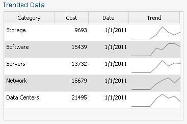

# Adicionar uma coluna Sparkline a uma tabela

**Aplica-se a** : TBM Studio 12.0 e posterior

Para mostrar dados de tendências, adicione uma coluna de sparkline a uma tabela. Na imagem a seguir, os sparklines são exibidos na coluna **Trend**. Os dados podem ser rastreados tanto para trás quanto para frente no tempo. Para que os sparklines funcionem, a tabela deve ter uma coluna de chave primária que persista durante todo o tempo da tendência. Além disso, deve haver dados para cada mês.

Os indicadores de status estão intimamente relacionados aos sparklines. Os indicadores de status são ícones que indicam o estado atual dos dados, como acima ou abaixo de um determinado valor. Os indicadores de status são descritos em [Adicionar uma coluna de indicador de status a uma tabela](add-status-indicators-to-tables.htm "(Abre em uma nova guia ou janela)").

Para adicionar sparklines a uma tabela:

1. Selecione a coluna de valor na tabela para a qual você deseja criar uma tendência no minigráfico.
2. Clique na guia **Fórmulas**.
3. No menu do ícone **Dates**, clique em **Sparkline Trend**. A coluna é adicionada à fórmula table.The é `=Sparkline(past,future,column).` Os argumentos são descritos abaixo:
   - **Passado** é o número de períodos que a linha de tendência retrocederá no tempo. Esse deve ser um número positivo.
   - **Futuro** é o número de períodos que a linha de tendência avançará no tempo. Esse deve ser um número positivo.
   - **Coluna** é o nome da coluna que contém os dados para os quais você deseja criar tendências.

Por exemplo, a fórmula abaixo fará com que os dados da coluna Custo tenham uma tendência de retrocesso e avanço de 4 meses.

> =SPARKLINE( 4,4,Cost )
