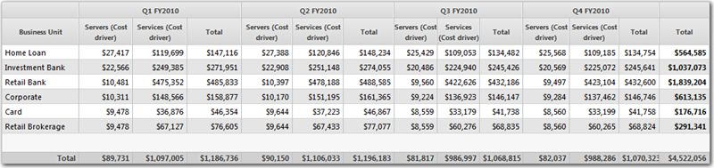

# Adicionar uma coluna de total a uma tabela

**Aplica-se a** : TBM Studio 12.0 e posterior

Você pode adicionar uma coluna de total de tabela e colunas de total de grupos a uma tabela. Uma coluna de total de tabela mostra o total de todas as colunas visíveis na tabela. As colunas ocultas não são incluídas no total. Na imagem a seguir, uma coluna de total é exibida para cada grupo trimestral e uma coluna de total é exibida para as linhas:

*Figura A. Uma tabela que exibe colunas totais para cada grupo e uma coluna total para uma linha inteira*

Observação: Se uma tabela tiver colunas de total e você converter a tabela em um gráfico de barras, as colunas de total não serão incluídas no gráfico.

## Adicionar uma coluna de linha total

1. Selecione a tabela.
2. Na guia **Data (Dados** ), clique em **Sum (Soma** ).
3. Clique em **Show Total Column (Mostrar coluna total** ).

## Adicionar colunas de total de grupo

1. Selecione a tabela.
2. Na guia **Data (Dados** ), clique em **Sum (Soma** ).
3. Clique em **Show Group Total Columns**.
