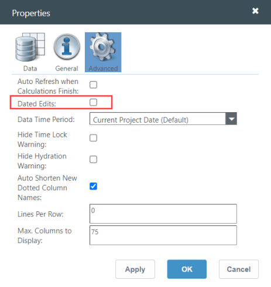
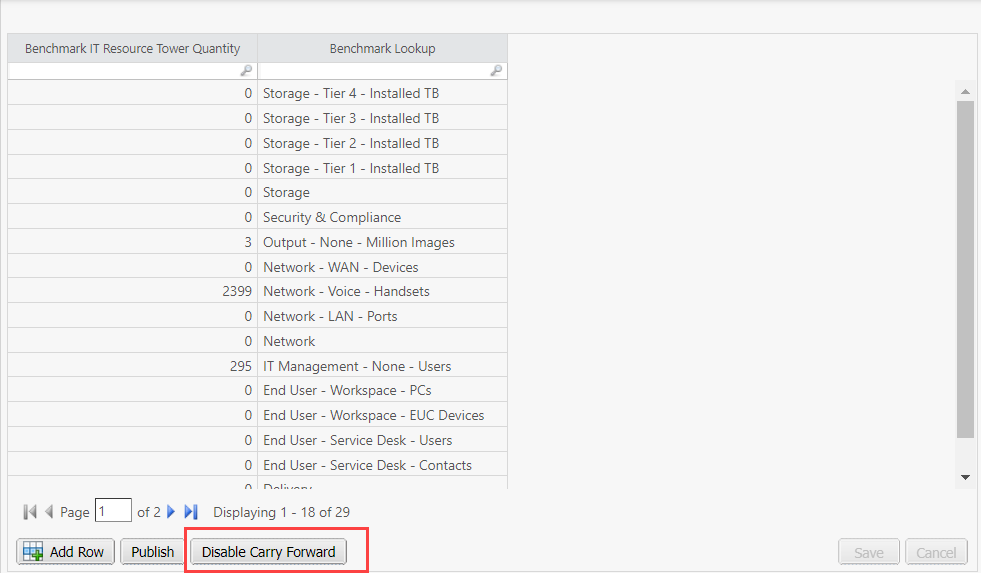
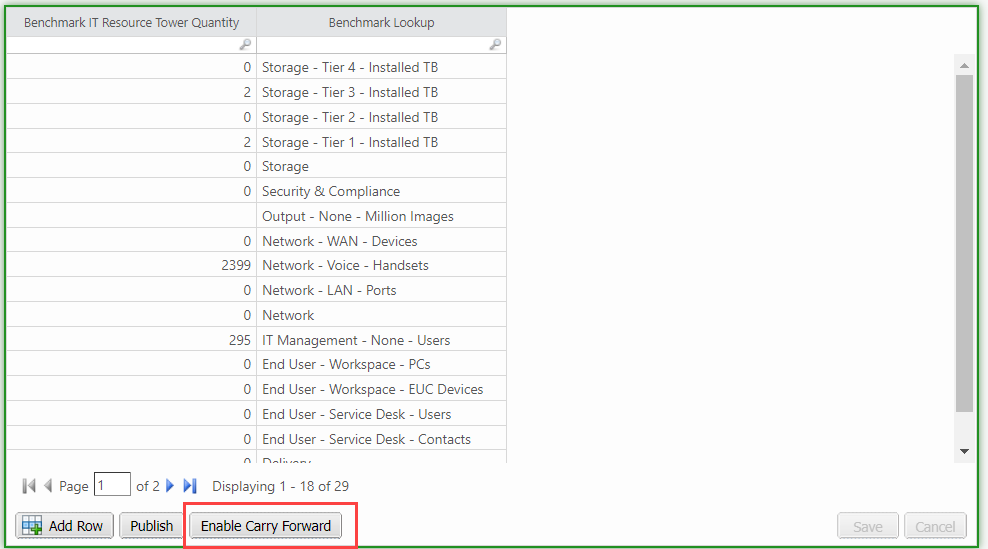

# Transporte

Essa função permite que o usuário leve adiante os valores numéricos em um relatório de tabela editável (ET).

Para ativar esse recurso, navegue até a janela pop-up [Propriedades avançadas](set-table-properties.htm "(Abre em uma nova guia ou janela)").

Marque a caixa de seleção **Edição de dados** para ativar o recurso de transporte. O botão **Disable Carry Forward (Desativar transporte)** aparece abaixo do componente do relatório.

Observação: o transporte é aplicável somente para valores numéricos e colunas consecutivas. Se houver uma coluna não numérica no meio, o transporte não será aplicado a partir de então.

Se o usuário selecionar **Disable Carry Forward (Desativar** transporte), o transporte será desativado e o botão aparecerá como **Enable Carry Forward (Ativar** transporte).

O comportamento de transporte é aplicável somente à sessão local e não persiste. Portanto, toda vez que o usuário retornar, ele estará no estado padrão de transporte ativado.
