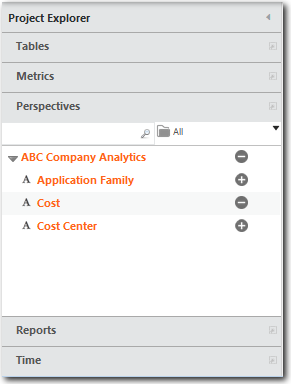
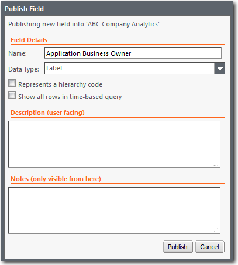

# Criar perspectivas personalizadas em relatórios

**Aplica-se a** : TBM Studio 11.0

Para ampliar as perspectivas padrão de **Tabelas**, **Métricas** e **Tempo**, você pode criar perspectivas personalizadas. Na ilustração abaixo, há uma perspectiva personalizada: ABC Company Analytics. Uma perspectiva personalizada contém campos selecionados de outras perspectivas que você deseja disponibilizar aos usuários corporativos. Uma vantagem das perspectivas personalizadas é que você pode adicionar campos de várias tabelas diferentes e bloquear os campos na tabela. Isso possibilita a criação de relatórios que contêm dados de várias tabelas em diferentes níveis em um modelo. Além disso, é melhor usar apenas campos bloqueados para tabelas em seus relatórios de produção.

Assista a estes vídeos de demonstração do Apptio Education Services:

- [Criar uma perspectiva personalizada](https://community.apptio.com/videos/1892 "(Abre em uma nova guia ou janela)")
- [Adicionar uma coluna de taxa](https://community.apptio.com/videos/1893 "(Abre em uma nova guia ou janela)")

Ou navegue por [todos os vídeos do site Apptio](https://community.apptio.com/docs/DOC-7714 "(Abre em uma nova guia ou janela)").

## Criar uma perspectiva personalizada

Para criar uma perspectiva personalizada e adicionar campos a ela:

1. Clique com o botão direito do mouse na seção **Perspectivas** do **Project Explorer** e clique em **Adicionar nova perspectiva**.
2. Na caixa de diálogo Criar perspectiva, digite o nome da perspectiva e clique em OK.

## Adicionar um campo a uma perspectiva personalizada

Para adicionar um campo a uma perspectiva personalizada:

1. Arraste um campo das seções **Tabelas**, **Métricas** ou **Tempo** no **Project Explorer** para o cabeçalho **Perspectivas** no **Project Explorer**.
2. Quando solicitado, selecione uma perspectiva e clique em **OK**.
3. Preencha os campos na caixa de diálogo Publicar campo.
4. Preencha os campos e clique em **Publicar**. Os campos são descritos abaixo.

**Descrições de campo:**

- **Nome** - O nome do campo. Você pode aceitar o nome padrão ou alterar o nome. Se você for bloquear o objeto, uma prática recomendada é incluir o nome do objeto no nome do campo.
- **Data Type (Tipo de dados** ) - Selecione um tipo de dados na lista. O tipo controla a formatação básica dos dados.
- **Bloquear para objeto** - Esse campo é exibido quando você publica um campo de dados. Quando marcada, ela garante que o campo será aplicado somente ao objeto selecionado quando ele foi adicionado à perspectiva. Se você não marcar essa opção, o campo será aplicado ao relatório de objeto selecionado no momento.
- **Representa um código de hierarquia** - Aplica-se somente a fatiadores. Quando marcado, e o campo publicado é usado para definir um fatiador, ele encontra todos os valores que começam com os caracteres de pesquisa inseridos pelo usuário mais um caractere adicional e cria um grupo de fatiadores para cada um deles. Por exemplo, se o usuário digitar "ab", o filtro encontrará "aba", "abc" e "abd" e criará grupos para cada um deles. Para obter uma discussão mais detalhada sobre essa opção, consulte [Representação de códigos de hierarquia em perspectivas](../hierarchy-codes-perspectives.htm "(Abre em uma nova guia ou janela)").
- **Show all rows in time-based query (Mostrar todas as linhas na consulta baseada em tempo** ) - Quando marcada, se uma tabela ou gráfico for baseado em tempo (por exemplo, g.: meses, trimestres, etc.), todas as linhas serão exibidas em todos os períodos, mesmo que um ou mais períodos contenham linhas com zeros em todos os fields.You deve marcar essa opção em todos os cálculos que incluam uma função que extraia dados de outros períodos. Por exemplo, PreviousYear e YearToDate. Para obter uma discussão mais detalhada sobre essa opção, consulte [Mostrar todas as linhas na consulta baseada em tempo](#Createcustomperspectivesinreports__Showallrowsintimebasedqueryoption).
- **Descrição** - O texto inserido no campo é exibido como uma dica de ferramenta quando o usuário passa o ponteiro do mouse sobre o campo. Use esse campo para fornecer informações aos analistas sobre os dados representados pelo campo. Isso é importante porque os analistas podem não estar familiarizados com os conjuntos de dados do projeto e o nome do campo pode não transmitir o conteúdo. A inserção de uma explicação completa dos dados ajudará os analistas a usar o campo de forma eficaz ao criar tabelas e gráficos.
- **Notas** - Informações para outros usuários avançados que podem editar o campo.
- **Filtro** - Esse campo é exibido se você estiver publicando um campo da área **Filtro**. Esse é um campo não editável.
- **Fórmula** - Esse campo é exibido se houver uma fórmula associada ao campo. Você pode editar a fórmula.

## Mostrar todas as linhas na opção de consulta baseada em tempo

Algumas tabelas baseadas em tempo podem ter uma ou mais linhas que não têm valores para um ou mais períodos de tempo. Por padrão, as linhas sem valores não são exibidas. Para garantir que todas as linhas sejam exibidas em todos os períodos, marque a opção **Mostrar todas as linhas na consulta baseada em tempo**.

Por exemplo, suponha que você tenha uma tabela com os seguintes dados em janeiro e fevereiro:

FY2016 de janeiro

| **Coluna A** | **Coluna B** |
| --- | --- |
| X | 1 |
| Y | 2 |
| Z | 3 |

Fevereiro FY2016

| **Coluna A** | **Coluna B** |
| --- | --- |
| X | 4 |
| Z | 3 |

Você tem duas métricas calculadas: Custo e YearToDate(Cost ). Você adiciona colunas Cost e YTD à tabela para exibir as métricas.

Quando você estiver em fevereiro, a linha Y não será exibida.

| **Coluna A** | **Custo** | **YTD** |
| --- | --- | --- |
| X | $4 | 5 |
| Z | $3 | 6 |

No entanto, se você tiver marcado a opção, a linha Y será exibida.

| **Coluna A** | **Custo** | **YTD** |
| --- | --- | --- |
| X | $4 | 5 |
| Z | $3 | 6 |
| Y |  | 2 |

Além disso, você deve marcar essa opção em todos os cálculos que incluam uma função que extraia dados de outros períodos de tempo. Por exemplo, PreviousYear e YearToDate.

## Renomear uma perspectiva personalizada

Para alterar o nome de uma perspectiva personalizada, clique com o botão direito do mouse no nome da perspectiva e clique na opção **Renomear**.

## Criar uma dimensão

Você pode agrupar campos em uma perspectiva personalizada.

Para criar um grupo de campos e adicionar dimensões ao grupo:

1. Clique com o botão direito do mouse em uma perspectiva personalizada e clique em Add New Group (Adicionar novo grupo).
2. Arraste as dimensões de uma área para o grupo.

## Excluir uma dimensão

Para excluir uma dimensão de uma perspectiva personalizada, clique com o botão direito do mouse e clique em **Excluir campo**.

## Excluir uma perspectiva

Para excluir, clique com o botão direito do mouse na barra de título da perspectiva e selecione Excluir.

## Criar uma perspectiva somente para administradores

Se você estiver atribuído a uma função de administrador, poderá criar perspectivas que sejam visíveis apenas para outros usuários com funções de administrador. Isso é útil para criar um local onde você pode armazenar dimensões usadas com frequência que não deseja que os analistas acessem.

Para criar uma perspectiva somente para administradores, coloque parênteses ao redor do nome da perspectiva.
