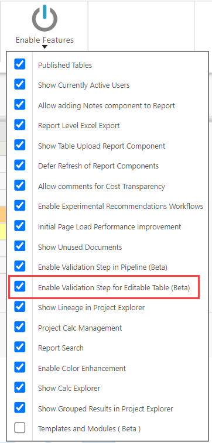

# Validação de dados para tabelas editáveis

Para ativar a validação de dados em theUI,, navegue até a guia **Project (Projeto** ) > **[**Enable Features (Ativar recursos**](../../admin/enable-features.htm "(Abre em uma nova guia ou janela)")** ) > e selecione a opção **Enable Validation Step for Editable Table (Beta) (Ativar etapa de validação para tabela editável** ).

Ao inserir dados corrompidos ou incorretos em uma tabela editável, uma mensagem de aviso ou erro será exibida perto do respectivo valor.

À medida que você corrigir os erros, as linhas validadas se moverão para baixo, e as linhas que ainda tiverem erros aparecerão na parte superior.

Você pode salvar e fazer o check-in do relatório apesar desses erros.
