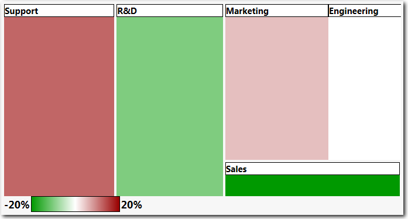
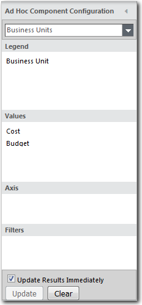

# Mapas de árvores

**Aplica-se a** : TBM Studio 12.0 e posterior

Uma das melhores maneiras de retratar as proporções relativas de valores é usar um mapa de árvore. Os mapas em árvore exibem retângulos aninhados que representam dados hierárquicos (estruturados em árvore). Um exemplo de mapa de árvore é mostrado na imagem a seguir:

## Exibir valores em um mapa de árvore

Um mapa em árvore pode exibir um único valor, como o custo, ou pode comparar dois valores, como o plano orçamentário e o real. Quando você compara valores, a cor é usada para indicar a variação entre os valores. Uma escala é exibida para ajudá-lo a avaliar o grau da variação.

A porcentagem de variação é calculada subtraindo o segundo valor do primeiro valor e dividindo o resultado pelo segundo valor. Por exemplo, suponha que você tenha os seguintes dados:

| Unidade de negócios | Custo | Orçamento | Variância |
| --- | --- | --- | --- |
| Vendas | 1.000 | 800 | -20% |
| Marketing | 2.000 | 2.100 | 5% |
| P&D | 3.000 | 2.700 | -11% |
| Suporte | 2.500 | 2.800 | 11% |
| Engenharia | 1.500 | 1.500 | 0% |

Você cria o gráfico usando as configurações mostradas na imagem a seguir:

## Criar um mapa de árvore

Para criar um mapa de árvore:

1. Criar uma tabela.
2. Selecione **Tree Map** na guia **Ad Hoc**.
3. Use as opções da guia **Tree Map** para configurar o mapa.

Observação: A visualização do Tree Map suporta até 4 colunas na legenda.
