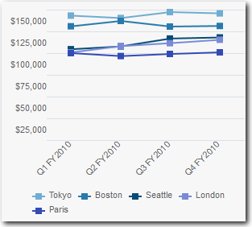
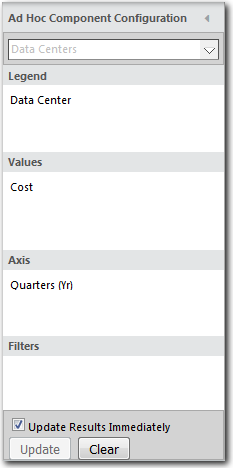

# Gráficos de tendências

**Aplica-se a** : TBM Studio 12.0 e posterior

Um gráfico de tendências exibe um valor à medida que ele muda ao longo do tempo. Por exemplo, você poderia criar uma tendência de custos de data center para os últimos quatro trimestres, conforme mostrado na imagem a seguir. Você cria tabelas baseadas em gráficos de tendências. Para criar um gráfico de tendências, arraste um campo de tempo para a área **Axis (Eixo** ) da caixa de diálogo **Ad Hoc Component Configuration (Configuração de componente ad hoc** ).

## Criar um gráfico de tendências

1. Selecione o ícone **Gráfico** no **relatório**.
2. Na caixa de diálogo **Configuração de componentes ad hoc**, arraste os campos para as áreas apropriadas.
3. Arraste um campo de tempo para a área Axis (Eixo).

   O gráfico mostrado na imagem anterior foi criado usando os campos mostrados na imagem a seguir:

   
4. Para definir o número de períodos exibidos no gráfico de tendências, clique com o botão direito do mouse no valor na área **Axis (Eixo** ) e selecione uma das opções:
   - **Este trimestre** - Exibe os três meses do trimestre fiscal atual.
   - **Este semestre** - Exibe os seis meses do semestre fiscal atual.
   - **Este ano** - Exibe os 12 meses do ano fiscal atual.
   - **Range (Intervalo** ) - Exibe uma caixa de diálogo na qual você pode definir o número de meses a serem mostrados, retrocedendo e avançando no tempo a partir do mês atual

## Bloquear o período de tempo

Por padrão, os gráficos de tendência apresentam tendências para frente e para trás em relação ao período de tempo selecionado no momento. Se quiser bloquear o gráfico de tendências para um período de tempo específico, defina o período de tempo usando o campo **Período de tempo dos dados** na guia **Avançado** da caixa de diálogo **Propriedades**.

Por exemplo, suponha que seu ano fiscal seja de janeiro a dezembro e você queira que um gráfico de tendências exiba os dados do ano fiscal independentemente do período selecionado no momento. Você deve definir **o Período de tempo da data** como **Início do ano fiscal atual**.
