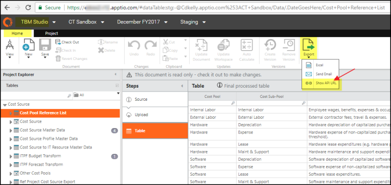
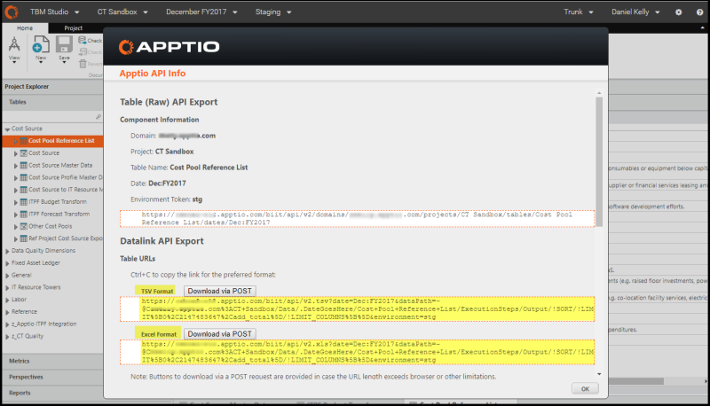
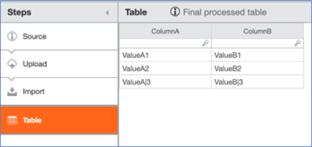

# API: Download de dados

**Aplica-se a** : TBM Studio v11.x, v12.0, v12.1, v12.2 e posteriores

Usando a API, você pode baixar tabelas brutas e também transformar tabelas na guia Data (Dados). Além disso, você pode fazer download de dados de tabelas e gráficos em relatórios. Você pode fazer download de dados no Excel (formato de arquivo.xls ou.xlsx). Para arquivos grandes, você pode usar o formato de arquivo TSV (.TSV).

## Autenticação

Para obter mais informações, consulte o link da comunidade [Autenticação de usuário usando APIs](https://community.ibm.com/community/user/viewdocument/user-authentication-using-apis?CommunityKey=44bcb0d2-5ce6-4504-89eb-019253d3b5d8&tab=librarydocuments "(Abre em uma nova guia ou janela)")

## Obtenção de URLs de API para tabelas

Navegue até uma tabela em TBM Studio. Selecione a guia **Home**, clique em **Export** no menu suspenso e, em seguida, selecione **Show API URL**.

É exibida uma caixa de diálogo modal que permite selecionar e copiar o URL apropriado:

## Obtenção de URLs de API para elementos de relatório

Clique com o botão direito do mouse na parte inferior das tabelas, em qualquer lugar de um gráfico ou use o menu suspenso no canto superior esquerdo dos elementos de relatório (se houver) e você terá um menu de contexto no qual poderá selecionar Show API URL :

É exibida uma caixa de diálogo modal que permite selecionar e copiar o URL apropriado:

## Alterar o delimitador

Em alguns casos, talvez você queira alterar o delimitador. Para fazer isso, você pode usar o argumento "delimiter" da seguinte forma, especificando um valor de codificação de caracteres hexadecimais (para pesquisar codificações de caracteres, consulte [esta página da Wikipedia](https://en.wikipedia.org/wiki/ASCII#Printable_characters "(Abre em uma nova guia ou janela)") ).

https://HOST/biit/api/v2/domains/DOMAIN/projects/PROJECT\_NAME/tables/TABLE\_NAME/dates/TIME\_PERIOD.tsv?delimiter=ENCODED\_CHARACTER

Por exemplo, se você quiser alterar o delimitador para que seja um caractere de pipe "|", você obterá o formato TSV URL, conforme mostrado anteriormente neste documento, e especificará o delimitador como “%7C”, que é a codificação hexadecimal para um caractere de pipe semelhante a esse:

https://customer.apptio.com/biit/api/v2/domains/customer.com/projects/Cost Transparência/tabelas/teste Table/dates/Jan:FY2020.tsv?delimiter=%7C

Às vezes, os dados podem conter o delimitador que você deseja usar. Para dar um exemplo, digamos que você esteja começando com uma tabela como a seguinte:

No entanto, você deseja usar o caractere pipe como delimitador. Observe que, na terceira linha, os valores incluem caracteres de pipe. Para usar o caractere pipe com êxito, você deve substituir os valores de dados por outra coisa. No exemplo a seguir, os caracteres de pipe ( %7C ) serão substituídos por vírgulas ( %2C ):

https://customer.apptio.com/biit/api/v2/domains/customer.com/projects/Cost Transparência/tabelas/teste Table/dates/Jan:FY2020.tsv?delimiter=%7C&delimiterReplacement=%2C

O download resultante terá a seguinte aparência:

ColumnA|ColumnB

ValueA1|ValueB1

ValueA2|ValueB2

ValueA,3|ValueB,3

## Download via API

Consulte um dos artigos a seguir para obter mais detalhes sobre como usar a API para executar um download:

- [Tutorial da API: Download e upload da tabela v.12 Costing Standard usando a ferramenta Postman](studio_tutorial.html)
- [Apptio Scripts de demonstração da API](studio_demo_scripts.html)
