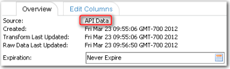

# API URL para fazer upload de uma tabela

♦ Aplica-se a: v11.x, v12.0, v12.1, v12.2+

Você pode fazer upload de dados para Apptio usando a linha de comando da API URL ou a ferramenta Apptio ETL (Extract, Transform, Load). As informações abaixo descrevem como usar a API URL. Para obter informações sobre a ferramenta ETL, consulte [https://community.apptio.com/docs/DOC-4223](https://community.apptio.com/docs/DOC-4223 "(Abre em uma nova guia ou janela)")[DataLink Scripts de amostra da API](../../../datalink-classic/api-dlc-sample-scripts.html).

## URL

Use o seguinte URL para fazer upload de uma tabela para Apptio :

```
https://[customerid].apptio.com/biit/api/v1/[domain]/[project]/[table]/[time-period]/[action
        | force]
```

Os parâmetros usados no site URL estão descritos abaixo. Os parâmetros com um asterisco (\*) são obrigatórios.

| Parâmetro | Descrição |
| --- | --- |
| ID do cliente\* | O ID atribuído ao cliente. |
| domínio\* | O domínio do cliente (ou seja, customer.com ). |
| projeto\* | O projeto dentro do domínio do cliente. |
| tabela\* | O nome da tabela em que os dados serão armazenados. |
| período de tempo\* | Uma designação de hora compatível com Apptio (ou seja, January:2000 ) ou atual para representar o mês:ano atual no calendário gregoriano. |
| ação | O comportamento a ser executado na tabela com os dados, seja Append ou Overwrite. Se você usar esse parâmetro, não use o parâmetro Force parameter.ValuesAppend: anexa os dados aos dados atuais set.Overwrite: remove os dados atuais e os substitui pelos novos dados**.OBSERVAÇÃO** : Se você precisar usar os parâmetros Action e Force, precisará incluir os parâmetros no corpo do POST em vez de no URL. |
| forçar | Usado para substituir as verificações de validade do conjunto de dados feitas pela função de importação do aplicativo. Se você usar esse parâmetro, não use o parâmetro Action. Valores:true: As verificações de validade serão overridden.false: As verificações de validade não serão substituídas. |

## Exemplo de URLs

Abaixo estão exemplos do site URL com os parâmetros incluídos no site URL.

| Exemplo | URL |
| --- | --- |
| O parâmetro Force tem como padrão false | biit/api/v1/[domain ]/[projeto]/[tabela]/[período de tempo]/overwrite |
| O parâmetro Force tem como padrão false | biit/api/v1/[domain ]/[projeto]/[tabela]/[período de tempo]/append |
| O parâmetro de ação tem como padrão a substituição | biit/api/v1/[domain ]/[project]/[table]/[time-period]/force |
| Forçar validação anterior e anexar | --form "force=true" biit/api/v1/[domain ]/[project]/[table]/[time-period]/append |

## Uso de campos de formulário no corpo do POST para especificar parâmetros

Em vez de incluir os parâmetros overwrite/append/force no site URL, você pode especificá-los em campos de formulário no corpo do POST. Os parâmetros são mostrados abaixo.

| Parâmetro | Valores |
| --- | --- |
| forçar | "true" (verdadeiro) ou "false" (falso) |
| ação | "append" (acrescentar) ou "overwrite" (sobrescrever) |

## Método

Para fazer upload de dados para Apptio, use o método http:POST.

## Formatos de arquivo suportados

Os formatos de arquivo suportados são:

- CSV
- TSV
- CSV.GZ
- TSV.GZ

Observação: o único tipo de mime compatível é multipart/form-data.

## Códigos de retorno

Há três códigos de retorno possíveis:

- 200 OK
- 400 String de API incorreta
- erro interno de upload 500

## Respostas

As respostas são retornadas em JavaScript Object Notation (JSON). As respostas bem-sucedidas incluirão o nome do arquivo, o tamanho do arquivo e a soma de verificação MD5 com base nos dados transmitidos para Apptio. Um exemplo de resposta é mostrado abaixo.

```
{
"md5":"3727119d89edcdd71377e39e18f3a5e1\",
"length":13,
"fileName":"testFile.csv"
}
```

As respostas de erro retornam a mensagem que descreve o erro. Abaixo está um exemplo em que foi fornecida uma data inadequada.

```
{

"message":"Poorly formatted date string: 'SOMEDATE:2010'. Ought to be of the form 'granularity':'year'."

}
```

## Uploads refletidos na guia Data>Overview

Quando você faz upload de dados para Apptio por meio da API, **os dados da API** são exibidos no campo **Source (Fonte)** na guia **Data>Overview (Dados>Visão geral** ), conforme mostrado abaixo.



## Diferenças com a API do serviço do Uploader (API ULS)

Quando você usa essa chamada de API para fazer upload em um projeto R12 em que a tabela de destino ainda não existe, o site Apptio cria a tabela no primeiro período do projeto, mas os dados aparecem no período especificado na chamada de API. Isso difere da API ULS.

Para obter mais detalhes sobre a API do ULS, consulte [API do Serviço de Uploader](../../admin/uploader-service-api.htm "(Abre em uma nova guia ou janela)")
