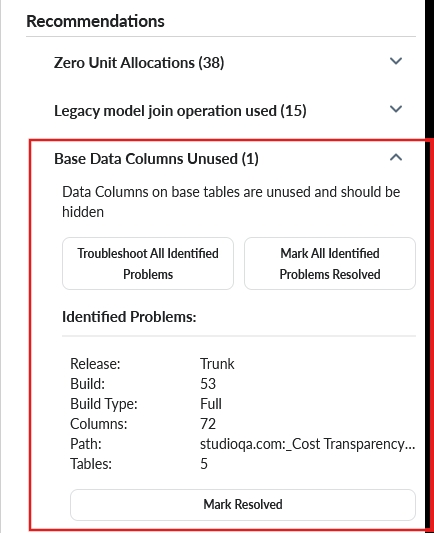
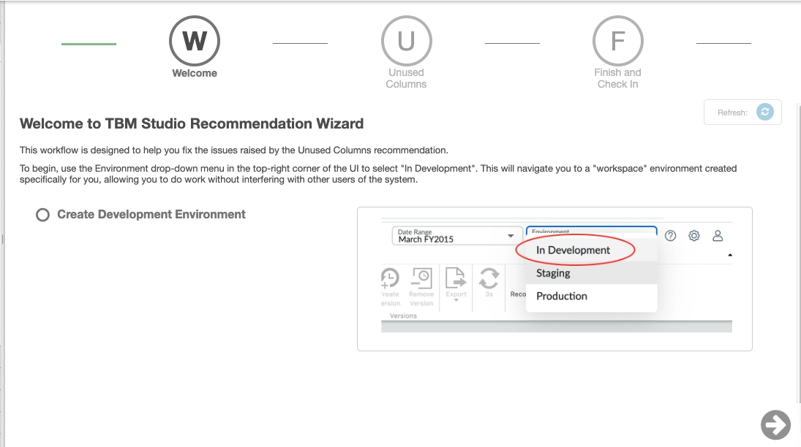
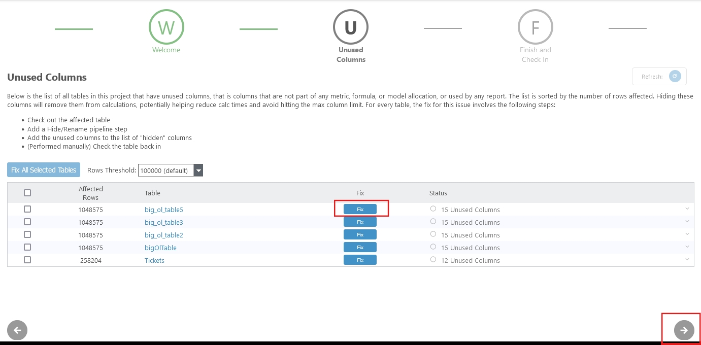
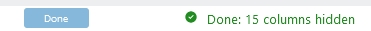
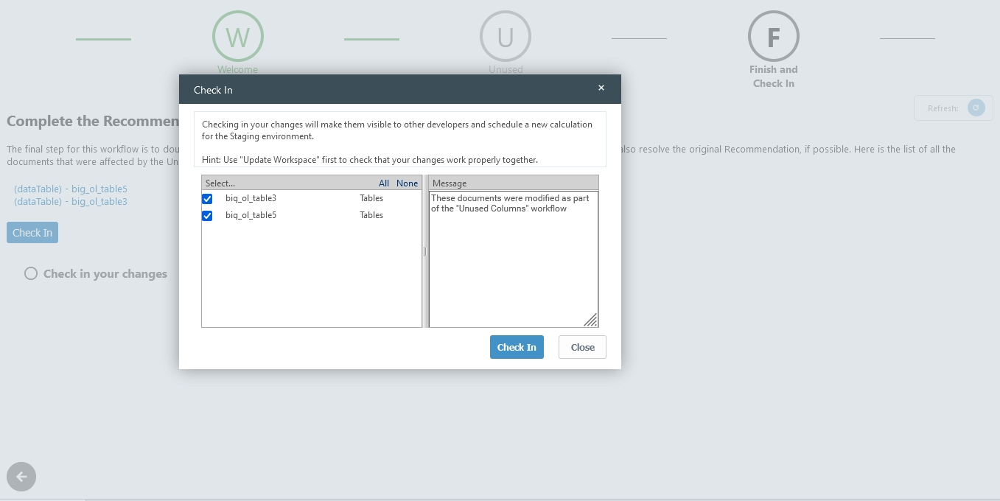

# Coluna de dados básicos Recomendação não utilizada

Navegue até a guia **TBM Studio** >� **Recommendations** > **Base Data Columns Unused** e selecione **Troubleshoot All Identified Problems (Solucionar todos os problemas identificados)**.

Mude para o espaço de trabalho **Development** e selecione **Next**.

Selecione o botão **Fixar** individualmente.

Depois de concluído, o status das colunas é alterado.

Selecione **Next** e, em seguida, selecione **Checkin** na última página.

