# Limite de trajetória do modelo

O Model Pathing Limiter impede a criação e o cálculo de modelos que tenham um número muito grande de caminhos. O número de caminhos em um modelo começará a crescer exponencialmente depois de um certo ponto e começará a ter um desempenho e um tempo de cálculo extremamente degradados.

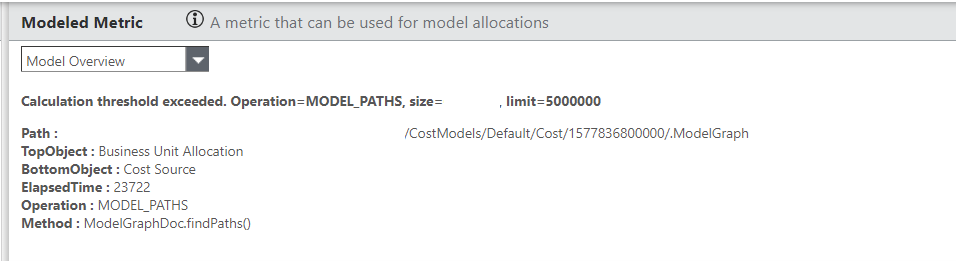

Um caminho consiste na rota que as unidades podem seguir em um modelo desde a parte inferior (geralmente a origem do custo) até qualquer objeto superior. O número de caminhos corresponde a todas as permutações possíveis que as unidades podem fazer em um modelo. À medida que os objetos e as alocações aumentam, o número de caminhos começa a aumentar exponencialmente.

## Entendendo os caminhos do modelo

O modelo a seguir tem um total de 15 caminhos do Nível 5 (parte superior) até o Objeto Base (parte inferior). O modelo foi criado para destacar o número de caminhos. Atualmente, não há como mostrar esse número no modelo.

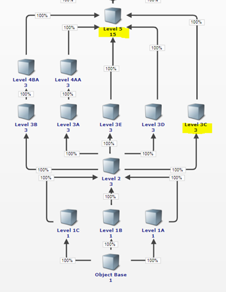

A adição de uma linha de alocação entre o Nível 3C e o Nível 5 acrescentará 3 caminhos adicionais ao modelo, pois há 3 caminhos até o Nível 3C. Se você rastrear visualmente as rotas da Base do Objeto até o Nível 3C, há três rotas possíveis.

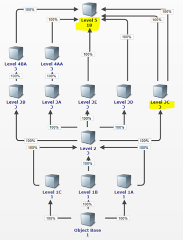

O componente de avaliação de desempenho produzirá uma tabela que indicará o número de caminhos e ajudará a identificar as áreas problemáticas.

No modelo a seguir, há um total de 60 caminhos para o topo.

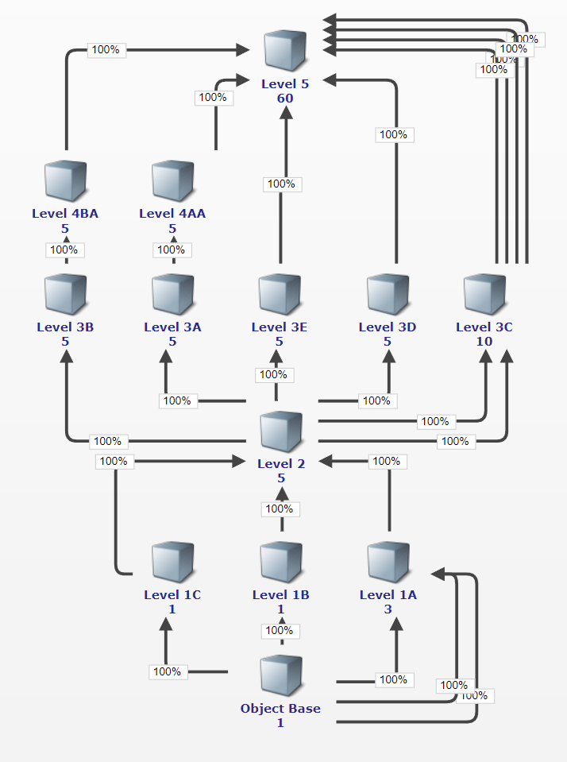

A figura a seguir mostra o relatório de caminhos do modelo para esse modelo.

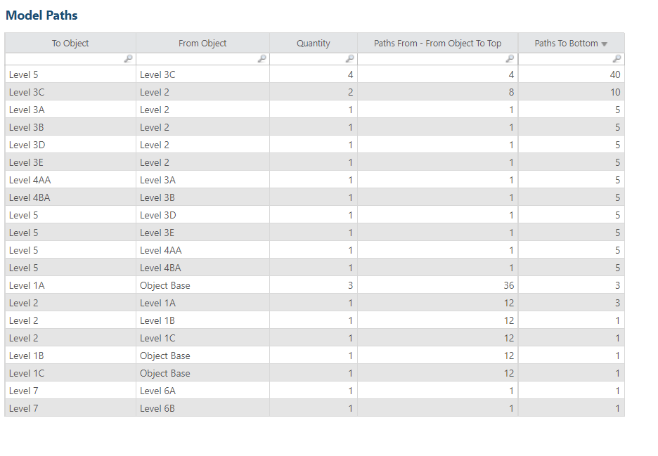

Para obter o total de caminhos para um determinado objeto, filtre por esse objeto na categoria To Object (Para o objeto) e, em seguida, some os Paths To Bottom (Caminhos para a parte inferior). Ele corresponderá ao modelo anterior (60).

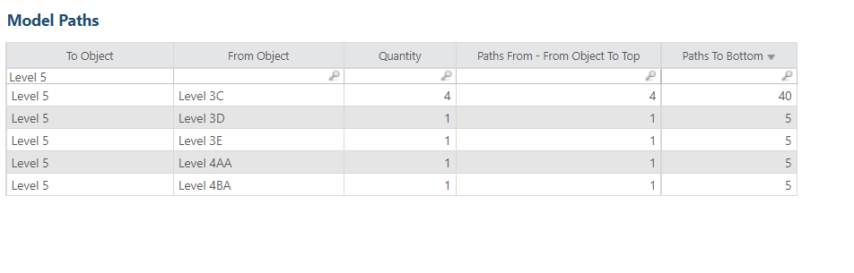

A coluna Quantidade é o número de alocações entre Para o objeto e Do objeto. O local ideal para começar a investigar onde as alocações podem ser removidas ou combinadas é o número de Quantidade mais alto e o mais baixo no modelo ou na tabela. Para esse modelo, seria o par de Level 1A e Object Base. Há mais alocações entre o Nível 5 e o Nível 3C, mas, por estarem no topo do modelo, elas são menos impactantes.

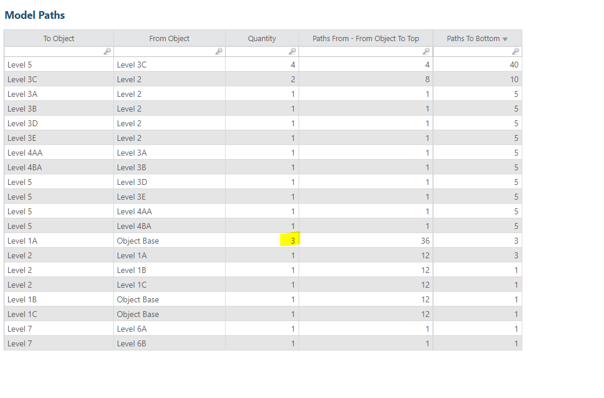

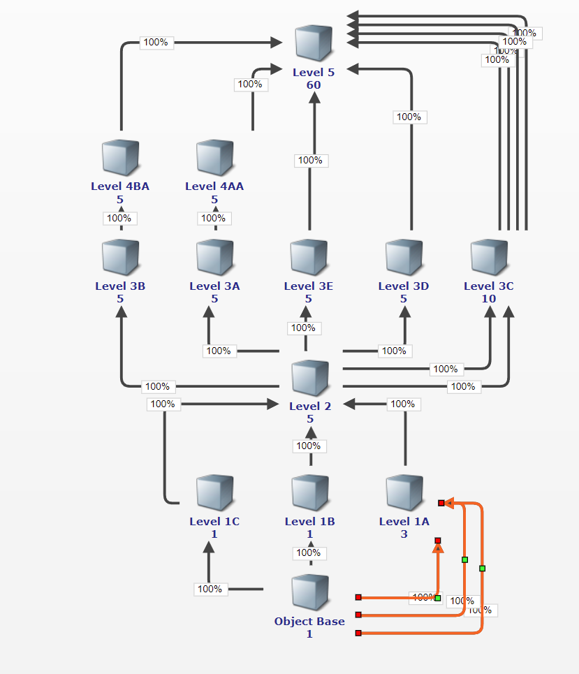

Há mais linhas que vão do Nível 3C ao Nível 5, mas elas estão mais acima no modelo. As alocações de Object Base para o nível 1A geram 3 caminhos para cada caminho acima deles. Portanto, reduzir os caminhos mais abaixo tem um impacto maior. A remoção de uma dessas alocações reduz a contagem em 12 (20%).

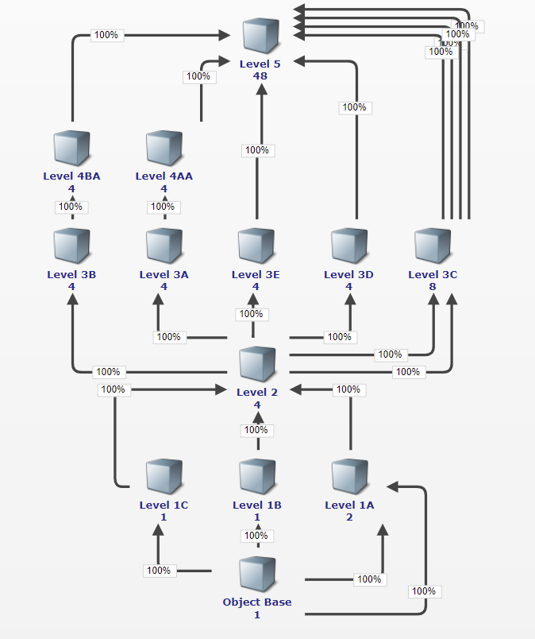

A remoção de uma linha do Nível 3C para o Nível 5 reduz a contagem em 10.

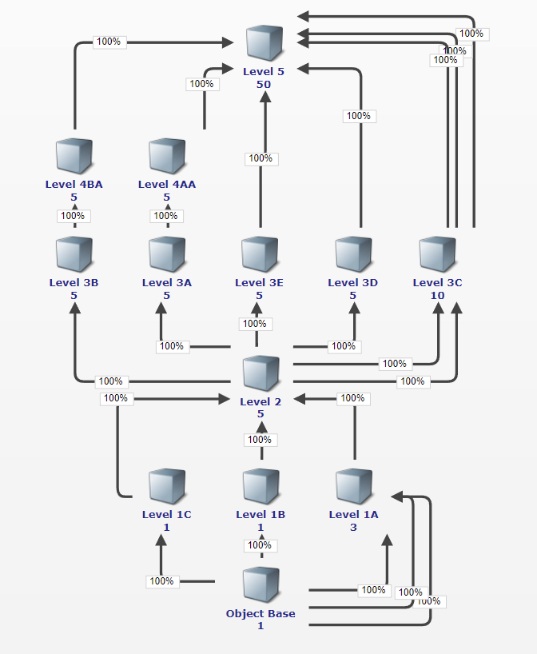

Fazer as duas coisas resulta em uma redução de 20.

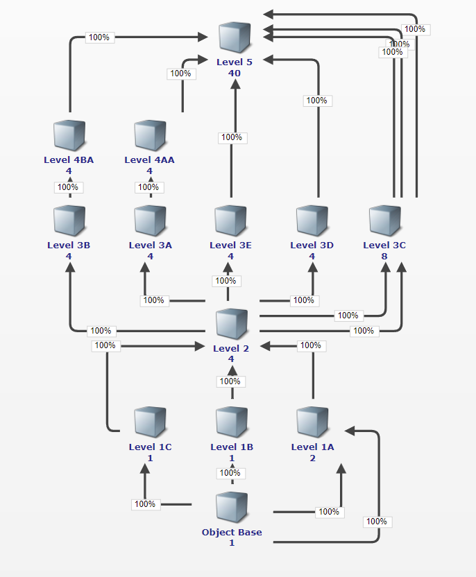

Em resumo, o número de caminhos em um modelo começará a aumentar em uma taxa exponencial à medida que mais objetos e alocações forem adicionados. Especificamente, quando mais de uma alocação de saída for adicionada a partir de um objeto, o número total de caminhos no modelo aumentará. À medida que o número de objetos com mais de um caminho de saída aumenta, o número de caminhos também aumenta. A única maneira de reduzir o número de caminhos em um modelo é reduzir o número de alocações existentes em um modelo. Para obter ajuda para reduzir o número de alocações em seu modelo, entre em contato com seu CSM.
