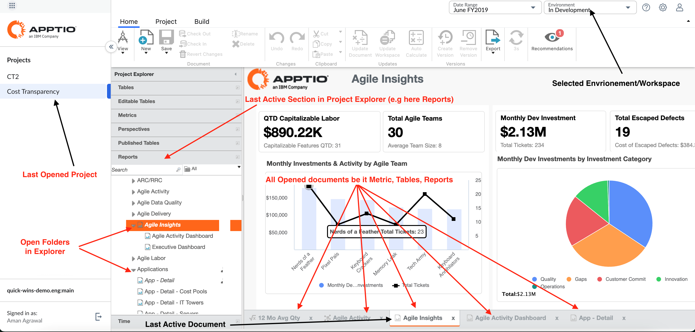

# Alterações no gerenciamento do estado do espaço de trabalho do TBM Studio

Aplica-se a: Servidor 12.11.8/ BFF-2.8.0

Essa funcionalidade permite que os usuários restaurem com eficiência o espaço de trabalho depois que o usuário retornar ao site TBM Studio novamente.

## Segundo plano

TBM Studio atualmente armazena informações de estado do espaço de trabalho localmente no navegador. Essas informações incluem:

- Últimos documentos acessados
- Abrir pastas
- Documentos abertos
- Último aplicativo selecionado (CT ou TBM Studio)
- Detalhes do projeto (se TBM Studio foi usado pela última vez)

## Preocupações com a segurança e mudanças implementadas

Uma auditoria de segurança recente identificou o armazenamento de dados confidenciais no navegador como uma vulnerabilidade. Para atender a essa preocupação, foram implementadas as seguintes alterações:

- Os usuários terão a opção de desativar o armazenamento no navegador das informações de estado do espaço de trabalho.
- A desativação do armazenamento do navegador impedirá a restauração automática do espaço de trabalho anterior no login.

## Impacto nos usuários

## TBM Studio USUÁRIOS

Por padrão, os usuários agora irão para a página de cálculo em vez de seu último projeto ao abrir o site TBM Studio.

O estado do espaço de trabalho salvo anteriormente, como projeto ativo, seções do explorador, guias e estado do documento de check-out, não será mais restaurado automaticamente.

## CT - Billing Standard Usuários

Nenhum impacto sobre os usuários finais.

## Perguntas frequentes (FAQ)

A desativação do armazenamento do navegador é obrigatória?

Não, é um recurso opcional disponível para todos os clientes em todas as regiões.

Clientes do governo: O armazenamento do navegador é desativado por padrão para clientes do governo. Eles não podem restaurar o estado anterior, a menos que o armazenamento seja ativado por meio da configuração `/data`.

Os usuários podem ter restauração de segurança e de espaço de trabalho?

Atualmente, isso não é possível. No entanto, os usuários podem definir um projeto padrão em TBM Studio para garantir que eles acessem esse projeto em vez da página de cálculo. Essa abordagem não restaurará outras configurações do espaço de trabalho.

Como desativar o armazenamento do navegador?

Essas informações não se destinam a notas de divulgação pública. Os clientes governamentais podem entrar em contato com o CSM para ativar o armazenamento via `/data`.

## Notas adicionais

Essa alteração afeta a versão do servidor 12.11.8 e a versão do BFF 2.8.0.

Embora essa alteração possa causar inconvenientes, estamos explorando soluções alternativas para restaurar as informações de estado do espaço de trabalho com segurança no futuro. Recomenda-se que todos os usuários considerem cuidadosamente o equilíbrio entre segurança e conveniência ao decidir se desejam desativar o armazenamento do navegador.
