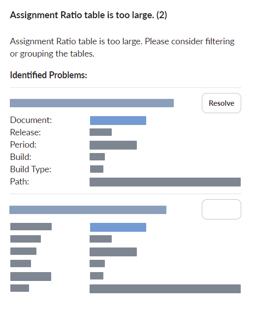
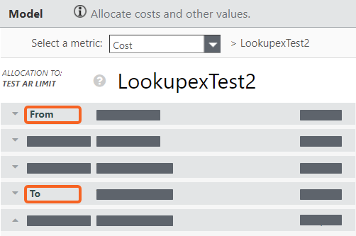

# A tabela Assignment Ratio é muito grande

O limitador de taxa de atribuição impede a criação de tabelas de taxa de atribuição que sejam muito grandes.

O maior tamanho das tabelas de Taxa de Atribuição de Alocação é determinado pelos seguintes fatores:

- A contagem de linhas do identificador da tabela de origem
- A contagem de linhas do identificador da tabela de destino

  

Esse erro geralmente é causado pelo não uso de uma alocação no estilo Data Relationship. Sem o uso do Data Relationship, é criado um grande número de alocações do tipo *muitos para muitos* ou *todos para todos*. Essas alocações têm baixo desempenho e reduzem a eficácia das alocações.

## A recomendação de configuração para a tabela Assignment Ratio é um erro muito grande

Para resolver esse erro, você pode executar uma ou mais das seguintes ações:

- Adicionar relacionamento de dados à alocação afetada.

  
- Adicione um filtro De ou Para à alocação afetada.

  
- Reduzir o número de linhas de identificadores nos objetos de origem.
- Reduzir o número de linhas de identificadores nos objetos de destino.
