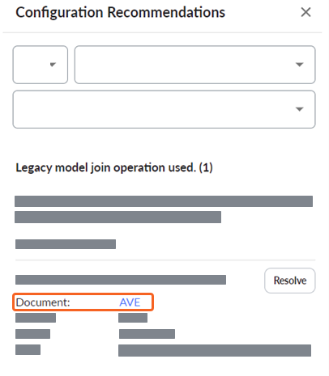
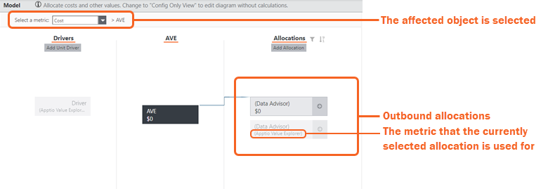
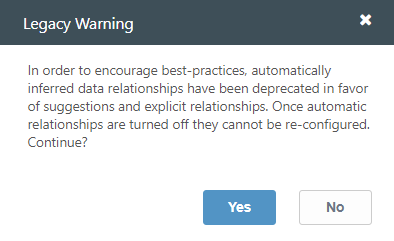
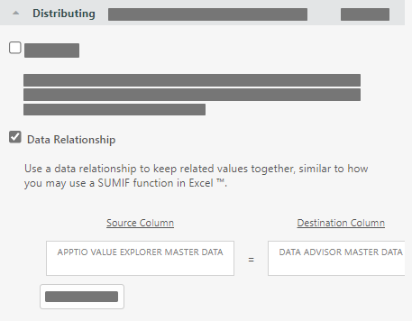

# Operação de união de modelos legados usada

O erro *usado na operação de união do modelo legado* é resultado da maneira como as alocações de relacionamento de dados foram criadas na versão R11 do site TBM Studio. Algumas das alocações padrão são configuradas dessa forma para manter a compatibilidade com versões anteriores e para minimizar o atrito ao atualizar o conteúdo.

## Sobre esta tarefa

A relação de dados é mostrada:

| Comparação da relação de dados | |
| --- | --- |
| R11 relação de dados legados em TBM Studio R12 | TBM Studio R12 relacionamento de dados |
| Na versão R12 do site TBM Studio, esse tipo de erro, especificamente na caixa de seleção **Relacionamento automático**, é exibido conforme mostrado abaixo. | Em R12, as alocações de relacionamento de dados são criadas determinando quais dados de coluna devem corresponder entre os objetos. Abaixo, você pode ver as colunas de origem e destino selecionadas. |

## Recomendação de configuração para o erro usado na operação de união do modelo legado

Observação: Devido ao controle de versão do objeto, talvez seja necessário corrigir o problema em vários períodos de tempo diferentes para o mesmo objeto.

Para resolver esse erro:

1. Na linha Documento, selecione o link para abrir o objeto afetado.

   
2. Na guia Home, selecione Check Out.
3. Percorra as alocações de saída até localizar a alocação legada e, em seguida, selecione-a.

   

   Você é redirecionado para o objeto Modelo apropriado e para o período de tempo em que a alocação herdada existe. As alocações usadas para todas as métricas disponíveis são listadas, não apenas a que foi selecionada. Percorra as alocações disponíveis, uma a uma, até localizar a alocação legada. Atualmente, o site TBM Studio não pode direcioná-lo diretamente para a linha de alocação exata.
4. Em Distributing (Distribuição), desmarque a caixa de seleção Automatic relationship (Relacionamento automático) e salve as alterações.
5. Selecione Yes para continuar.

   
6. Em Coluna de origem e Coluna de destino, selecione os valores necessários para estabelecer uma nova relação de dados para a linha de alocação.

   

   Você pode usar uma ou mais relações de dados, conforme necessário.
7. Confirme as alterações e confirme se a alocação está funcionando conforme desejado. Você pode comparar o desempenho da nova configuração com a configuração anterior ainda disponível no Staging.
8. Verifique nas alterações se o novo desempenho é satisfatório.

Aviso: Não é possível reativar a configuração herdada para essa alocação depois de fazer o check-in da nova configuração. Apptio O suporte pode ajudar na recuperação de configurações legadas, se necessário.
