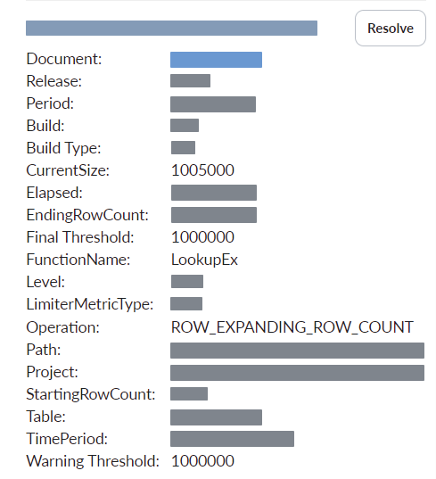
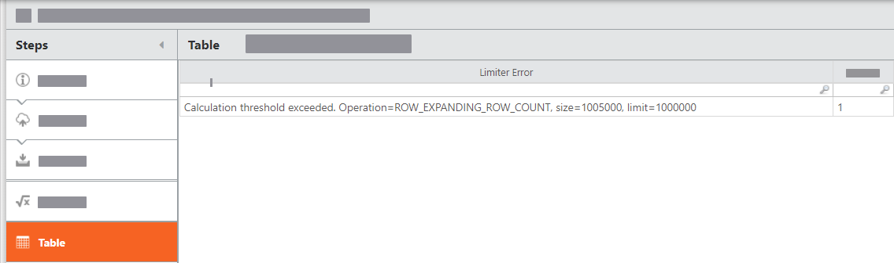

# Limite limitado: Linha Expansão

O limitador de expansão de linha impede a geração de tabelas muito grandes nos produtos Apptio. Certas funções, como *LookupEx*, *SplitEx* e *Unpivot*, podem resultar em tabelas involuntariamente grandes.

Se o limite de expansão de linha for atingido, isso resultará do fato de uma dessas funções ter excedido o limite definido em Apptio.

## Recomendação de configuração para o limite limitado: Erro de expansão de linha

Para solucionar o erro da função LookupEx :

- Analise a relação entre as duas tabelas para determinar por que há um grande número de correspondências *de um para muitos* e reduza sua variabilidade.
- [LookupEx função](../formulas-and-functions/functions/lookupexandlookupex_wild.htm "(Abre em uma nova guia ou janela)")

O maior número possível de combinações para LookupEx é o produto das duas tabelas.

Para solucionar o erro da função SplitEx :

- Revise os dados subjacentes que estão divididos e reduza o tamanho dos dados para limitar a expansão.
- [SplitEx função](../formulas-and-functions/functions/splitex.htm "(Abre em uma nova guia ou janela)")

Para resolver o erro da função Unpivot, siga um destes procedimentos:

- Reduzir o número de colunas que são recolhidas.
- Reduzir a contagem de linhas da tabela atual.
