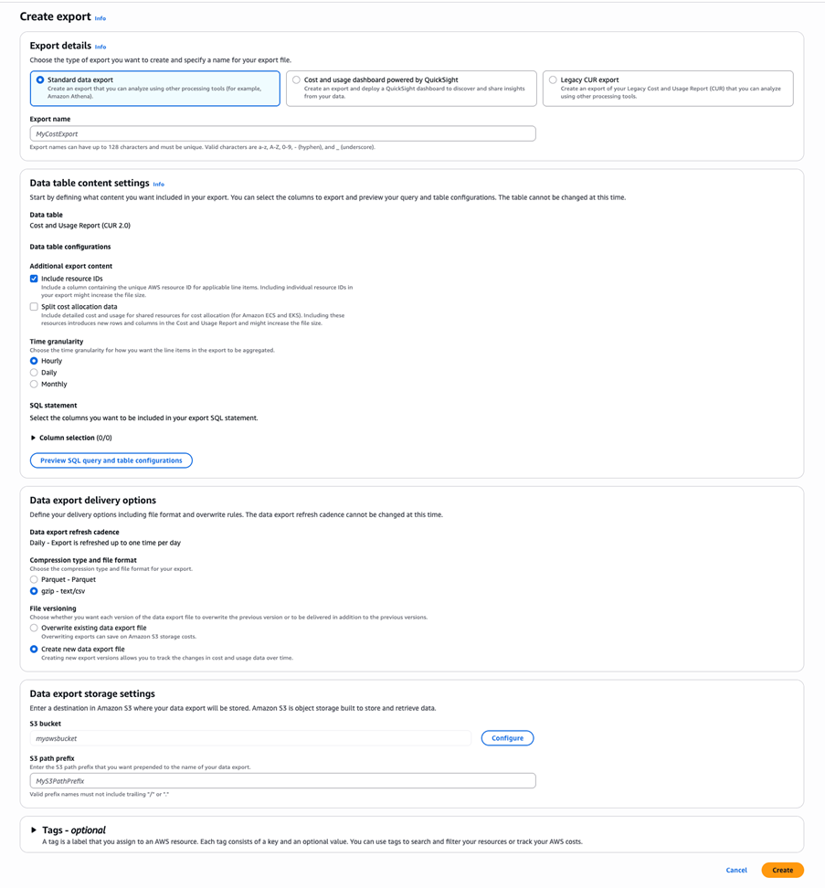
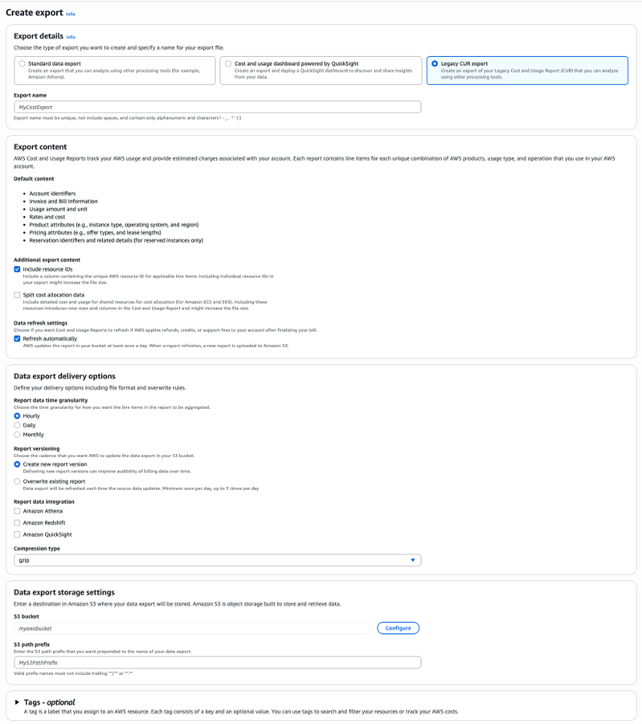
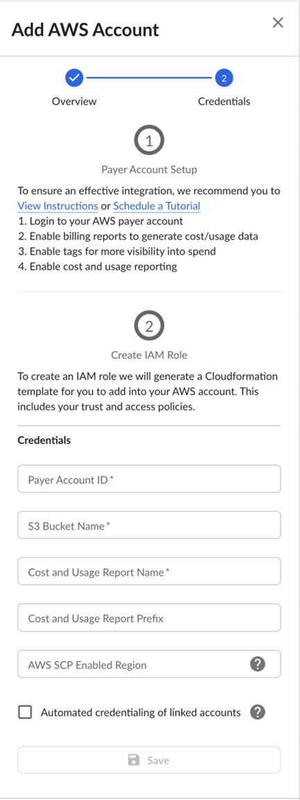
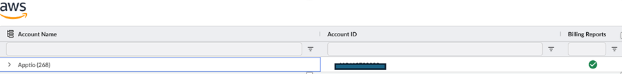

# Connecting with AWS - Customer Integration Guide

Overview

This guide walks you through the process of securely connecting your AWS environment to IBM
Cloudability and Turbonomic. Once connected, you’ll gain access to an enhanced FinOps experience in
both Cloudability and Turbonomic.

Note: To ensure full compatibility and support, please follow the connection steps as described.
Custom CUR configurations are not supported. If you have questions, reach out to **IBM
Support**.

Prerequisites

Before you begin, ensure you have access to:

- AWS console
- Admin (or similar) privileges in AWS for S3 creation and IAM permissions
- Admin access to the Cloudability Vendor Credentials

Cloudability’s AWS Credentialing process requires two main steps:

- Management Account Credentialing
- Linked Account Credentialing

AWS Management Account Credentialing

Cloudability uses AWS
Management Account credentialing for:

- Bringing in Cost and Usage data for credentialed Management Account(s).
- Syncing the linked accounts under the Management Account(s).

Note: For this to work you must have consolidated billing enable and your linked accounts must
roll up (from a billing perspective) to your Management account.

The credentialing process
involves a few steps which will require you to take actions in both AWS and Cloudability at various
phases.

Let’s get started with the Credentialing process:

1. **AWS Console - Create an AWS Cost and Usage report**
   1. From the **AWS Management Console** , select your account name at the top right and select
      **Billing and Cost Management**.
   2. From the **Billing & Cost Management Dashboard** page, select **Data Exports (under Cost
      and Usage Analysis)**.
   3. Select **Create**.

Cloudability supports AWS Legacy CUR and CUR 2.0 in both the formats.

- gzip - text/csv
- Parquet - Parquet

Here are the steps required to configure either of them.

Note: Other AWS data exports
are not supported (e.g. Pro forma CUR)

- Cloudability supports data exports created at a Management Account level.

Table 1. Configuration
Table

| Steps in AWS | Legacy CUR | CUR 2.0 |
| --- | --- | --- |
| Create Export > Export Details | Legacy CUR Export | Standard Data Export |
| Create Export > Data table content settings | Select **Include resource IDs**. **Split cost allocation data** should be **unchecked**.  Select **Refresh automatically in data refresh settings.** | Select **CUR 2.0**.  - Select **Include resource IDs**. - **Split cost allocation data** should be **unchecked** - Select **Hourly** for Report data time granularity.  Column Selection – Leave as **default** (all columns) |
| For Data export delivery options, select the following. | Select **Hourly** for Report data time granularity.  Select Create **new report version.**  Note: This is required for working seamlessly between Cloudability and Turbonomic.  Report Data Integration options should not be selected.  Ensure that the compression type is set to **gzip or parquet** | Ensure that the compression type is set to **gzip- text/cs or parquet.**  Ensure Create **new data export file** for Report versioning is selected.  Note: This is required for working seamlessly between Cloudability and Turbonomic |
| For Data export storage settings. | Your Cost and Usage report files will reside in this bucket. You can;   - Enter a pre-existing S3 bucket and prefix OR - Select **Configure**. If Configure is selected   - Select **Create a Bucket** (or select existing bucket if already created)   - Enter an S3 bucket name   - Select Region for creating a new bucket   - Click **Create Bucket**   - Add an **s3 path prefix**   - Add any tags **(optional)**   - Select **Create Report** | Your Cost and Usage report files will reside in this bucket. You can;   - Enter a pre-existing S3 bucket and prefix OR - Select **Configure**. If Configure is selected   - Select **Create a Bucket** (or select existing bucket if already created)   - Enter an S3 bucket name   - Select Region for creating a new bucket   - Click **Create Bucket**   - Add an **s3 path prefix**   - Add any tags **(optional)**   - Select **Create** |

Note: Cloudability looks for the manifest file in the below location:

**Legacy
CUR**  - <Cost and Usage report prefix>/<Cost and Usage report
Name>/YYYYMMDD-YYYYMMDD/<Cost and Usage report Name>-Manifest.json

**CUR 2.0** -
<Cost and Usage report prefix>/<Cost and Usage report
Name>/metadata/BILLING\_PERIOD=YYYY-MM/<Cost and Usage report Name>-Manifest.json

Note: Customers can configure server-side encryption with Amazon S3 managed keys (SSE-S3) on their
S3 buckets. Cloudability doesn't support encryption using KMS or customer provided encryption
keys.

Please record the below details as these will be entered in Cloudability in the below
steps:

1. **PAYER ACCOUNT ID: AWS** Management Account ID
2. **S3 BUCKET NAME:** The bucket that contains your Cost and Usage report created earlier
3. **COST AND USAGE REPORT NAME** created earlier
4. **COST AND USAGE REPORT PREFIX** created earlier

Note: Existing customers on AWS Legacy CUR, can continue to remain on Legacy CUR. If you wish
to move to CUR 2.0 , then you’ll need to update credentials in Cloudability with CUR 2.0 as you
cannot upgrade your Legacy CUR to CUR 2.0.The data export that you create as per the cloudability
steps by default will load the data in the above location. If any historical data is fetched then
cloudability expects the manifest files in the above location.

For details on moving from Legacy
CUR to CUR 2.0 please check the FAQs

Please leave the below options as unchecked

- Split cost allocation data
- Include Capacity Reservation Columns and Granularity
- Manually Compatible discounts

2. AWS Console - Enable cost allocation tags

1. From the **Billing & Cost Management Dashboard** , navigate to [**Cost
   Allocation Tags**](https://console.aws.amazon.com/billing/home#/tags "(Opens in a new tab or window)") .
2. Select the tags that you want to include.

   Note: Be mindful of camel case. For example: If you
   have "Name" or "name" as a tag key - both needs to be activated so they are written to
   CUR.
3. Select **Activate** .

3. Cloudability - Configure Credentials for AWS Management
Account

You must have Cloudability Administrator rights to complete this procedure. If
you don’t have administrator rights, contact your organization’s primary Cloudability administrator
for assistance.

In Cloudability, navigate to **Settings**> **Vendor Credentials**>
**Add Datasource and select > AWS**.

1. Under **Credentials**, enter the following:
   - **Payer Account ID (Mandatory)**
   - **S3 Bucket Name (Mandatory):** The bucket that contains your Cost and Usage report
   - **Cost and Usage Report Name (Mandatory)**
   - **Cost and Usage Report Prefix (Mandatory)**
   - **AWS SCP Enabled Region (Optional)**
     - In the event you have applied [AWS service Service control Control Policy](https://www.ibm.com/links?url=https%3A%2F%2Fdocs.aws.amazon.com%2Forganizations%2Flatest%2Fuserguide%2Forgs_manage_policies_scps.html "(Opens in a new tab or window)") (SCP) which
       restrict access in some AWS regions, indicate your *allowed* region; for example: us-east-2. If
       not, this can be left blank. This helps Cloudability to make verification calls to the specified
       region .
     - Currently, Cloudability supports addition of a single SCP region.
   - **Automated Credentialing of Linked Account(s) (Recommended)**
     - We recommend the use of [Automated
       credentialing of AWS linked](aws-credentialing-premium-linked.html) accounts if you have a significant number of linked accounts.
       Using this will simplify your Credentialing process now and for future addition of new
       accounts.
     - To use the Cloudability Automated credentialing of linked accounts feature, additional work
       needs to be performed in Cloudability and AWS which includes downloading a CloudFormation Template
       from a linked account and deploying it as a StackSet (ensuring the correct IAM role is in place for
       linked accounts to inherit IAM permissions). This is covered in detail in Linked account
       credentialing.
   - **Choose Advanced Rightsizing as Read Only vs Automate Actions**
     - **Read Only** selection implies that you are allowing both Cloudability cost, Turbonomic cost
       and Turbonomic monitoring permissions to read your environment and not take actions.
     - **Automate Actions** selection implies that you are allowing all Cloudability and Turbonomic
       permissions including the ones for automated actions i.e.. Turbonomic execution and Turbonomic
       billing execution.

   Note: When Automated credentialing of AWS linked accounts is selected, then your selection of
   **Read Only** vs **Automate Actions** will be inherited by your linked accounts. If it is
   **NOT** selected, then the selection of **Read Only** vs ****Automate Actions**** will
   need to be performed on an individual linked account basis.
2. Select **Save**.
3. Select **Generate Template**.
4. Select **Download**.
5. An AWS CloudFormation template will be downloaded locally – save this in a secure place for your
   next step as this will need to be uploaded into the AWS console.

4. AWS Console - Upload the CloudFormation template to the AWS Management
Console

1. In the **AWS Management Console**, search for 'CloudFormation' and select it.
2. From the **AWS CloudFormation** page, select **Create Stack (with new resources
   (standard))**.
3. Under **Specify template** , do the following:
   - Select **Upload a template file**.
   - Select **Choose file** and upload the template you downloaded from Cloudability.
   - Select **Next** .
4. From the **Specify stack details** page, do the following:
   - Enter a **Stack name** (for example, 'Cloudability').
   - Verify the populated **Parameters**.
   - Select **Next** .
5. Scroll through the **Configure stack options** page and check the “I acknowledge that AWS
   CloudFormation might create IAM resources with customized names” and click Next.
6. From the **Review** page, select **Submit**.

Your new stack initially has a status of **CREATE\_IN\_PROGRESS**. When the status changes
to **CREATE\_COMPLETE**, you can verify your credential in Cloudability. You may need to refresh
the CloudFormation page in the UI to confirm this.

5. Cloudability - Verify the
Account Credential

1. In Cloudability, navigate to **Settings > Vendor Credentials > AWS**.
2. Click on the … next to the account being credentialed and select Re-Verify.
   - A green tick () indicates success where as a red
     exclamation () indicated errors.

Note: This above process will create an IAM role called CloudabilityRole which Cloudability will use
to verify the permissions. In case verification fails, please retry after 15 minutes.

After completion of this process,
within a few hours,

- Cloudability will start showing your Billing data and AWS tags within Cloudability.
- Pricing data would also be pulled in.
- Cloudability will also display the linked accounts.

As a next step you will need to credential the Linked accounts.

**Credentials
Status**

Cloudability Vendor credential screen displays both account status from:

- Cloudability
- Turbonomic

Once the latest templates are run the account status should be in sync between Cloudability
and Turbonomic. For details on the account status please check account details section.

[AWS Linked Account Credentialing](aws-credentialing-premium-linked.html)

[AWS Upgrading Existing
Cloudability Customers to Cloudability Premium](aws-credentialing-premium-upgrading.html)

[AWS Obtaining Memory Metrics
for EC2 Instances - Windows and Linux](aws-credentialing-premium-memory.html)

[AWS
FAQ](aws-credentialing-premium-faq.html)

- **[AWS Linked Account Credentialing](../admin/aws-credentialing-premium-linked.html)**
- **[AWS Credentialing using Bulk Actions](../admin/aws-credentialing-bulk-actions.html)**
- **[Connecting with AWS - Upgrading existing Cloudability customers to Cloudability Premium](../admin/aws-credentialing-premium-upgrading.html)**
- **[AWS Tags](../admin/support-for-aws-tags.html)**
- **[Connecting with AWS - Obtaining Memory Metrics for EC2 instances (Windows & Linux)](../admin/aws-credentialing-premium-memory.html)**
- **[Permissions Reference - Amazon Web Services](../admin/permissions-reference-aws.html)**
- **[Frequently Asked Questions for Connecting with AWS](../admin/aws-credentialing-premium-faq.html)**
