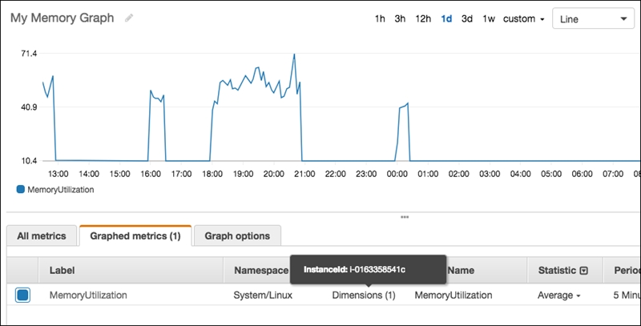

# Connecting with AWS - Obtaining Memory Metrics for EC2 instances (Windows & Linux)

The Cloudability Rightsizing Engine evaluates the underlying resource utilization for each EC2
instance and recommends instance types that are well matched to each utilization profile. The end
goal is to keep your costs down while being mindful of operational risks.

To get the most accurate recommendations, there are four utilization metrics that need to be
assessed: CPU, Disk IOPS (in the case of instances that have local disks), Network Bandwidth, and
Memory Utilization. For a number of very good reasons, we’ve taken the approach of pulling this data
directly from CloudWatch. The key reason being that hypervisor level metrics are saved to CloudWatch
by default for each instance without you doing anything. This leaves Memory Utilization as the only
metric that requires a little extra effort on your end to publish to CloudWatch. This is done using
what AWS calls Custom Metrics which you can read about [here](https://www.ibm.com/links?url=https%3A%2F%2Fdocs.aws.amazon.com%2Famazoncloudwatch%2Flatest%2Fmonitoring%2Fpublishingmetrics.html "(Opens in a new tab or window)") .

The good news is that AWS has come up with standard formats for memory data publication and we’ve
taken a streamlined approach to ingest that data. We require only one custom metric to be published
using the [current unified agent.](https://www.ibm.com/links?url=https%3A%2F%2Fdocs.aws.amazon.com%2Famazoncloudwatch%2Flatest%2Fmonitoring%2Finstall-cloudwatch-agent.html "(Opens in a new tab or window)")

**Steps for Integration**

**AWS Unified Agent**

This is the preferred method for memory data. Cloudability supports the standard location and
naming conventions that the unified agent uses when writing custom metrics to Cloudwatch. These
details are:

- **metric-name** : "mem\_used\_percent" (for Linux)
- **metric-name** : "Available Mbytes" (for Windows)
- **namespace** : CWAgent
- **dimensions** : InstanceId (it’s important to only add this one dimension)
- **unit** : percent

**Instructions**

AWS provides a number of options for installing the agent which you can find at [https://docs.aws.amazon.com/AmazonCloudWatch/latest/monitoring/install-CloudWatch-Agent-on-EC2-Instance.html](https://www.ibm.com/links?url=https%3A%2F%2Fdocs.aws.amazon.com%2Famazoncloudwatch%2Flatest%2Fmonitoring%2Finstall-cloudwatch-agent-on-ec2-instance.html "(Opens in a new tab or window)"). The unified agent provides capabilities to publish many types of custom metrics.

The following is an example of a minimal **Linux** configuration to publish just the memory
information:

```
{   
						"metrics": {
						"metrics_collected": {
						"mem": {
						"measurement": [
						"mem_used_percent"
						],
						"resources": [
						"*"
						]
						}
						},  
						"append_dimensions": {
						"InstanceId": "${aws:InstanceId}"
						} 
						}
				}
```

The following is an example of a minimal **Windows** configuration to publish just the memory
information:

```
{  
						"metrics": { 
						"metrics_collected": { 
						"Memory": { 
						"measurement": [ 
						{"name": "Available Mbytes", "unit":"Megabytes"} 
						], 
						"resources": [ 
						"*" 
						] 
						} 
						},  
						"append_dimensions": { 
						"InstanceId": "${aws:InstanceId}" 
						} 
						} 
						} 
				
```

Note: If the **Available Mbytes** metric is not available, the legacy **% Committed Bytes In Use**will be used if available. For example, {"name": "% Committed Bytes In Use",
"unit":"Percent"}

Note: When the custom metric is published, it's important that it only has the InstanceId dimension.
This is because as described in [https://docs.aws.amazon.com/AmazonCloudWatch/latest/monitoring/cloudwatch\_concepts.html#dimension-combinations](https://www.ibm.com/links?url=https%3A%2F%2Fdocs.aws.amazon.com%2Famazoncloudwatch%2Flatest%2Fmonitoring%2Fcloudwatch_concepts.html%23dimension-combinations "(Opens in a new tab or window)")by AWS, each dimension combination constitutes a completely separate metric, one that must be
queried with all dimensional data.

If you do wish to publish multiple dimensions you can rely on the aggregation\_dimensions keyword
as shown in the **Linux** example below. The extra dimension in this case is
AutoScalingGroupName. In this example, you'll end up with three published memory metrics each with a
different dimension combination 1) just InstanceID 2) just AutoScalingGroupName 3) both InstanceID
and AutoScalingGroupName.

The following is a **Linux** example:

```
{   
						"metrics": {
						"metrics_collected": {
						"mem": {
						"measurement": [
						"mem_used_percent"
						],
						"resources": [
						"*"
						]
						}
						},  
						"append_dimensions": {
						"InstanceId": "${aws:InstanceId}"
						} 
						}
				}
```

**Perl Based Agent**

Please note that AWS has deprecated the perl based agent but it remains available for download.
Cloudability will continue to support this method however we recommend you switch to the newer
unified agent if possible.

As stated above only one custom metric is required. The perl based metric looks like this:

- **metric-name**: MemoryUtilization
- **namespace**: System/Linux or Windows/Default
- **dimensions**: InstanceId (it’s important to only add this one dimension)
- **unit**: percent

**Instructions**

Install the perl CloudWatch monitoring scripts as described on this AWS webpage. You'll find
instructions on this page for installing the pre-requisite packages on machines running the Amazon
Linux AMI and other popular operating systems such as Red Hat.

Here is the crontab configuration we use at Cloudability for Linux machines:

`* * * * * ~/aws-scripts-mon/mon-put-instance-data.pl --mem-util
--from-cron`

This will publish exactly what Cloudability requires and nothing more. You should be able to
confirm that the memory metric is reported at 5 min intervals.

**Other options** : Other options include creating your own agent which integrates with the
AWS SDK. [Here](https://www.ibm.com/links?url=https%3A%2F%2Fgithub.com%2Fa3linux%2Fgo-aws-mon "(Opens in a new tab or window)") is an example using Golang that some of our customers
have had success with.

**How to confirm success**

Normally within 24 hours of configuring your EC2 instance, this memory information will become
available within Cloudability rightsizing.

Here is an example of the resultant memory data when viewing in the AWS Cloudwatch console. This
can be helpful for debugging purposes.



Note: This is example data from the perl based agent. Unified agent data will appear similar but
with the relevant namespace and metric name.

Having this memory data within CloudWatch is going to provide benefits well beyond Cloudability
and we’d highly recommend going down this path. For example, you could use the memory data to
trigger autoscaling events or trigger alarms. Once you find what method works for you, it’d be a
good idea to roll that up into your configuration.

**Getting Recommendations Based on GPU Data** Cloudability enables users to view
recommendations based on GPU data from AWS EC2 instances.

Cloudability ingests GPU processing and memory utilization data from your AWS instances. This
will allow Cloudability to make rightsizing recommendations that also consider this data. For
example, if you are not using GPUs then you could be recommended to move to an instance type that
does include GPUs so you can save money.

Cloudability provides 2 options for collecting GPU data:

**Option 1: Use AWS CloudWatch Agent (Linux only)**

In order to begin ingesting the GPU utilization data using AWS CloudWatch Agent, you must first
setup your agent to provide this data: [https://docs.aws.amazon.com/AmazonCloudWatch/latest/monitoring/CloudWatch-Agent-NVIDIA-GPU.html](https://www.ibm.com/links?url=https%3A%2F%2Fdocs.aws.amazon.com%2Famazoncloudwatch%2Flatest%2Fmonitoring%2Fcloudwatch-agent-nvidia-gpu.html "(Opens in a new tab or window)")

The following is an example of a minimal Linux configuration to publish just the memory and GPU
information:

```
{   
						"metrics": {
						"metrics_collected": {
						"mem": {
						"measurement": [
						"mem_used_percent"
						]       
						},
						"nvidia_gpu": {
						"measurement": [
						"utilization_gpu",
						"utilization_memory"
						]
						}    
						},  
						"append_dimensions": {
						"InstanceId": "${aws:InstanceId}"
						} 
						}
				}
```

**Option 2: Use GPU Monitoring Agent (both Linux & Windows)**

In order to begin ingesting the GPU utilization data, you must use the GPU monitoring agent .

Before You Start

Your VM should have the following:

- GPU enabled
- Nvidia drivers installed
- Python 2.7 or higher installed

**Steps for integration**

**Instructions for Linux VMs**

Run the Python script:

1. Install Python 2.7 or higher if it is not available already and make it the default Python
   version.
2. Install pip >= 20.3.4 if it is not available already.
3. Given that your instance is already running on the GPU Enabled AMI, you need to create an IAM
   role that grants your instance the permission to push metrics to Amazon CloudWatch. Create an EC2
   service role that allows for the following
   policy:

   ```
   { "Version": "2012-10-17", "Statement": [ { "Action": [ "cloudwatch:PutMetricData", ], "Effect": "Allow", "Resource": "*" } ] }
   ```
4. Get the custom gpumon script from [https://community.apptio.com/viewdocument/custom-gpumon-python-script-to-coll](https://www.ibm.com/links?url=https%3A%2F%2Fcommunity.apptio.com%2Fviewdocument%2Fcustom-gpumon-python-script-to-coll%3Fcommunitykey%3Df67c7e7c-be1c-4053-9845-2376da697342%26tab%3Dlibrarydocuments "(Opens in a new tab or window)") and place it
   in the targeted VM.
5. Install all the dependencies.

   For Python 2.7:

   `sudo pip2.7 install Nvidia-ml-py
   boto3`

   For Python 3 or higher:
6. Run the given command in the background:

   `python gpumon.py <Region> <log file
   path>`

   For example nohup python gpumon.py <AWS-Region> <log file path> &

**Install and run Datadog agent**

1. Follow the given doc to set up the Datadog agent at [https://docs.datadoghq.com/integrations/nvml/](https://www.ibm.com/links?url=https%3A%2F%2Fdocs.datadoghq.com%2Fintegrations%2Fnvml%2F "(Opens in a new tab or window)") .

Run the following Agent integration install command in place of the command provided in the
Datadog documentation:

`sudo -u dd-agent datadog-agent integration install -t
datadog-nvml==<INTEGRATION_VERSION>`

**Instructions for Windows VMs**

1. Install Python 2.7 or higher.
2. Given that your instance is already running on the GPU Enabled AMI, you need to create an IAM
   role that grants your instance the permission to push metrics to Amazon CloudWatch. Create an EC2
   service role that allows for the following policy:
3. Set up the path of Python to Windows environment variables.
4. Get the custom gpumon Python script from [https://community.apptio.com/viewdocument/custom-gpumon-python-script-to-coll](https://www.ibm.com/links?url=https%3A%2F%2Fcommunity.apptio.com%2Fviewdocument%2Fcustom-gpumon-python-script-to-coll%3Fcommunitykey%3Df67c7e7c-be1c-4053-9845-2376da697342%26tab%3Dlibrarydocuments "(Opens in a new tab or window)") update the log
   file path according to the Windows file directory.
5. Run the command in administrator mode to install all the dependencies.

   For Python
   2.7:

   `pip2.7 install Nvidia-ml-py boto3`

   For Python 3 and
   higher:

   `pip install Nvidia-ml-py boto3`
6. Run the script to collect the GPU utilization data and push it to cloud watch using the
   following command in administrator mode:

   `python gpumon.py <AWS-Region> <log file
   path>.`

**Install and run the Datadog agent**

1. Install the Datadog agent in your Windows VM.
2. Set the path ( **C:\Program Files\Datadog\Datadog Agent\bin** ) to the environment variables
   of Windows.
3. Run this command:

   `agent integration install -t
   datadog-nvml==<INTEGRATION_VERSION>`
4. Install pip in Windows in the given path of the Python executable which is used by Datadog (
   **C:\Program Files\Datadog\Datadog Agent\embedded3** )
5. In the command prompt in administrator mode, navigate to the path **C:\Program
   Files\Datadog\Datadog Agent\embedded3\Scripts** , then run the following command to install the
   package.

   `pip3 install grpcio pynvml`
6. Edit the **nvml.d/conf.yaml** file, in the **conf.d/** directory at the root of your
   Agent’s configuration directory to start collecting your NVML performance data. See the sample
   **nvml.d/conf.yaml** for all available configuration options.
7. Restart the Agent.

**Parent topic:** [Connecting with AWS - Customer Integration Guide](../admin/aws-credentialing-premium-home.html)
