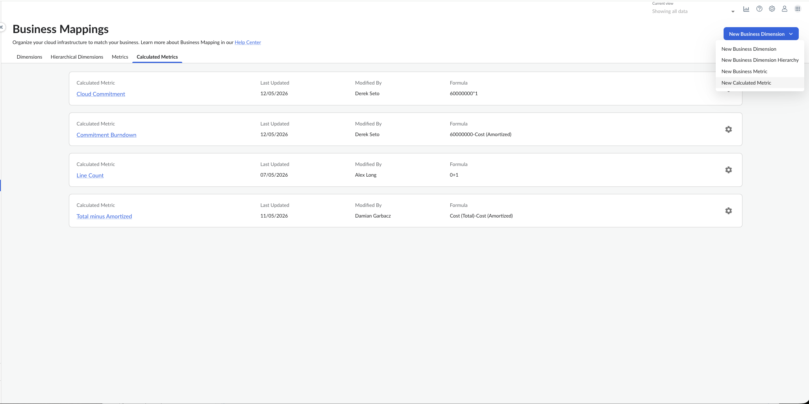
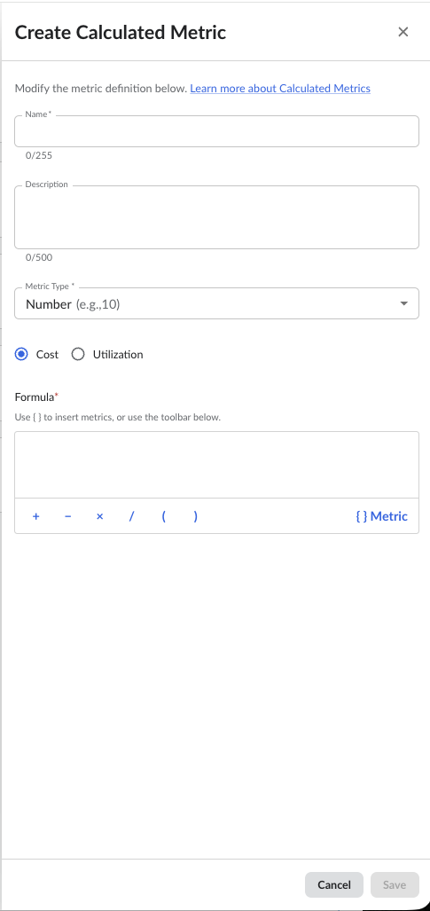
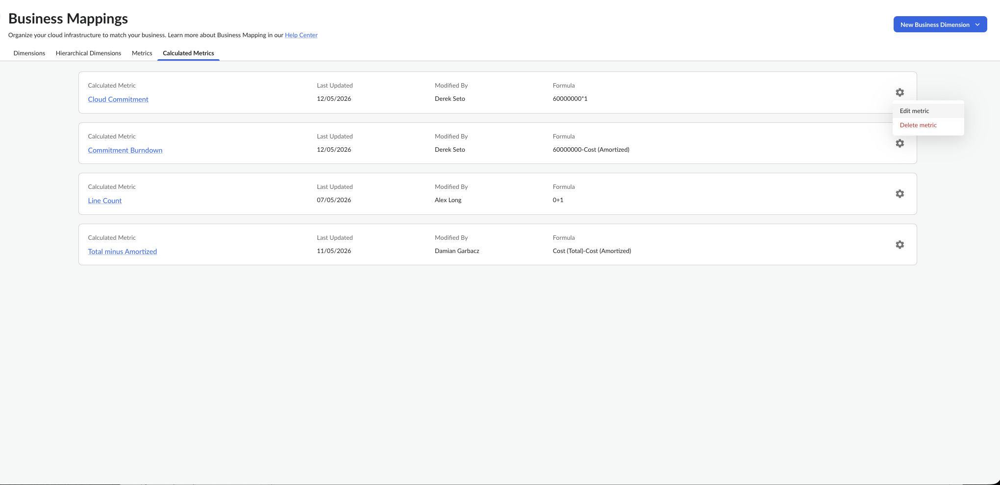
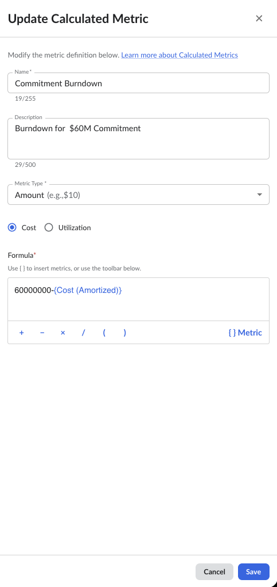
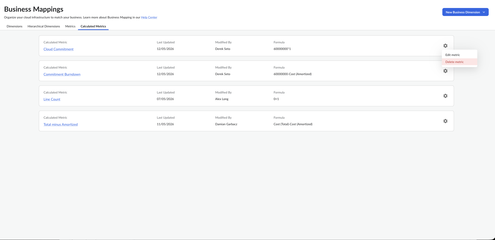
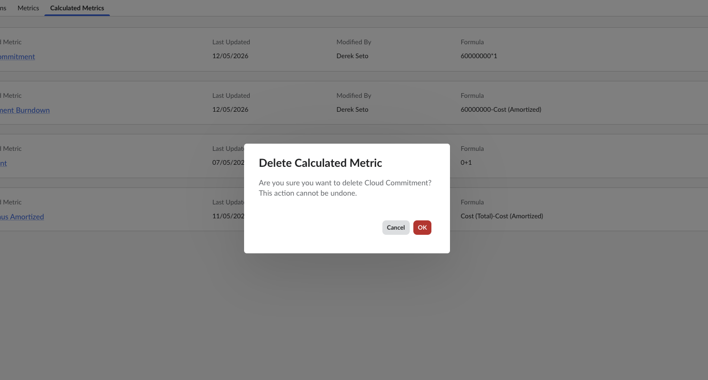
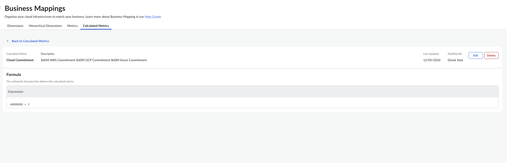

# Calculated Metrics

## What are Calculated Metrics?

Calculated Metrics are custom, reusable metrics that you can create in Cloudability using standard metrics, business metrics, constants, and basic arithmetic operations.

Unlike vendor-provided metrics, Calculated Metrics offer flexibility to define business-specific KPIs and unit economics measurements that align with your organization's unique requirements.

Calculated Metrics support the following arithmetic operations:

- Addition (`+`)
- Subtraction (`-`)
- Multiplication (`*`)
- Division (`/`)

These metrics help tailor Cloudability reporting to your organization's unique business and financial use cases. Calculated Metrics enable teams to create reusable KPIs that can be consistently used across Dashboards and Reports without recreating formulas multiple times.

## How do Calculated Metrics work?

Evaluated at Query Time

When a Dashboard or Report is loaded, Cloudability evaluates Calculated Metrics against the aggregated result set. This means calculations are performed on the final aggregated data rather than on individual cost line items during data ingestion.

This approach provides several advantages:

- Metrics are available immediately after creation
- No data reprocessing is required
- Historical reports automatically reflect formula updates
- Changes take effect instantly across all reports and dashboards

Applied to Aggregated Results

Calculated Metrics operate on aggregated data after grouping and summarization. This means the formula is applied to totals, averages, or other aggregate values rather than individual rows.

Tips for Creating Calculated Metrics

Choose a Clear Name

Each Calculated Metric requires a unique name. Choose a name that clearly conveys its purpose, as it will appear in reports and throughout Cloudability. The name must be unique within your organization and cannot match existing base measure names.

Select the Appropriate Data Source

Choose between Cost or Usage as your data source. All measures referenced in your formula must match the selected data source type.

Define a Clear Formula

Create formulas using valid measure names, constants, and arithmetic operators. Ensure proper use of parentheses to control the order of operations.

Add a Description

Provide a clear description that explains the metric's purpose and calculation logic. This helps other users understand and correctly apply the metric in their reports.

## Working with Calculated Metrics

Listing and reviewing Calculated Metrics

From the Business Mappings page, you can view all Calculated Metrics you have created. The list shows the metric name, description, data source, and creation details.

Creating new Calculated Metrics

To create a new Calculated Metric:

1. Go to **Organize → Business Mappings**
2. Select **New Calculated Metric** from the **New Business Dimension** dropdown

   
3. Enter a **Name** for the metric
   - The name must be unique within your organization
   - Cannot match existing base measure names
4. Add a **Description**
   - The description appears as a tooltip when the metric is used in Dashboards or Reports
   - Helps other users understand the metric's purpose
5. Select a **Metric Type** (Number Format)
   - **Number** - Default format for general numeric values
   - **Amount** - For currency/cost values
   - **Percentage** - For ratio or percentage calculations
6. Select the **Data Source**
   - **Cost** - Use cost-related metrics (e.g., unblended\_cost, amortized\_cost)
   - **Usage** - Use utilization metrics (e.g., avg\_cpu\_utilization, memory\_usage)
   - All measures in your formula must match the selected data source
7. Define the **Formula**
   - Use valid measure names from your selected data source
   - Include constants (numbers) as needed
   - Apply arithmetic operators: +, -, \*, /
   - Use parentheses to control order of operations

   
8. Click **Save** to create the metric

Once saved, the Calculated Metric becomes immediately available throughout Cloudability reporting.

Editing Calculated Metrics

To update an existing Calculated Metric:

1. Go to **Organize → Business Mappings**
2. Find the **Calculated Metric** you want to edit from the list
3. Click on the gear icon and choose **Edit metric** from the dropdown

   
4. Update the fields as needed:
   - Description
   - Number Format
   - Formula
   - Data Source

   
5. Click **Save** to apply changes

Deleting Calculated Metrics

To delete a Calculated Metric:

1. Go to **Organize → Business Mappings**
2. Find the **Calculated Metric** you want to delete from the list
3. Click on the gear icon and choose **Delete metric** from the dropdown

   
4. Click **OK** on the Delete Calculated Metric confirmation message

   

**Important:** A Calculated Metric can only be deleted if it is not currently referenced by any saved reports, dashboards, or widgets. If the metric is in use, you must remove those references before deletion.

Viewing Calculated Metric Details

To view the details of a specific Calculated Metric:

1. Go to **Organize → Business Mappings**
2. Find the **Calculated Metric** you want to view from the list
3. Click on the **Name** of the metric
4. View the complete details on the metric details page

   

The details page displays:

- Full Metric name and description
- Full Expression
- Creation and modification timestamps
- Creator and last modifier information

## Common Use Cases

**Compare Cloud Cost Models**

Understand the difference between original cloud cost and effective amortized cloud cost to measure the financial impact of commitments, discounts, and negotiated pricing.

**Example:**

```
Cost (List) - Cost (Amortized)
```

This calculation shows the total savings achieved through pricing optimizations.

**Analyze Savings Efficiency**

Measure how effectively pricing optimizations reduce costs across vendors, services, teams, and business units.

**Example:**

```
(Cost (List) - Cost (Amortized)) / Cost (List)
```

This percentage shows the proportion of list price saved through optimizations.

**Build Unit Economics**

Create operational KPIs to understand scalability and operational efficiency.

**Examples:**

- Cost per resource: `unblended_cost / usage_quantity`
- Cost per cluster: `unblended_cost / cluster_count`
- Cost per environment: `unblended_cost / environment_count`
- Cost per workload: `unblended_cost / workload_count`

**Apply Discounts or Markups**

Model different pricing scenarios by applying percentage-based adjustments.

**Examples:**

- 20% discount: `unblended_cost * 0.8`
- 10% markup: `unblended_cost * 1.1`
- Tiered pricing: `(unblended_cost + 100) / 2`

**Calculate Utilization Buffers**

Add safety margins to utilization metrics for capacity planning.

**Example:**

```
avg_cpu_utilization * 1.1
```

This adds a 10% buffer to CPU utilization for planning purposes.

## Permissions

Calculated Metrics support three permission levels that control user access and capabilities.

**Full Access**

**Permission:** `CalculatedMetricsFeatureFullAccess`

Users with full access can:

- View all calculated metrics
- Create new calculated metrics
- Update any calculated metric
- Delete any calculated metric

**Own Edit Access**

**Permission:** `CalculatedMetricsFeatureOwnEditAccess`

Users with own-edit access can:

- View all calculated metrics
- Create new calculated metrics
- Update only metrics they created
- Delete only metrics they created

**View Only Access**

**Permission:** `CalculatedMetricsFeatureViewOnlyAccess`

Users with view-only access can:

- View all calculated metrics
- View metric definitions and formulas
- Use metrics in reports and dashboards
- Cannot create, edit, or delete metrics

## What's the difference between Calculated Metrics vs Business Metrics?

| **Feature** | **Calculated Metrics** | **Business Metrics** |
| --- | --- | --- |
| Evaluation Timing | Evaluated at query time | Evaluated at ingestion |
| Processing Level | Applied to aggregated results | Applied to each row separately |
| Conditional Logic | No conditional expressions | Supports match expressions |
| Availability | Available immediately | Requires data reprocessing |
| Metric Limits | Unlimited | Up to 5 Business Metrics |
| Formula Complexity | Arithmetic operations only | Supports complex conditional logic |
| Historical Data | Updates apply retroactively | Requires reprocessing for historical data |

## Expression Rules and Validation

**Supported Operators**

- `+` Addition
- `-` Subtraction
- `*` Multiplication
- `/` Division

**Validation Rules**

- **Name:** Must be unique within the organization and cannot match existing base measure names
- **Expression:** Must use valid operators and valid measure names for your organization
- **Source Type:** All measures in the expression must match the specified source\_type (cost or usage)
- **Parentheses:** Must be properly balanced in expressions
- **Measure Names:** Can contain letters, digits, and underscores
- **Decimals:** Use period (.) for decimal numbers

**Expression Examples**

**Cost Metrics:**

```
unblended_cost * 0.8
(unblended_cost + 100) / 2
business_metric9 / total_adjusted_amortized_cost * bytes_transferred
```

**Usage Metrics:**

```
avg_cpu_utilization * 1.1
burst_balance * 100
avg_running_instances_per_hour / business_metric9
```

## Frequently Asked Questions (FAQ)

When are Calculated Metrics evaluated?

Calculated Metrics are evaluated at query time. This means calculations are performed when a Dashboard or Report is loaded rather than during billing data ingestion.

As a result:

- Metrics are available immediately after creation
- Historical reports automatically reflect formula updates
- No data reprocessing is required
- Changes take effect instantly across all reports

What types of formulas are supported?

Calculated Metrics support formulas built using:

- Standard metrics (cost and usage measures)
- Business metrics
- Constant values (numbers)
- Addition (`+`)
- Subtraction (`-`)
- Multiplication (`*`)
- Division (`/`)
- Parentheses for order of operations

**Example:**

```
(Cost (List) - Cost (Amortized)) / Cost (List)
```

Can Calculated Metrics use conditional logic?

No. Calculated Metrics do not support:

- IF/THEN logic
- CASE statements
- Boolean conditions
- Match expressions

For conditional or rule-based logic, use Business Metrics or Business Mappings instead.

Do Calculated Metrics require data reprocessing?

No. Calculated Metrics are available immediately after creation or modification and do not require billing data reprocessing. Changes to formulas automatically apply to all historical data when reports are run.

Is there a limit to the number of Calculated Metrics?

No. Cloudability supports an unlimited number of Calculated Metrics per organization.

Can Calculated Metrics reference other Calculated Metrics?

No. Calculated Metrics are designed to use standard metrics, business metrics, constants, and arithmetic operations. Nested or chained Calculated Metrics (where one Calculated Metric references another) are not currently supported.

What happens if I delete a Calculated Metric that's in use?

You cannot delete a Calculated Metric if it is currently referenced by any saved reports, dashboards, or widgets. You must first remove all references to the metric before deletion is allowed. This prevents breaking existing reports and dashboards.

How can I use the API to manage Calculated Metrics?

You can use Cloudability APIs to create, read, update, and delete Calculated Metrics
programmatically. API documentations to mange Calculated Metrics is available on the
 [Calculated
Metrics Endpoint](../api-v3/calculated_metrics_end_point.html)  topic.

**Parent topic:** [Organize Your Cloud Spend](../admin/tag-data.html)
