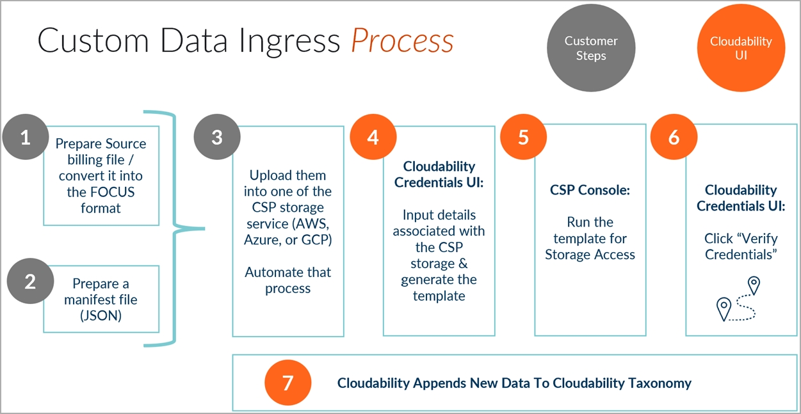

# Connect Custom Data (FOCUS Ingress)

The   FinOps Open Cost and Usage Specification  (  FOCUS)
  is a community-driven effort to develop a standard schema for cloud, SaaS, and other
billing data. The primary goal of the FOCUS specification is to make it easier to understand, report
on, and manage cloud costs. The FOCUS specification is intended to be adaptable across a variety of
cloud service providers and SaaS product sources and defines columns (dimensions and metrics),
column-specific requirements, and attributes (spec-wide requirements).

You can bring any cost and usage data from additional data sources as long as it has been
formatted into the FOCUS schema and adheres to the columns that are required, as defined by the
specification.

Note:

- We don’t recommend using FOCUS for CSP data as the current cost data set which Cloudability gets
  natively (CUR/Azure exports/GCP Billing etc) is much more granular than the FOCUS dataset. Using
  FOCUS, we get only cost data, the current CSP integrations also bring in utilization data which is
  used in multiple Optimization use cases.
- If you have already credentialed your CSP account(s) via native connector, please don't use the
  same account to connect via the FOCUS connector.
- To ensure full compatibility and support, please follow the connection steps as described.
  Custom configurations are not supported. If you have questions, reach out to **IBM
  Support**.

The FOCUS Specifications can be  [found here](https://focus.finops.org/ "(Opens in a new tab or window)")  with specific columns  [additionally here](https://focus.finops.org/focus-columns/ "(Opens in a new tab or window)")  .

Cloudability currently supports

1. FOCUS version 1.0
2. FOCUS version 1.1

Note: Custom Data  credentialing option should not be used for CSPs that we
already support natively (e.g., AWS, Azure, etc.), as some features, such as rightsizing, will not
be supported.

Steps for integration



Data Source Management

All the data that is uploaded to any of the storage services must be the entire month-to-date
data.

Also, the data must follow a specific structure as:

`<Root
Directory>/<Optional_Sub_Directories>/<Vendor>/<Report_Period>/<Epoch Time
Folder>/<prefix>-Manifest.json`

The  M  in Manifest should always be capitalized.

- Root Directory  : A prefix like AWS bucket name, Azure container name or GCS
  bucket name
- Optional Sub Directories  : An optional field for customer. They may or
  may not have additional sub directories
- Vendor  : A vendor name which would help in identifying the vendor type
- Report Period  : Report Period for which the data is available. This must be
  in the formats  YYYYMMDD-YYYYMM(+1)DD  . For example, for report period
  2023-02 the name would look like →20230201-20230301.
- Epoch Time Folder  : This will be used to identify the latest drop for
   month-to-date  data.
- Manifest  : Metadata json file containing details of specific report period
  dataset.

All custom data sources via this capability needs to adhere to the FOCUS specifications.

Sample Manifest File 

```
{
		"compression": "GZIP",
		"content_type": "Parquet",
		"report_id": "uuid-f431e214843b3c19756368",
		"root_dir": "byod-input-prod",
		"all_report_keys": [
		"<complete/path/excluding/root_dir>/cost-and-usage-report-00001.snappy.parquet",
		"<complete/path/excluding/root_dir>/cost-and-usage-report-00002.snappy.parquet"
		],
		"updated_at": "2024-04-04T05:00:22Z",
		"focus_version": "1.0"
	}
```

File Content Type : JSON

| Header / Field | Header / Field definition | Value : Required / Optional |
| --- | --- | --- |
| compression | CSV : gzip  Parquet : All that are supported by Java Hadoop frameworks. | Optional |
| content type | Parquet or CSV | Required |
| report ID | Randomly generated unique report identifier. | Optional |
| root\_dir | S3 Bucket or Azure Directory or GCS bucket to fetch the report from. This will be dependent of the type of credentials chosen. | Required |
| all report keys | It is a nested JSON, that is the list of only new absolute file paths excluding the root directory. | Required |
| updated at | Last updated time of the report. | Optional |
| focus version | FOCUS version as per  [https://finops.dev/focus-spec](https://finops.dev/focus-spec "(Opens in a new tab or window)")  The version must match the exact FOCUS Spec version. e.g. 1.0 or 1.1 | Required |

Integration Steps 

Note: Once the credentialing process in Cloudability is completed (Described below), you will see a
green check mark next to your credential details, but Cloudability will still need to validate that
the billing file and the manifest file comply with the requested formats. If you do not see any data
in Cloudability after 24 hours, please reach out to the Apptio Support team.

We support  AWS Simple Storage Service  ,  Google Cloud
Storage  and  Azure Blob Storage  as the storage services for
housing FOCUS-aligned data.

To add credentials for custom data in Cloudability, follow the steps below:

1. In Cloudability, navigate to  Settings  >  Vendor
   Credentials  > Add Datasource > Other Data
   Sources.
2. Select  Other Data Sources > Add a Credential >
   The Add other Datasources Account panel opens, click **Next**.
3. Click on  Preferred Storage Provider  and follow the prompts.

AWS Simple Storage Service 

1. Enter Vendor for which the data needs to be ingested.
2. Enter **the corresponding AWS Account ID where the files are located** .
3. Enter AWS S3 bucket name under  Root Directory  .
4. Enter optional sub prefixes under  Sub Directories  .
5. Enter Manifest Prefix under  Manifest Prefix  .
6. Click  Generate template  .

For more information, refer to [Connect Amazon Web Services.](aws-credentialing-standard-enterprise-home.html)

Azure Blob Storage 

1. Enter the Vendor for which the data needs to be ingested.
2. Enter Azure  Billing Account ID where the files are located.
3. Enter  Tenant ID  .
4. Enter  Subscription ID  .
5. Enter the Resource Group name.
6. Enter the Storage Account name.
7. Enter Blob Container Name under  Root Directory  .
8. Enter optional sub directories under  Sub Directories  .
9. Enter Manifest Prefix under  Manifest Prefix  .
10. Click  Generate template  .

For more information, refer to  [Connect Microsoft Azure](azure-cm-setup.html) 
.

Google Cloud Storage Simple Storage Service 

1. Enter the Vendor for which the data needs to be ingested.
2. Enter GCP **Billing** Account ID  where the files are located.
3. Enter GCP GCS bucket name under  Root Directory  .
4. Enter optional sub prefixes under  Sub Directories  .
5. Enter Manifest Prefix under  Manifest Prefix  .
6. Click  Generate template  .

For more information, refer to  [Connect Google Cloud.](connect-google-cloud.html)

**Frequently Asked Questions**:

- **Can I use FOCUS format to bring CSP data for AWS, Azure, GCP, OCI?**We don’t recommend
  using FOCUS for CSP data as the current cost data set which Cloudability gets natively (CUR/Azure
  exports etc) is much more granular than the FOCUS dataset. Using FOCUS, we get only cost data, the
  current CSP integrations also bring in utilization data which is used in multiple Optimization use
  cases.

- **What are the use-cases of using FOCUS for CSP data?**FOCUS can be used for CSP datasets
  for regions or vendors which we don’t support natively in Cloudability. E.g.
  - AWS China
  - Ali Cloud
  - Any other public cloud which Cloudability doesn’t support natively
- **If I bring in other regions or vendor’s data, what are the pre-requisites?**
  - FOCUS data should be hosted in a bucket outside of the region which Cloudability doesn’t support
    e.g. Not in China but rather USA or EU or AU.
  - Ensure that while credentialing provide the **account details where the cost export files are
    hosted.**
  - Parquet files must only be compressed while being generated (Using hadoop, avro default
    compression techniques) and not explicitly compressed.
  - The FOCUS manifest.JSON file must have the correct “report keys” which specify the exact report
    files to retrieve, including correct file extensions.
