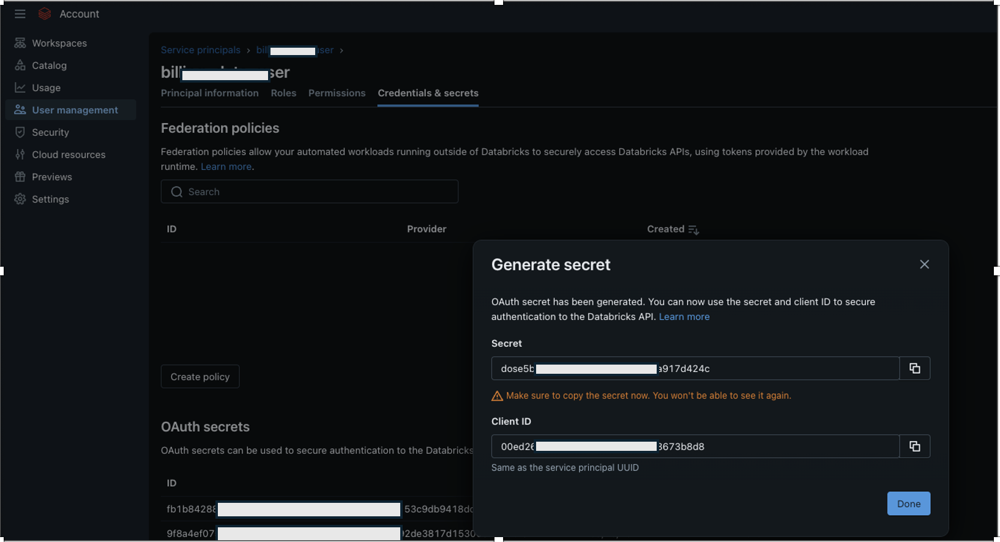
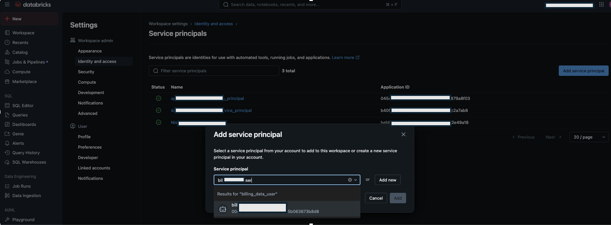
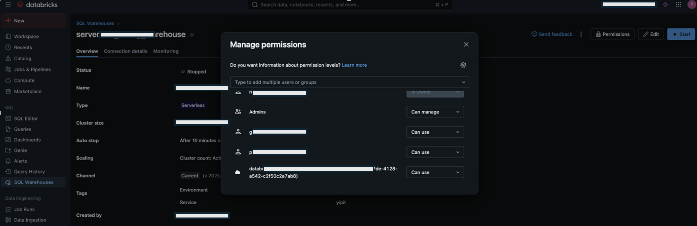
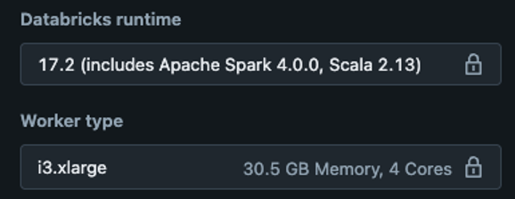

# Connect Databricks

You can connect your Databricks account to Cloudability to enable the ingestion of cost and usage
data. This integration is intended to be used only for Databricks on AWS and Databricks on GCP. If
you are using Azure Databricks, you will have sufficient data granularity in your Azure billing
data.

It takes 24 hours before your initial cost and usage data appears in Cloudability

**Prerequisites**

- Should be a Cloudability administrator and have access to the Cloudabiliy’s Vendor Credentials
  page.

- Appropriate permissions to set up a Unity Catalog, enable a Workspace & System Schema and
  create a **Service Principal User** that will have access to the catalog, schema, and table.

- You should be a Databricks Account admin to manage OAuth credentials for the service
  principals.
- Databricks Account admin / Workspace admin can take actions in the databricks workspace
  console.

- Need to create a SQL Warehouse (SQL Warehouse should be serverless), that can be used by the
  Service Principal User to run the query
- Should be able to schedule the notebook to run once in 24 hours to pull Databricks costs and
  usage data
- For Scheduling the notebook, customer needs to create a compute machine which contains the spark
  configuration.
- Please check if you have a commitment contract or pay as you go contract for databricks, this
  would help Cloudability is showing the billing cost appropriately

Summary of the integration

This integration requires users to set up a Unity Catalog, enable a Workspace & System
Schema and create a  Service Principal User  that will have access to the
catalog, schema, and table. Users also need to create a SQL Warehouse, that can be used by the
Service Principal User to run it, based on the notebook downloaded in the Credentials UI. This
notebook must run once every day to pull Databricks costs and usage data. Cloudability does not have
access to your custom discounts with Databricks, so we have added an option to input that
information in the credentialing UI so that we can factor this discount into the costs we display.

Databricks recommends using a service principal identity for automated tools, jobs, and
applications. We ask you to create one for this integration, as we are automating the process of
usage and billing monitoring.

1. Set Up Unity Catalog. Click [https://docs.databricks.com/en/data-governance/unity-catalog/get-started.html](https://www.ibm.com/links?url=https%3A%2F%2Fdocs.databricks.com%2Fen%2Fdata-governance%2Funity-catalog%2Fget-started.html "(Opens in a new tab or window)") .
2. Enable a Workspace for Unity Catalog. Click [https://docs.databricks.com/en/data-governance/unity-catalog/enable-workspaces.html](https://www.ibm.com/links?url=https%3A%2F%2Fdocs.databricks.com%2Fen%2Fdata-governance%2Funity-catalog%2Fenable-workspaces.html "(Opens in a new tab or window)") .
3. Enable **System Schema** in Unity Catalog. Click [https://docs.databricks.com/api/azure/workspace/systemschemas/enable](https://www.ibm.com/links?url=https%3A%2F%2Fdocs.databricks.com%2Fapi%2Fazure%2Fworkspace%2Fsystemschemas%2Fenable "(Opens in a new tab or window)")
4. Create a **Service Principal User** at account level. Click [https://docs.databricks.com/en/admin/users-groups/service-principals.html#add-service-principals-to-your-account-using-the-account-consol](https://www.ibm.com/links?url=https%3A%2F%2Fdocs.databricks.com%2Fen%2Fadmin%2Fusers-groups%2Fservice-principals.html%23add-service-principals-to-your-account-using-the-account-consol "(Opens in a new tab or window)").
5. Add Service Principal to Unity Catalog Enabled Workspace. Click [https://docs.databricks.com/en/admin/users-groups/service-principals.html#add-a-service-principal-to-a-workspace-using-the-workspace-admin-settings](https://www.ibm.com/links?url=https%3A%2F%2Fdocs.databricks.com%2Fen%2Fadmin%2Fusers-groups%2Fservice-principals.html%23add-a-service-principal-to-a-workspace-using-the-workspace-admin-settings "(Opens in a new tab or window)").
6. Grant Service Principal the privilege on the newly created catalog, schema and table. Click
   [https://docs.databricks.com/en/data-governance/unity-catalog/manage-privileges/index.html#manage-privileges-in-unity-catalog](https://www.ibm.com/links?url=https%3A%2F%2Fdocs.databricks.com%2Fen%2Fdata-governance%2Funity-catalog%2Fmanage-privileges%2Findex.html%23manage-privileges-in-unity-catalog "(Opens in a new tab or window)").
7. Create an SQL warehouse, [Click
   https://docs.databricks.com/en/compute/sql-warehouse/create.html](https://www.ibm.com/links?url=https%3A%2F%2Fdocs.databricks.com%2Fen%2Fcompute%2Fsql-warehouse%2Fcreate.html "(Opens in a new tab or window)") .

   Note: SQL Warehouse should
   be serverless
8. Grant Service Principal the permission to use SQL Warehouse. Click [https://docs.databricks.com/en/compute/sql-warehouse/create.html#manage-a-sql-warehouse](https://www.ibm.com/links?url=https%3A%2F%2Fdocs.databricks.com%2Fen%2Fcompute%2Fsql-warehouse%2Fcreate.html%23manage-a-sql-warehouse "(Opens in a new tab or window)").

Note: It If you are purchasing Databricks via a cloud provider marketplace and adding cost and usage
data for Databricks with this integration, you will see costs displayed twice in Cloudability
reporting. As an example, if you purchased Databricks via the AWS Marketplace, you would have:

- The high-level line item for AWS.

- The line items with detailed Databricks costs and  AWS Marketplace 
  listed as  Seller.

You will need to set up filters or views to hide your Marketplace costs. Marketplace costs
are excluded from billing.

**Step 1 – Databricks Account Console**

**Create a Service Principal**

To add a service principal to the account using the account console, follow the steps below.

1. As an account admin, log in to the account console.
2. Click  User Management  .
3. On the  Service Principals  tab, click  Add Service Principal
    .
4. Enter a name for the service principal.
5. Click  Add.
6. Select the credentials & secrets tab
7. Under **OAuth Secrets** , click **Generate Secret** .
8. Select the maximum number of days and select done.
9. Copy the displayed **Secret** and **Client ID** , and then click **Done.**

**Step 2 – Databricks Workspace Console**

Add Service Principal to the Workspace 

1. Log in to the workspace.
2. Click  User Management  .
3. Select  Settings  .
4. Click  Identity and access  .
5. Click  Manage  in Service principals.
6. Click  Add Service Principal.
7. Add the same service principal which was created above.

Add Permission to Service Principal to the Warehouse 

1. Click  SQL Warehouse  .
2. For the warehouse to be used in querying, click on the warehouse.
3. Click  Permissions  .
4. Add  Service Principal  with the  Can Use 
   permission.

**Step 3 – Cloudability**

1. In Cloudability , navigate to **Settings** > **Vendor Credentials** > **Add Datasource
   and select Databricks**
   1. Download the notebook

**Step 4 – Databricks Workspace Console**

Customer have to schedule the notebook that they downloaded from cloudability UI to run 24 hours
once in their **Workspace where the Service Principal was added.**

Note: For running this
notebook, customer must create their compute machine with below Databricks runtime which should
contain spark.

If the billing\_data catalog exist, then please proceed with the below steps, if not please run
the notebook downloaded from Cloudability and then proceed with the below steps.

Add Permission to Service Principal to the Table 

1. Click on the catalog.
2. Click the catalog name, for which permissions need to be given.
3. Click  Permissions  .
4. Click  Grant  .
5. Select the Principals.
6. Select  USE CATALOG  ,  USE SCHEMA  , and
    SELECT  under  Privileges  .
7. Click  Confirm.

**Step 5: Cloudability console**

1. Enter the details in Cloudability UI
   1. Databricks Account id
   2. Databricks client id
   3. Databricks secret

      Note: Copy client id and secret from the service principal
   4. Workspace URL without https – This is the workspace where you have applied the service
      principal
   5. Enter the Warehouse id which you have created in step 2
   6. Select the subscription model
      1. Marketplace – Select marketplace if you have purchased Databricks via AWS or GCP
         marketplace
      2. Direct – Select this option if you have bought directly from Databricks
   7. Dependent CSP
      1. Select AWS or GCP where the infrastructure is hosted
   8. Select a payment model
      1. Committed contract
         1. Here we need the start date, end date discount % details of the commitments
         2. In case you have multiple commitment contracts, same can be added using the + button
      2. Pay as you go
         1. Share the pay as you go start date
   9. Click **Save**
   10. Click **Verify**.

A green tick ()
indicates success whereas a red exclamation () indicated errors

In the event that verification fails, please retry after 15 minutes.

After completion of this process, within 24 hours, you’ll start seeing your billing data and tags
for databricks being populated within Cloudability.

**Frequently Asked Questions**

**Does Cloudability support IP whitelisting for controlling the traffic to Databricks?**

Yes, IP whitelisting is supported. Please contact IBM support for more details.

**Does Cloudability supports** **Private links or Delta Sharing for Databricks?**

No Private links or Delta Sharing are not yet supported for Databricks.

**What to do in case the Scheduled notebook is not running?**

Please ensure to configure a compute machine with Spark enabled

**Is it possible to modify the Notebook?**

It is recommended not to edit the notebook that is downloaded from Cloudability UI as various
internal processes uses the configurations.

**How to get Databricks Tags?**

Cloudability supports Resource level custom tags

- These are part of the Databricks Billing data and no extra permissions are required within
  Cloudability for enabling these
- We do pass usage metadata, identity metadata and product features as Tags.Workspaceid will be
  visible as a tag key under cldy:databricks:workspaceid

**What is the need to enter the discounts in UI?**

Cloudability does not have access to your custom discounts with Databricks, so we have added an
option to input that information in the credentialing UI so that we can factor this discount into
the costs we display

**What is the relevance of the dates while credentialing Databricks?**

The dates mentioned during Credentials UI are used to fetch the data from Databricks.

Databricks APIs allow us to fetch the data for past 13 months, customers can choose any date
within the past 13 months to fetch Databricks granular data.
