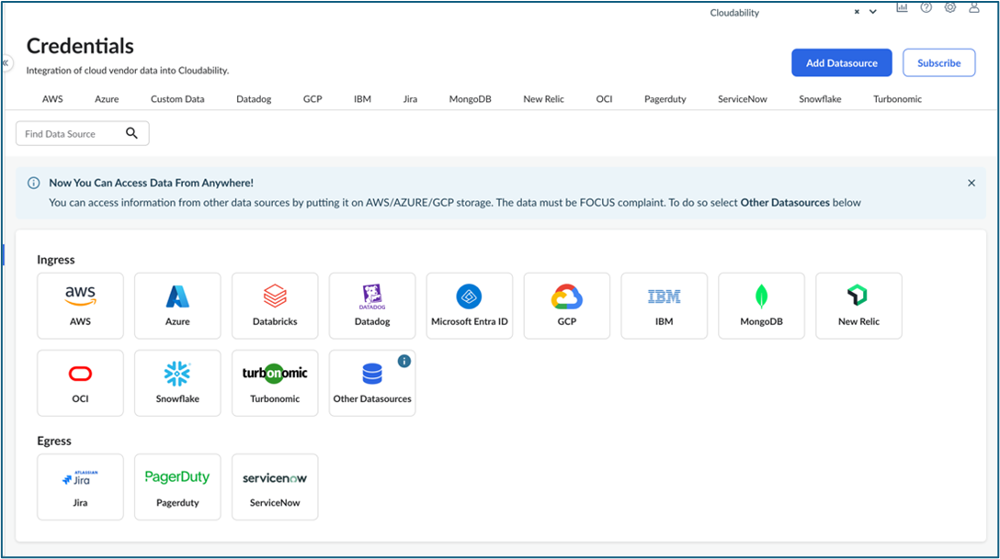
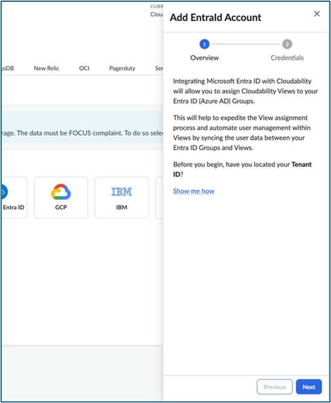
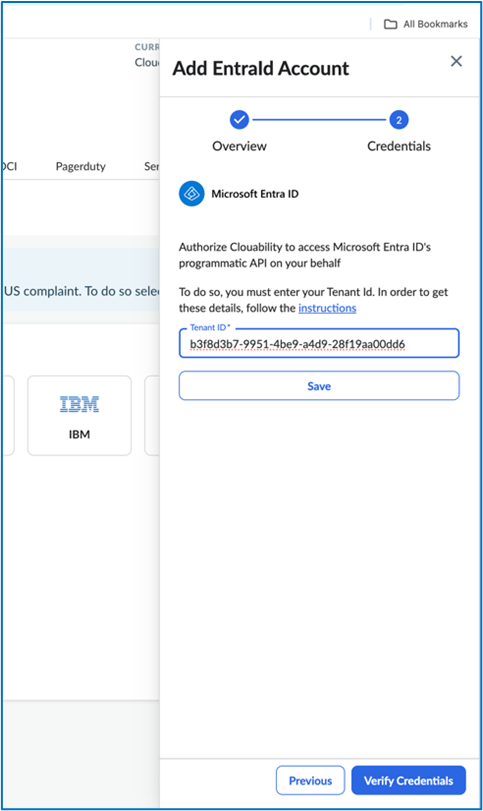
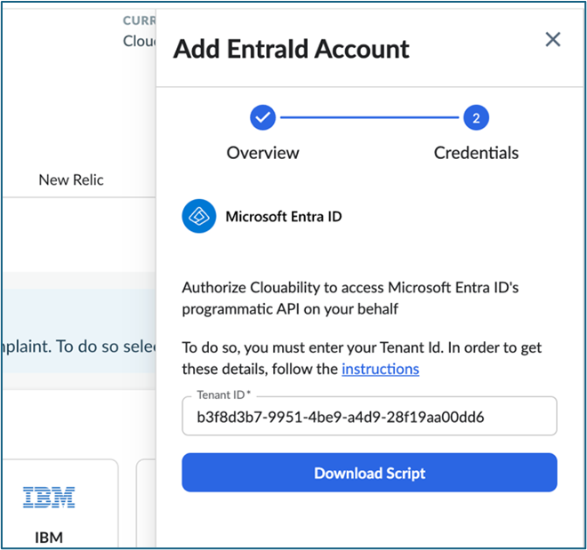
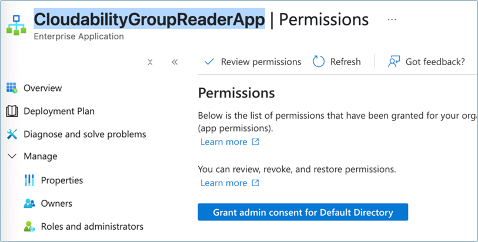
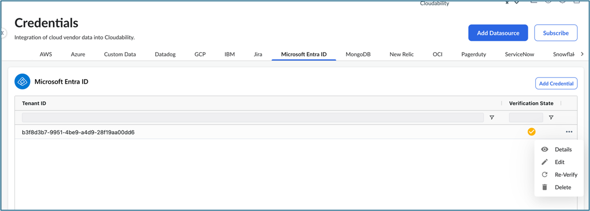
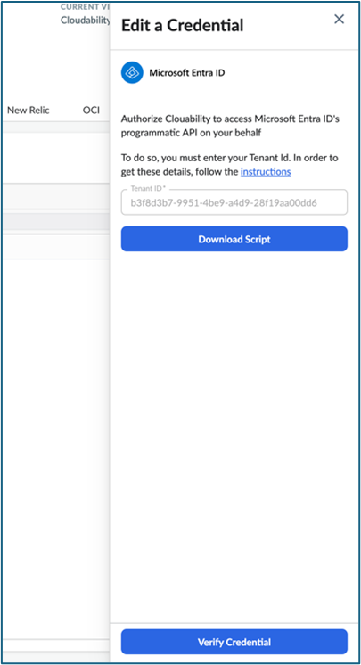
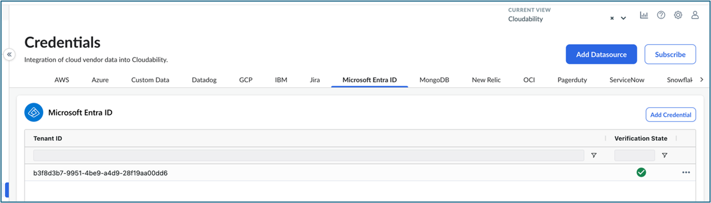

# Connect Microsoft Entra ID

Microsoft Entra ID (earlier known as Azure Active Directory) is a cloud-based Identity
and Access Management (IAM) service which acts as an Identity Provider (IdP). It authenticates and
verifies the identities of users, devices, and services for secure access to applications and
resources.

Before you start, ensure:

- You are a Cloudability administrator.
- You have Admin permissions in the Microsoft Entra ID tenant.

**How Cloudability connects with your Microsoft Entra ID tenant**

- To connect to your Microsoft Entra ID tenant, Cloudability registers its own app in the Entra ID
  tenant that you choose to credential with Cloudability. Then, Cloudability creates a Service
  Principal in your tenant using the registered app.
- For authentication, Cloudability uses its app’s access and secret key which are stored and
  managed by Apptio.
- To credential Cloudability with your Microsoft Entra ID, download a power shell script from
  Cloudability’s Vendor Credentials module and run it in your Microsoft Entra ID tenant you want to
  credential.
- Here's a sample of a power shell
  script:

  ```
  $entraAppId = "8dd8d868-a85c-4607-acd4-491df5068a79" $cldyEntraObjectId = (Get-AzADServicePrincipal -ApplicationId $entraAppId).id if (!$cldyEntraObjectId) { New-AzADServicePrincipal -ApplicationId $entraAppId $cldyEntraObjectId = (Get-AzADServicePrincipal -ApplicationId $entraAppId).id } else { echo "Service principal already present, skipping new service principal creation" }
  ```
- Running this script in your power shell command will register Cloudability’s app (with the AppID
  as mentioned in the first line of the script) in your tenant and create the Service Principal using
  the app. If a Service Principal is already present, then it will skip the creation of a new Service
  Principal and will re-use the existing Service Principal.
- Finally, you will need to add *User.ReadBasic.All* and *GroupMember.Read.All*permissions to the Service Principal.

  Note: To credential Cloudability with your Entra ID, you
  don’t need to take any other action in your Azure environment other than running the power shell
  script as mentioned earlier and granting the required permissions.

**Detailed Steps**

1. Navigate to **Settings > Vendor Credentials**.
2. Click **Add Datasource** button and then select **Microsoft Entra ID**.

   
3. Click **Next** from the slide out.

   
4. Provide the Tenant ID for the specific Azure Entra ID tenant you want to credential with
   Cloudability and click **Save**.

   
5. Select **Download Script**.

   
6. Run the downloaded script in the specific Azure Entra ID tenant.
7. Add *User.ReadBasic.All* and *GroupMember.Read.All* permissions to the Service
   Principal. Follow these steps to add the permissions:
   1. Search "CloudabilityGroupReaderApp" in the Azure Portal search bar.
   2. Once inside the application, navigate to the Permissions section under Manage.
   3. Click **Grant admin consent for Default Directory**.
   4. After the consent is granted, you can see the permission(s) listed as shown here.

      
8. After the script runs successfully, navigate to **Settings > Vendor Credentials > Microsoft
   Entra ID tab**. The credential will display with a **yellow tick** indicating it is yet to be
   verified. Expand the **...** option and select the **Edit** option.

   
9. Click the **Verify Credential** button from the slide out.

   
10. If verified, the credential will display with a **green tick**.

    
