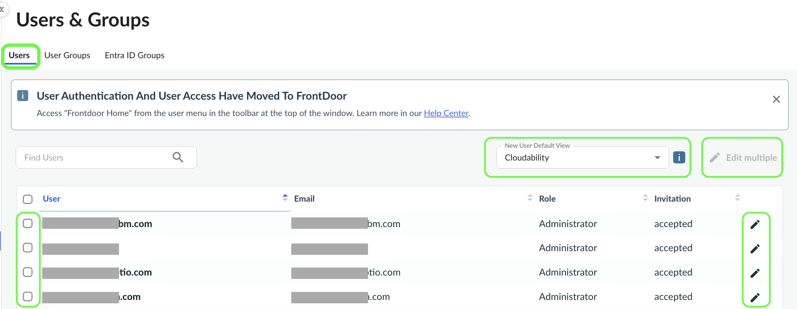
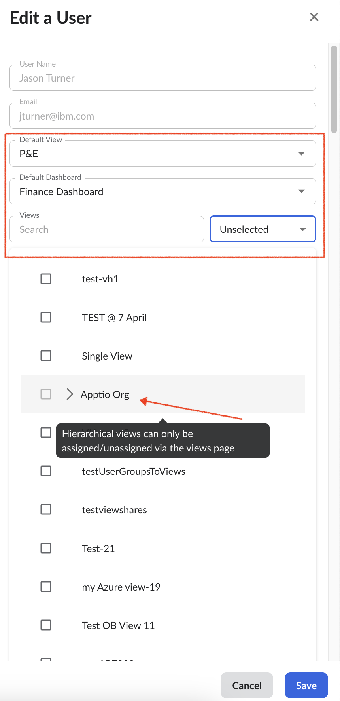
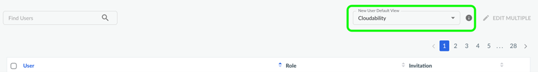

# Manage Users, User Views and Dashboards

## Overview

As a Cloudability Admin, you can manage a user’s access to views and dashboards within
Cloudability. This includes configuring their default view, setting a default dashboard, and
granting access to specific views. Other user management tasks, such as adding or removing roles,
are handled through **Access Administration**.

[Roles and permissions in Cloudability](iam.html)

[Learn how to manage user permissions and roles in Access Administration](https://www.ibm.com/docs/en/apptio-platform/access-administration/saas?topic=management-manage-user-permissions-roles "(Opens in a new tab or window)") .

## Managing user views and dashboards

1. Navigate to 
   **Settings** > **Users & Groups > **Users****tab.
2. Select the check box next to the name of user you want to manage, then select  .
3. You can also search for the user using either the user name or email.
4. To edit views and dashboards for multiple users, select at least two users,
   and then select 
   **Edit Multiple**.

   
5. In the **Edit a User** pane that appears, you can configure the following settings for the user:
   - **Default View** – Sets the view the user sees by default upon login
   - **Default Dashboard** – Specifies the default dashboard assigned to the user
   - **View Access** – Grants the user access to specific views. You can filter them based on all
     ‘Selected’, ‘Unselected’ and ‘All’ criteria.

     Note: Hierarchical views can only be assigned/unassigned
     via the Views Permission page.

   

   Note:

   When users are assigned a view, they can not see any data until they have the 
   ViewsFeatureFullAccess  permission. For more information, visit  [Managing user permissions and roles](https://www.ibm.com/docs/en/apptio-platform/access-administration/saas?topic=management-manage-user-permissions-roles "(Opens in a new tab or window)")
6. Select  Save.

## Setting a Default View for a New User

Cloudability allows you to configure a **default view** that new users see when they log in
for the first time, as long as they’ve been granted access to that view. This default view is often
referred to as the **org-level default view**.

If an admin hasn't set a default view for a user, or if the user hasn’t configured one in their
profile (*Manage Profile > Preferences*), Cloudability will automatically default them to this
org-level default view upon login.

To configure the default view, select a value from the **New User Default View** dropdown.

Note: First-time users are restricted to this view. After the initial sign in, other views can be
accessed or additional permissions can be granted by administrators.

**Parent topic:** [Manage Users and User Groups](../admin/manage-users-and-user-groups.html)
