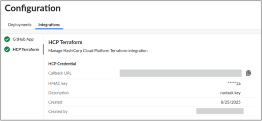

# HCP Terraform/Terraform Enterprise

## Overview

Cloudability Governance integrates with [HCP
Terraform](https://developer.hashicorp.com/terraform/cloud-docs "(Opens in a new tab or window)") and [Terraform Enterprise](https://developer.hashicorp.com/terraform/enterprise "(Opens in a new tab or window)") via a [**Run Task**](https://developer.hashicorp.com/terraform/cloud-docs/workspaces/settings/run-tasks "(Opens in a new tab or window)"), enabling automated cost analysis and
policy enforcement during pull request workflows.

Once configured, the Run Task evaluates Terraform plans and provides real-time feedback —
flagging cost risks, missing tags, and non-compliant resources — before deployment.

**Prerequisite:** Ensure that you have installed IBM Cloudability GitHub app before proceeding
with the Run Task set up.

## Generate Credentials in Cloudability

1. In the Cloudability UI, go to **Configuration > Integrations**.
2. Generate a **Callback URL** and **HMAC Key**.
   - These credentials authenticate and route Run Task callbacks from HCP Terraform.
   - Each key pair represents a single HCP credential for your organization.

   

## Create a Run Task in HCP Terraform

1. In the HCP Terraform UI, navigate to **Settings → Integrations → Run Tasks**.
2. Create a new Run Task with the following details:
   - **Stage**: Post-plan
   - **Endpoint URL**: Use the Callback URL from Cloudability
   - **HMAC Key**: Use the key generated in Cloudability
   - **Enforcement Level**: Choose Advisory (warn only) or Mandatory (block on failure).

     *Tip: Start with Advisory to evaluate impact before enforcing.*
3. Attach the Run Task to one or more workspaces:
   - You can apply it globally to all workspaces or attach it individually.
   - Reusing a single Run Task across multiple workspaces is recommended.

   Once the setup is complete, head to the [**Deployment
   Configuration**](governance-deployment-configurations.html) page.

## Configuration with Terraform Enterprise

If your Terraform Enterprise instance is hosted behind a firewall, ensure it allows **incoming
requests from Cloudability** so that Run Task results can be posted successfully.

Refer to the [Terraform Enterprise Run Task API](https://developer.hashicorp.com/terraform/enterprise/api-docs/run-tasks/run-tasks-integration#run-task-callback "(Opens in a new tab or window)") documentation for
technical details on callback configuration.

If you run into any issues, reach out to your Cloudability Account Team. They will connect you
with the Product Team for support.

## How to include provider-account information in Terraform plan output

For AWS resources, this can be achieved by include [aws\_caller\_identity](https://registry.terraform.io/providers/hashicorp/aws/latest/docs/data-sources/caller_identity "(Opens in a new tab or window)") as data source in your Terraform files.

For Terraform files that deploy resources to a single account, it can be done by adding the
following line in your Terraform configuration.

```
data "aws_caller_identity" "defaultidentity" {}
```

For Terraform files that deploy resources to multiple accounts through defined providers, it can
be done by adding following lines for each provider in your Terraform configuration. In the below
example "engineering" and "staging" are two different
providers.

```
data "aws_caller_identity" "engineering" {
  provider = aws.engineering
}
data "aws_caller_identity" "staging" {
  provider = aws.staging
}
```

## Integrate your custom pricing and add your usage information for more accurate cost estimation

- Please refer to IBM Cloudability documentation [here](https://www.ibm.com/docs/en/cloudability-commercial/cloudability-premium/saas?topic=governance-preferences-configuration "(Opens in a new tab or window)") to see how to get more accurate cost estimation,
  inclusive of your custom pricing.
- Please refer to IBM Cloudability documentation [here](https://www.ibm.com/docs/en/cloudability-commercial/cloudability-premium/saas?topic=governance-usage-configuration-based-cost-estimation "(Opens in a new tab or window)") to add usage information to get more accurate cost
  estimation

**Parent topic:** [Setup Cloudability Governance](../admin/governance-setup-cldy-governance.html)
