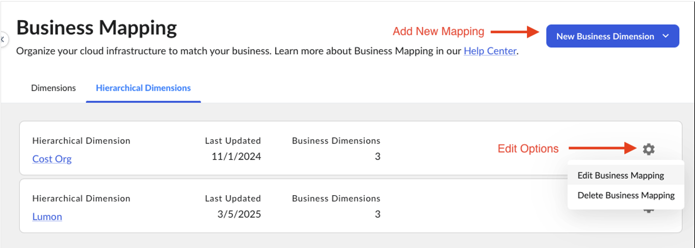
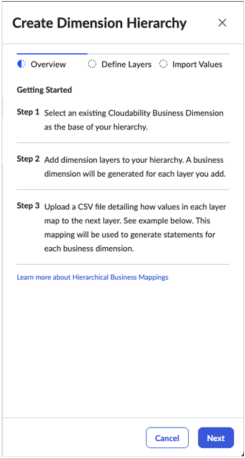
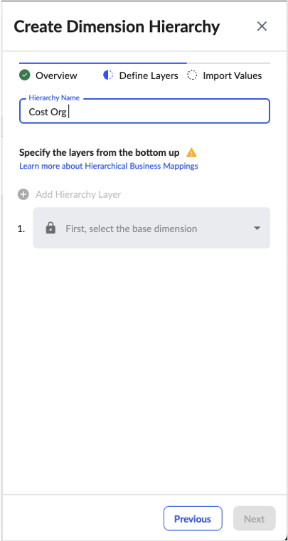
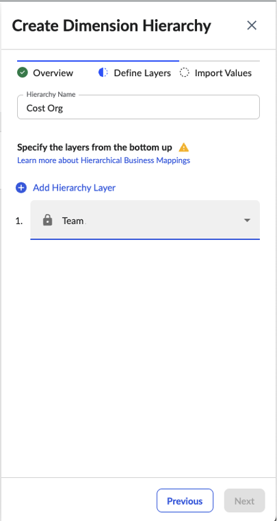
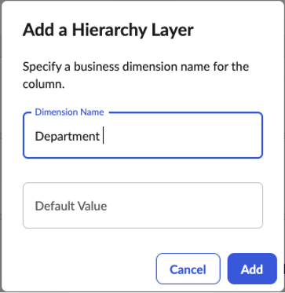
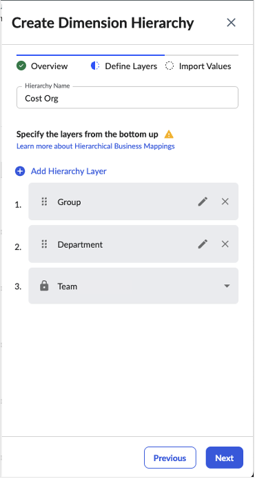
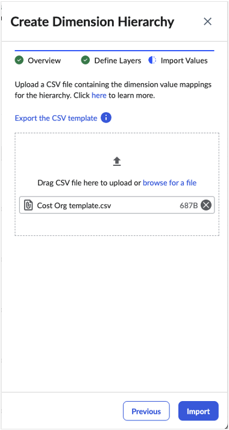
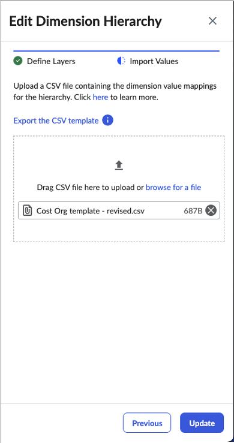

# Organize data using hierarchical business mappings

Note:

Hierarchical Business Mappings currently have a limit of 1000 Business Mappings rows.

A Hierarchical Business Mapping is a specialized form of Business Mapping designed to create and
maintain hierarchical data relationships between Business Dimensions (up to five). Business
Dimensions are synthetic dimensions generated using business logic (Business Mapping statements) to
map cloud- and vendor-specific tags to meaningful business concepts.

A Hierarchical Business Mapping (HBM) enables you to create a related set of Business Dimensions
that can support cost rollups in Cloudability Reporting, View Filters, and Plans. This approach
simplifies the creation and maintenance of the necessary business logic needed to keep related
Business Dimensions synchronized.

## How does it work?

Imagine you need to report on costs at different levels of cost ownership within your
organization: Team, Department, and Group. You want a Business Dimension for each level and you
would typically need to create separate Business Mappings for each. However, these dimensions follow
a hierarchical structure — Teams roll up to Departments, which in turn roll up to Groups.

To define these relationships using standard Business Mappings, you would need to create
statements specifying how each Team maps to a Department and how each Department maps to a Group.
While this approach may work for a small number of Teams, Departments, and Groups, it becomes
difficult to manage at scale—especially when rollup relationships change over time (e.g., new Teams
or Departments are added, or reporting structures are reorganized).

A Hierarchical Business Mapping (HBM) simplifies this process by allowing you to define a single
Business Mapping that applies to multiple Business Dimensions in a structured rollup hierarchy.
Instead of manually defining individual Business Mappings using complex and inter-dependent IF-THEN
style logic, you can create the entire hierarchy using a simple declarative approach:

1. Select a Business Dimension to use as the base of your hierarchy (e.g., Team).
2. Specify the additional hierarchy levels you want (e.g., Department and Group).
3. Upload a mapping file that specifies how values in each tier relate to their parent tier.

Cloudability automatically generates new Business Dimensions and Business Mapping statements for
each hierarchy level. If rollup relationships change—such as the addition or removal of Departments
or Groups—you simply upload a new mapping file, and the system updates all Business Mapping
statements accordingly. This ensures that the correct values of Team, Department, and Group are
assigned consistently to guarantee accurate cost rollups.

Additionally, the Hierarchical Business Mapping can be used to create Views that align with the
HBM cost rollup structure. See [Organize Views Using
Hierarchical Views](hierarchical-views.html) to learn more.

## What is a mapping file?

A mapping file is a structured way to define how values in each Hierarchical Business Mapping
(HBM) tier roll up to their parent tier. It is a table (CSV file), where:

- The leftmost column represents the base dimension.
- Each subsequent column represents a parent tier in the hierarchy.
- Each row defines how a value in the base dimension maps to its parent tiers.

For example, the table below shows a mapping file for an HBM where Team is the base dimension,
rolling up into Department and then Group. There are 10 Teams (Team 1 through Team 10), and each row
specifies how a Team maps to its corresponding Department and Group.

| Team | Department | Group |
| --- | --- | --- |
| Team 1 | Dept A | Group X |
| Team 2 | Dept D | Group Y |
| Team 3 | Dept B | Group X |
| Team 4 | Dept A | Group X |
| Team 5 | Dept C | Group Y |
| Team 6 | Dept B | Group X |
| Team 7 | Dept C | Group Y |
| Team 8 | Dept D | Group Y |
| Team 9 | Dept B | Group X |
| Team 10 | Dept C | Group Y |

For illustrative purposes, here is the same table but reformatted to highlight the
hierarchical relationships between Teams, Departments, and Groups. This format makes it easier
to see how Groups are composed of multiple Departments, and in turn, how each Department
contains specific Teams.

| Team | Department | Group |
| --- | --- | --- |
| Team 1 | Dept A | Group X |
| Team 4 |
| Team 3 | Dept B |
| Team 6 |
| Team 9 |
| Team 5 | Dept C | Group Y |
| Team 7 |
| Team 10 |
| Team 2 | Dept D |
| Team 8 |

In this example mapping file:

- Group X includes Dept A and Dept B:
  - Dept A consists of Team 1 and Team 4.
  - Dept B consists of Team 3, Team 6, and Team 9.
- Group Y includes Dept C and Dept D:
  - Dept C consists of Team 5, Team 7, and Team 10.
  - Dept D consists of Team 2 and Team 8.

## Hierarchical Business Dimension (HBM) Concepts

Name

The name of the overall hierarchy. This is a required attribute. Choose a name that clearly
conveys its overall structure or purpose, as it will appear as the root node for the hierarchy –
i.e. the name of the top-level View if you create a Hierarchical View structure for the HBM.

Base Dimension

Every hierarchy is built on top of a base business dimension. This must be an existing business
dimension, and cannot be a dimension used in another HBM.

Hierarchy Layers

Additional hierarchy (roll up) layers. Each layer must have a name, and that name must be unique
(cannot be the name of an existing business dimension). These will be generated as new business
dimensions upon completion of the HBM setup.

## How to set up Hierarchical Business Mappings

Listing and reviewing hierarchical business dimensions

From the Business Mappings home page, under the Hierarchical Dimensions tab, you can see a list
of all the hierarchical business dimensions you have set up.

Creating hierarchical business dimensions

To create a new hierarchical business dimension:

1. On the Hierarchical Dimensions tab, select  New Business Dimension
   Hierarchy  from the Add menu.
2. The Create Dimension Hierarchy drawer will open on the
   Overview step > Select Next to advance to the next
   step (Define Layers).

   
3. Give the hierarchy a name > type the desired name (e.g., Cost Org) in the
   Hierarchy Name field.

   

   Note:

   The hierarchy name is used as the root View name its corresponding Hierarchical View. See [Organize Views using Hierarchical Views](hierarchical-views.html) to learn more.
4. Select an existing business dimension as the base of the hierarchy > Click the select
   the base dimension dropdown and pick a dimension from the list (e.g.
   Team).

   

   Note:

   You must select a base dimension before you will be able to add hierarchy layers.
5. Add additional layers to the hierarchy > click the Add Hierarchy Layer
   button and enter the desired dimension name (e.g. Department) in the modal
   that appears. Click Add.

   

   Note:

   Default Value is not used and can be ignored.
6. Repeat Step 5 to add additional hierarchy layers. You may add up to a total of four (4) layers
   on top of the base dimension. Click Next to finish adding layers to advance
   to the next step (Import Values).

   
7. Upload a mapping file that describes how base dimension values map to parent tier values > click
   browse for a file or drag/drop a CSV file into the import box. Click
   Import to import the mapping file and create the HBM.

   

   Note:

   Clicking the Export the CSV template link will download a template CSV
   file pre-populated with the current base dimension values ready to be filled in with parent
   dimension values.

Editing hierarchical business dimensions

To modify an existing hierarchical business mapping:

1. Select the Edit Business Mapping option from the Options (gear)
   menu. This will open the Edit Dimension Hierarchy drawer on the Import Values
   step.
2. Rename the Hierarchical Business Dimension >click Next to update.
3. Upload a revised mapping file > click browse for a file or drag/drop a
   CSV file into the import box. Click Update to import the mapping file and
   update the HBM with the new mappings.

   

   Note:

   Any associated Hierarchical View will automatically update to mirror the changes in the revised
   mapping.

   For more information, refer to  [Organize Views using
   Hierarchical Views.](hierarchical-views.html)

Deleting hierarchical business dimensions

To delete an existing hierarchical business mapping, select the Delete Business Mapping option
from the Options (gear) menu. This will remove the hierarchical business mapping from the
system and delete the HBM tier business dimensions, but not the base business dimension.

Note:

Before deleting an HBM, as best practice, you should first delete its associated Hierarchical
View.

For more information, refer to  [Organize Views using
Hierarchical Views.](hierarchical-views.html)

**Parent topic:** [Business mapping](../admin/business-tags.html)
